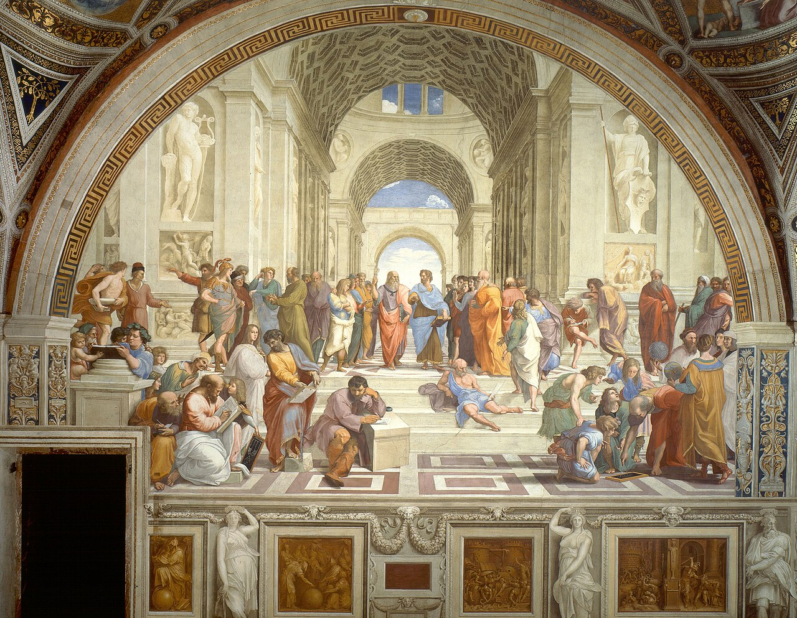
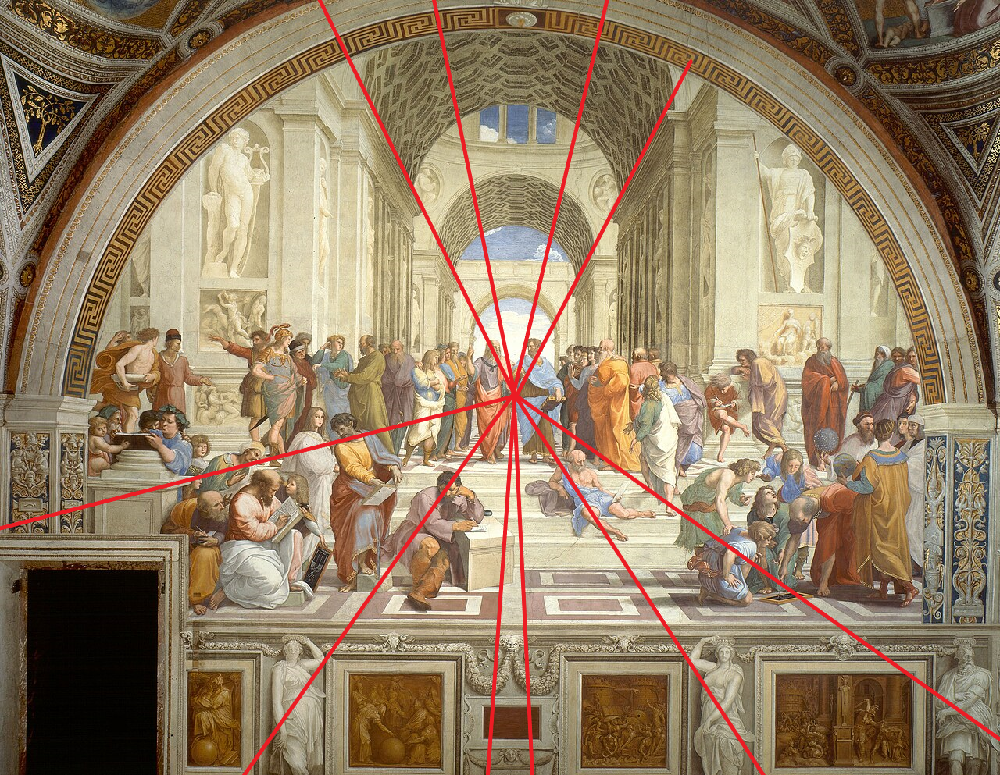
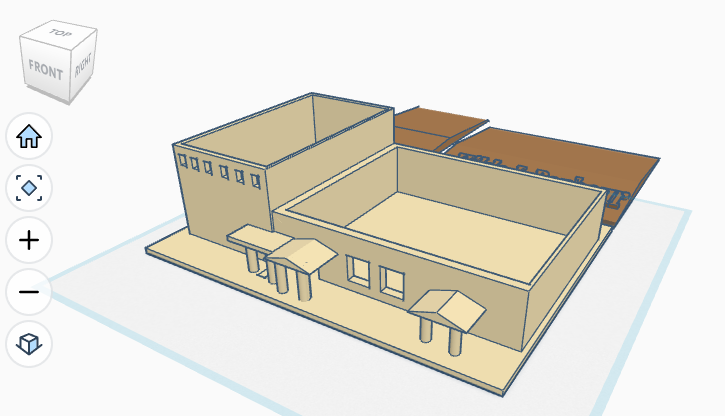
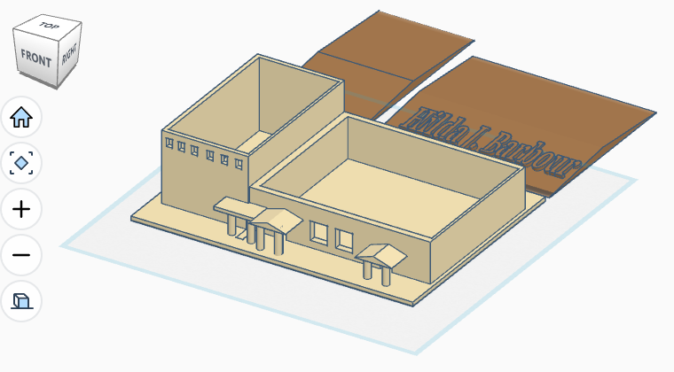

# CLOs
* CLO 1 - Explain the different coordinate systems used in computer graphics.
* CLO 6 - Use OpenGL functions to create and apply single and compound transformations.
* CLO 11 - Explain how the GLM computer graphics math library is used to create and apply transformations.

# Introduction

Ok, I am going to level with you. This exploration is likely going to be *super* "heady" and you will likely want to reread it multiple times. Better yet, keep it open in a tab throughout this term. If you don't understand the math, that is fine. You are in good company! Just know how to *apply* the math in the context of 3D Graphics and the GLM functions that make it easier to implement.

So, everyone ready? We are about to take a shallow dive into **The Math of 3D Graphics!**

# 3D Graphics Math (it won't be *that* bad)

What you are about to see is basically *Linear Algebra*[^1] If you have taken a course in the subject, then YAY for you! If you haven't taken such a class, or are like me and took it *decades* ago, don't worry, things will be OK!

# Points

This is likely the easiest concept to grasp, so it's a good place to start! A *point* is just that: *a point in space*. You have surely plotted countless points across your academic career. They show up when graphing equations on you calculator. They show up when plotting data on a graph for a presentation.

Most of these points are presented in a *2-D plane*. This means, they have both an *X* and a *Y* coordinate. These two coordinates allow us to describe a point's position on the x and y axis. As we mentioned in our [Coordinate Systems](./coordinate_systems.md) exploration, we need to expand our axis to include a *Z*. 

This means that *any* vertex we want to place in our scene requires an *X*, *Y*, an *Z* coordinate. Given this information, what *type* do you think we should use: `vec3` or `vec4`?

**HIDE ANSWER: If you guessed `vec3` you are making the purely logical choice. Sadly, you are incorrect in the context of 3D Graphics Math. We actually want a `vec4`**

"Hold up!" I can hear you shout. If we need three numbers to represent a 3D point, why *wouldn't* we use a `vec3`? As with many things in 3D Graphics, we make decisions based on ease of use. In this case, we want to use a `vec4` so we can leverage something called *Homogeneous Coordinates*.

This is just a fancy term for adding an element to the coordinate vector to make the math easier. For our purposes, we will be adding `W`, which will typically be set to `1`. We can create a point centered on the origin by calling:

```C++
glm::vec4 point(0.0f, 0.0f, 0.0f, 1.0f);
```

OK, so we now know how to create a `vec4` to hold our *homogenous coordinates*, but what math is made easier because of it? Well, *Matrix Math* of course! (editor's note: great segue!)

# Matrices

Did you all see the segue? Masterful! Anyway, a *matrix* is basically a series of number organized into rows and columns. Behold! *A Matrix!*

$$
\begin{bmatrix}
A_{00} & A_{01} & A_{02} & A_{03} \\
A_{10} & A_{11} & A_{12} & A_{13} \\
A_{20} & A_{21} & A_{22} & A_{23} \\
A_{30} & A_{31} & A_{32} & A_{33} 
\end{bmatrix}
$$

You have likely seen these before, so we won't need a ton of explaining. The only thing you really need to know about this notation, is that *rows* go left-to-right and *columns* go top-to-bottom. The subscript for each "cell" denotes the row first, and then the column.

We are now going to examine a few *special* matrices that we will be using *a lot* in this course. Again, the goal isn't to make you understand the math, or even to remember the *content* of each matrix. GLM will handle all of that. What you need to know is what they are *for*.

## The Identity Matrix

We are going to be uncharitable and give this matrix another name: *The Do-Nothing Matrix*. Did I just hear you gasp: thinking I am being beyond rude? Why would I rename *The Identity Matrix* to *The Do-Nothing Matrix*?

*Clearly*, I am doing it to be funny, but I am also trying to give you an easy way to remember what it is used for by knowing what it *does*. I mean, can you tell me what you think it does just by looking at it?

$$
\begin{bmatrix}
1 & 0 & 0 & 0 \\
0 & 1 & 0 & 0 \\
0 & 0 & 1 & 0 \\
0 & 0 & 0 & 1
\end{bmatrix}
$$

If you can tell just by looking at it, bravo! For the rest of us (including myself), *The Do-Nothing Matrix* (aka *The Identity Matrix*) is the matrix that when multiplied by *any* other point or matrix[^2], that point or matrix remains unchanged: hence, *The Do-Nothing Matrix*.

Why would this be helpful to us? That is a great question...for *you* to try to noodle up a theory. Please don't stress about this question, there are no wrong answers; I just want to have you start thinking about why these things exist. By the end of this exploration, you may be able to guess as to the use before I spell it out.

**Hide Answer: We are going to use the *Identity Matrix* as the "base" for all of the *Transforms* we will be doing later in this exploration. Everything from *moving, scaling, and rotating* your scene will all start with *The Identity Matrix***

GLM and GLSL both have built-ins to make generating an identity matrix easy.

```C++
glm::mat4(1.0f);  // GLM Identity Matrix generation

mat4(1.0f);  // GLSL Identity Matrix generation
```

I bet some of you are thinking of asking, 

>"That is all very well and good, but why the dickens do we use a 4x4 matrix instead of a 3x3 matrix? You said we needed to make points `vec4`s to work with Matrix Math! An Identity Matrix can be 3x3, which would have played nicely with the logical `vec3` representation of a 3D point."

My response to that would be, "Wow, you feel strongly about this, and rightfully so!" You must trust the process and wait.[^3]

## Operations

A matrix isn't much use unless we can *do* something with it. We are now going to cover how we can manipulate matrices to produce desired results. Please note, when we talk about matrix operations, we will typically place the "result" on the left-hand side of the `=`. This is because the order in which you do matrix math is important. In the context of 3D graphics, we will be going right-to-left when applying operations. Therefore, our result is placed on the left to mirror how we will assign the resultant value to variables in our code.

### Transpose

When you *transpose* a matrix you "flip" the rows and columns. In other words, Row 1 is rotated to become Column 1, and so on. Below you will see the *T* in the corner of the matrix, which signals *transpose*.

$$
\begin{bmatrix}
A_{00} & A_{10} & A_{20} & A_{30} \\
A_{01} & A_{11} & A_{21} & A_{31} \\
A_{02} & A_{12} & A_{22} & A_{32} \\
A_{03} & A_{13} & A_{23} & A_{33}
\end{bmatrix}=\begin{bmatrix}
A_{00} & A_{01} & A_{02} & A_{03} \\
A_{10} & A_{11} & A_{12} & A_{13} \\
A_{20} & A_{21} & A_{22} & A_{23} \\
A_{30} & A_{31} & A_{32} & A_{33}
\end{bmatrix}^T
$$

So, what do we need to transpose a matrix? 

When we move, rotate, or scale our models using a transformation matrix, it works great for vertices (points). However, it can distort our *normal vectors* — the arrows that point perpendicular to a surface and are critical for lighting (covered much later in the course). To correctly transform normals, we multiply them by the *inverse transpose* of the transformation matrix. This keeps them pointing in the right direction.

We will learn about the *inverse* of a matrix shortly.

Both GLM and GLSL have built-in functions to transpose a matrix.

```c++
glm::transpose(mat4); // GLM transpose function

transpose(mat4); // GLSL transpose function
```

### Addition

Matrix *addition* is *very* simple, but it requires that the matrices being added are the same "shape" (i.e. same dimensions). We just need to add the elements from one matrix to the corresponding elements in the other matrix (see below).

$$
\begin{bmatrix}
A+a & B+b & C+c & D+d \\
E+e & F+f & G+g & H+h \\
I+i & J+j & K+k & L+l \\
M+m & N+n & O+o & P+p
\end{bmatrix}=\begin{bmatrix}
A & B & C & D \\
E & F & G & H \\
I & J & K & L \\
M & N & O & P
\end{bmatrix}+\begin{bmatrix}
a & b & c & d \\
e & f & g & h \\
i & j & k & l \\
m & n & o & p
\end{bmatrix}
$$

Adding two matrices together in with GLM and in GLSL is trivial; we use the `+` operator.

```C++
glm::mat4 result = matA + matB; // GLM matrix addition

mat4 result = matA + matB; // GLSL matrix addition
```

If I am being honest with you, we won't be doing much matrix addition, but we will be doing a lot of what comes next!

### Multiplication

Matrix *multiplication* is going to be our mathematical workhorse when it comes to 3D graphics. While matrix *addition* required the matrices to have the same "shape," matrix *multiplication* requires that the number of *columns* in the first matrix equal the number of *rows* in the second matrix. 

**Nota bene:** The number of rows in the resultant matrix will equal the number of rows in the first matrix. The number of columns in the resultant matrix will equal the number of columns in the second matrix.

Let's take a look at two examples. First, we will look at multiplying two 4x4 matrices. 

$$
\begin{bmatrix}
Aa+Be+Ci+Dm & Ab+Bf+Cj+Dn & Ac+Bg+Ck+Do & Ad+Bh+Cl+Dp \\
Ea+Fe+Gi+Hm & Eb+Ff+Gj+Hn & Ec+Fg+Gk+Ho & Ed+Fh+Gl+Hp \\
Ia+Je+Ki+Lm & Ib+Jf+Kj+Ln & Ic+Jg+Kk+Lo & Id+Jh+Kl+Lp \\
Ma+Ne+Oi+Pm & Mb+Nf+Oj+Pn & Mc+Ng+Ok+Po & Md+Nh+Ol+Pp
\end{bmatrix}=\begin{bmatrix}
A & B & C & D \\
E & F & G & H \\
I & J & K & L \\
M & N & O & P
\end{bmatrix}*\begin{bmatrix}
a & b & c & d \\
e & f & g & h \\
i & j & k & l \\
m & n & o & p
\end{bmatrix}
$$

Notice, we aren't explaining how any of these operations work, but you can noodle through by looking at the examples. You only need to have a rough idea of what is going on.

Now, let's look at another common example we will see in this course.

$$
\begin{pmatrix}
AX+BY+CZ+D \\
EX+FY+GZ+H \\
IX+JY+KZ+L \\
MX+NY+OZ+P
\end{pmatrix}=\begin{bmatrix}
A & B & C & D \\
E & F & G & H \\
I & J & K & L \\
M & N & O & P
\end{bmatrix}*\begin{pmatrix}
X \\
Y \\
Z \\
1
\end{pmatrix}
$$

Remember that the number of rows in the first matrix has to match the number of columns in the second matrix? Are you thinking, "But the first matrix has 4 rows and the second matrix has only one column?" Let me remind you that in our context, we are going to be performing these operations from *right-to-left*. Therefore, our single column matrix is the *first* matrix and the 4x4 matrix is the *second* matrix.

Question Time: Did you notice that the second example uses `()` around the single column matrix and the resultant matrix? Why do you think that is?

**HIDE ANSWER: We use the `()` to designate the matrix as a *point*, not a *transformation* matrix. In the second example, the resultant matrix is also a point, so is wrapped with `()`s.**

Something to be aware of is that the *associative property*[^4] applies to matrix multiplication. This "feature" of matrix multiplication is often called *concatenation*. This is a very powerful aspect of matrix multiplication that we will use *a lot*. 

We will find ourselves needing to apply the same sequence of transformations (represented by matrices) to all the vertices in a model. Instead of calculating it for each vertex, we can precalculate it once and save the *concatenation* matrix for future use.

Both GLM and GLSL support matrix multiplication with the `*` operator.

```C++
glm::mat4 result = matA * matB; // GLM matrix multiplication

mat4 result = matA * matB; //GLSL matrix multiplication
```

### Inverse

The last matrix operation we will cover is taking the *inverse* of a matrix. We are not going to show you how it is done; it is *very* complicated. Luckily, both GLM and GLSL offer built-in functions to handle this for us.

```C++
glm::inverse(matA); // GLM inverse generation

inverse(matA); // GLSL inverse generation
```

We will not be needing the inverse to often, but, as mentioned above, we absolutely need it when we need the *inverse transpose* to help correct our *normals*. We will also need to use it to move between *World Space* and *Local Space* (more details coming shortly). It can also be used to "undo" a transform that we applied and restore the original state to a vertex.


## Transformations

As we mentioned multiple times above, we will be using matrices to *transform* our vertices. A *Transformation* (*transform* for short) is simply doing math to manipulate where in our scene each vertex will be. For example, moving a point from one location to another (called *Translation*).

### Translation

BAM! *Another* seamless segue! Moving a vertex from one location to another is called a *Translation*. We will be using this *all* the time. We will need it to place our models/objects in the correct location in our 3D scene. Translations are also used to animate our scene and even move our camera around.

In order to perform a *translation* we need to use a *Translation Matrix*. Let's look at an example before trying to explain what is happening.

$$
\begin{pmatrix}
X + T_x \\
Y + T_y \\
Z + T_z \\
1
\end{pmatrix}=\begin{bmatrix}
1 & 0 & 0 & T_x \\
0 & 1 & 0 & T_y \\
0 & 0 & 1 & T_z \\
0 & 0 & 0 & 1
\end{bmatrix}*\begin{pmatrix}
X \\
Y \\
Z \\
1
\end{pmatrix}
$$

On the far right we have our *point* (i.e. vertex). Do you remember when I told you to wait to learn why we needed to add a *fourth* element to our point representation? Well, this is why. In order to apply a translation to a point, we have to use a 4x4 matrix. The other transforms that we will look at could be done with a 3x3, but not a *translation*. Therefore, we just store our points in `vec4`s to make everything consistent across transforms.

Now, the *Translation Matrix* is the *Identity Matrix* with the first three elements in the last column replaced with the translations we wish to apply along each axis. For example, $T_x$ is the "distance" we wish to move the X value of the vertex.

Don't let the matrix math worry you, GLM offers a built-in function to make translations easy.

```C++
// Generate Identity Matrix
glm::mat4 model = glm::mat4(1.0f);  
// Apply the (x, y, z) translation to the model matrix
model = glm::translate(model, vec3(x, y, z));  
```

You have to pass in a `mat4` as the first parameter for all these translations. In this example, we use the name "model" for our matrix because we are going to be using a series of transforms to place our *model* into our scene. If it is the first transform we wish to apply, we have to start somewhere, so we use our *Do-Nothing Matrix*.

You also need to pass in the `x, y, and z` values as a `vec3`. This will apply to all GLM transform functions.

This resultant `model` matrix can then be used to transform our vertices with simple multiplication: `mat4 * vec4`, where `mat4` is our transform matrix and `vec4` is our vertex.

### Scaling

*Scaling* is used to change the size of a model/object. Given that models are made up of many vertices, when scaling, each vertex needs to be moved away from a central point or contracted toward it. Think of it as the vertices exploding outward for scaling up or being pulled back in by a black hole when scaling down.

Let's take a look at what the *scaling matrix* looks like in action!

$$
\begin{pmatrix}
X \cdot S_x \\
Y \cdot S_y \\
Z \cdot S_z \\
1
\end{pmatrix}=\begin{bmatrix}
S_x & 0 & 0 & 0 \\
0 & S_y & 0 & 0 \\
0 & 0 & S_z & 0 \\
0 & 0 & 0 & 1
\end{bmatrix}*\begin{pmatrix}
X \\
Y \\
Z \\
1
\end{pmatrix}
$$

Again, we start with our point on the right. The *scaling matrix* is the *Identity Matrix* with the first three elements in the diagonal replaced with the factors by which we wish to scale our object. Notice that the resultant point *multiplies* the starting X, Y, and Z values instead of *adding* like we did with *translations*. So the values we put into the *scaling matrix* are *factors* of scaling. For example, an $S_x$ of `0.5` will *shrink* the object by half. Also, notice that we can scale the object along each axis *independently*. This means that we can have non-uniform scaling of our objects.

Here is how easy it is to do using GLM.

```C++
// Generate Identity Matrix
glm::mat4 model = glm::mat4(1.0f);  
// Apply the (x, y, z) scale to the model matrix
model = glm::scale(model, glm::vec3(x, y, z));  
```

Just as before with `glm::translate(...)`, we can use the resultant `model` matrix to scale our vertices: `mat4 * vec4`.

### Rotation

Now it is time for our final transform: *Rotation*. We will use this when we want to *rotate* an object around a specified axis

The math for rotations is a bit tricky. Luckily, a gentleman named Leonhard Euler came up with a clever way of rotating around a specified axis in 3D dimensional space. He discovered that if you break up the rotation into three separate rotation around the X, Y, and Z axis individually, you could combine them into a single matrix that contains all three! We call these *Euler Angles*.[^5]

To use Euler Angles, we just need to specify how much we want to rotate (in *radians*) and provide an axis to rotate around. By imagining our axis passing through the origin, we can use a simple vector to describe our axis: (x, y, z). Now we just do the math (shown) below to calculate how much to move each vertex in each dimension to produce the desired rotation.

**Rotation around X by θ:**

$$
\begin{pmatrix}
X' \\
Y' \\
Z' \\
1
\end{pmatrix}=\begin{bmatrix}
1 & 0 & 0 & 0 \\
0 & \cos\theta & -\sin\theta & 0 \\
0 & \sin\theta & \cos\theta & 0 \\
0 & 0 & 0 & 1
\end{bmatrix}*\begin{pmatrix}
X \\
Y \\
Z \\
1
\end{pmatrix}
$$

**Rotation around Y by θ:**

$$
\begin{pmatrix}
X' \\
Y' \\
Z' \\
1
\end{pmatrix}=\begin{bmatrix}
\cos\theta & 0 & \sin\theta & 0 \\
0 & 1 & 0 & 0 \\
-\sin\theta & 0 & \cos\theta & 0 \\
0 & 0 & 0 & 1
\end{bmatrix}*\begin{pmatrix}
X \\
Y \\
Z \\
1
\end{pmatrix}
$$

**Rotation around Z by θ:**

$$
\begin{pmatrix}
X' \\
Y' \\
Z' \\
1
\end{pmatrix}=\begin{bmatrix}
\cos\theta & -\sin\theta & 0 & 0 \\
\sin\theta & \cos\theta & 0 & 0 \\
0 & 0 & 1 & 0 \\
0 & 0 & 0 & 1
\end{bmatrix}*\begin{pmatrix}
X \\
Y \\
Z \\
1
\end{pmatrix}
$$

This seems complicated, and it is! Luckily, we don't have to do *any* of this ourselves. GLM provides!

```C++
// Generate Identity Matrix
glm::mat4 model = glm::mat4(1.0f);  
// Define desired angle in degrees
float theta = 45.0f;
// Apply rotation θ around axis (x, y, z)
model = glm::rotate(model, glm::radians(theta), glm::vec3(x, y, z));
```

Just as before, we can use the resultant `model` matrix to scale our vertices: `mat4 * vec4`.

WARNING: Euler Angles are *awesome*, but they are not perfect. There are some very specific conditions that can arise while using Euler Angles that result in something called *Gimbal Lock*.[^6] This is a very troubling issue that can be solved by using something called *Quaternions*, but for our purposes we can usually be safe using Euler Angles, so we aren't going to over complicate things.

### Putting Them All Together

As mentioned *way* up above, we can "chain" multiple transforms by concatenating their matrices (i.e., multiplying them together). This lets us pre-compute a single combined matrix and apply all the transformations to each vertex efficiently. We will be using this concept *a lot*.

But, before we look at some examples, we need to understand a key limitation of matrix concatenation: matrix multiplication is *not* commutative. This means that it matters *greatly* in which order we apply the transforms. Remember, they will apply right-to-left, so the first transform you want to happen should be the rightmost matrix in the multiplication.

So, let's look at a fairly standard transform concatenation. Remember how I said we were going to imagine that the axis of rotation passed through the origin when we call `glm::rotate(...)`? How often do you think that happens? 

**HIDE ANSWER: ALMOST NEVER**

So, what are we to do? Take a guess given *all the context clues* I have provided.

**HIDE ANSWER: That's right! We need to:**
* move our object to the be centered at the origin
* apply our rotation
* return the object back to it's original position

**END HIDING**

We can accomplish this by stringing together our transforms to produce a single matrix.

```C++
glm::vec3 pos = glm::vec3(5.0f, 0.0f, 10.0f);   // object's position

glm::mat4 model = glm::mat4(1.0f);  // Identity Matrix

// All three steps combined into one matrix
model = glm::translate(model, pos);                    // move back
model = glm::rotate(model, glm::radians(45.0f), glm::vec3(0,1,0)); // rotate
model = glm::translate(model, -pos);                   // move to origin first
```

Notice the order of operations! Even though our "move to origin" translation appears *last*, it will be applied *first* when we use `model` to transform our vertices. 

So, working backwards:

1. We translate the model to the origin by simply negating the position vector: `-pos`. Isn't that cool! We can move any object/point to the origin simply by negating its current position!
2. Now that the object is centered on the origin it is safe to rotate around the axis we defined.
3. Then, all we have to do is translate the object back to its original position: `pos`.

After all of this, we are left with `model`, which contains not one, not two, but *three* transforms! We precompile this transform matrix once and then apply it over and over again to *all* the vertices in the object on the GPU. This is much more efficient than applying each transform to all the vertices before applying the next.

You will come across some other fairly common transform "patterns," but the sky is the limit when it comes to how we decide to chain transforms together.

# Vectors

We are now going to be moving away from matrices and onto *vectors*. You have likely seen these in your academic career, but just in case, let's define the term. In mathematics, a *vector* is defined by both a *magnitude* (think length or distance) and *direction* (think orientation). They are often represented as an arrow.

There are several notations used to represent vectors, but we are going to stick with representing them as a tuple (e.g. `(x, y, z)`). You may be thinking, "I don't see either a magnitude *or* a direction!" We can get away with this notation because we are imagining all our vectors as beginning at the origin. So, we can do some quick math to find the *magnitude*: $$|v| = \sqrt{x^2+y^2+z^2}$$. Another benefit of assuming all vectors start at the origin is that our *direction* is just the tuple itself!

Throughout this course, you will see us representing both vectors and points using `vec3` and `vec4`. We will need to rely on context to know what we are trying to represent. One benefit of using the same structure for both points and vectors, is that we can use our matrix transforms interchangeably.

If you think about it, we actually dealt with vectors during the matrix section. Do you have any guess as to where they showed up?

**Hide answer: When we applied translations, we were really adding a displacement vector to a point. Translation is just vector addition, which we are going to cover first!**

## Operations

### Addition and Subtraction

We are going to start with the easiest vector operations: addition and subtraction.

Adding two vectors is done **component-wise**. If we have vectors $\mathbf{A}$ and $\mathbf{B}$, then:

$$
\mathbf{A} + \mathbf{B} = (A_x + B_x,\ A_y + B_y,\ A_z + B_z)
$$

Subtraction is likewise component-wise (editor's note: I couldn't resist!).

$$
\mathbf{A} - \mathbf{B} = (A_x - B_x,\ A_y - B_y,\ A_z - B_z)
$$

This is the same as adding the negative of $\mathbf{B}$:

$$
\mathbf{A} + (-\mathbf{B})
$$

**Nota bene**L  $\mathbf{A} - \mathbf{B}$ gives the vector that points **from $\mathbf{B}$ to $\mathbf{A}$**.

Both GLM and GLSL have overloaded the `+` and `-` operators to make vector addition easy. This will work for both `vec3` and `vec4` types.

### Normalize

This is a term that we have touched on briefly, but we should really spell out clearly. When we *normalize* a vector, we are changing it so that the *magnitude* is exactly `1`, but the *direction* remains the same. Why is this helpful?

You may have heard the term *surface normal*, which is used with our lighting algorithms. These normals tell us which direction a surface is facing. If a surface is pointing away from a light source, we don't want to illuminate it.

We can *normalize* both `vec3` and `vec4` types using GLM and GLSL.

```C++
glm::normalize(glm::vec3(1, 2, 4));  // GLM Normalize function

normalize(vec3(1, 2, 4));  // GLSL Normalize function
```

### Dot Product

This next vector operation is going to be something we use frequently. Before we talk about its uses, let's discuss what it is.

Given two vectors ($\mathbf{A}(u, v, w)$ and $\mathbf{B(x, y, z)}$), the *Dot Product* is calculated:

$$
\mathbf{A} \cdot \mathbf{B} = ux + vy + wz
$$

GLM and GLSL make this easy for us.

```C++
glm::dot(glm::vec3(u, v, w), glm::vec3(x, y, z));  // GLM Dot Product

dot(vec3(u, v, w), vec3(x, y, z));  // GLSL Dot Product
```

Again, we care less about how it is calculated and more about how it is *used*. Perhaps the most important use is finding the angle between two vectors.

<div align="center" markdown="1">


</div>

$$
\begin{align*}
\vec{V} \cdot \vec{W} &= |\vec{V}| \, |\vec{W}| \cdot \cos(\theta) \\
\\
\cos(\theta) &= \frac{\vec{V} \cdot \vec{W}}{|\vec{V}| \cdot |\vec{W}|}
\end{align*}
$$

Notice, that the denominator on the right consists of $|\vec{V}| \cdot |\vec{W}|$, which are the two magnitudes of the vectors. If these vectors have been *normalized* ($\hat{V}$ and $\hat{W}$), then both magnitudes are `1` and we can simplify the equation:

$$
\begin{align*}
cos(\theta) = \hat{V} \cdot \hat{W}
\\
\theta = arcos (\hat{V} \cdot \hat{W})
\end{align*}
$$

The dot product can also be used for:

* Finding a vector's magnitude: $\sqrt{\vec{V} \cdot \vec{W}}$
* Determining if two vectors are perpendicular: $\vec{V} \cdot \vec{W} = 0$
* Determing if two vectors are parallel: $\vec{V} \cdot \vec{W} = |\vec{V}| * |\vec{W}|$

### Cross Product

Another operation that we will use frequently is the *Cross Product*. 

Given two vectors $\mathbf{A}(u, v, w)$ and $\mathbf{B}(x, y, z$), the *Cross Product* is calculated:

$$
\mathbf{A} \times \mathbf{B} = (vz - wy, wx - uz, uy - vx)
$$

Again, GLM and GLSL make this easy for us.

```C++
glm::cross(glm::vec3(u, v, w), glm::vec3(x, y, z));  // GLM Cross Product

cross(vec3(u, v, w), vec3(x, y, z));  // GLSL Cross Product
```

The number one thing we will be using the cross product for is to find the *normal* to a surface defined by two vectors. These *normals* are *perpendicular* to the surface defined by the two vectors. Again, this is *super important* for lighting.

In the diagram below, $\vec{V}$ and $\vec{W}$ form a plane. By taking the cross product ($\vec{V} \times \vec{W}$) we can generate a *normal* ($\vec{N}$). 

<div align="center" markdown="1">


</div>

Be warned, while this is called a *normal*, it is not *normalized*. It is best practice to always normalize these before using them for lighting.

```C++
glm::vec3 normal = glm::cross(v, w);
normal = glm::normalize(normal);   // or glm::normalize(glm::cross(u, v))
```

# Space

Whew! That was a lot of maths. Let us take a quick break and talk about *space*!

<div align="center" markdown="1">


</div>

No, not that kind of *space*! We need to talk about *Local, World, and Space*.

## Local Space

We have talked a lot about the OpenGL Pipeline and different mathmatical operations we will be using, but we haven't talked much about what we will use these things *for*. At the end of the day, we want to render a 3D scene.

We have discussed that our program will convert the vertices into pixels on a screen. Those vertices will represent all sorts of things. Some of them will be part of the landscape/terrain and fairly static. Others will be part of objects or models that we will animate in order to have them move around the scene.

Typically, each of these elements will be created using 3D modeling software (e.g. Blender or Maya). These models need to have a way to describe where each vertex is in relation to the others, and, typically, we do this by orienting all of them around the origin (0, 0, 0).

This is called *Local Space*: somtimes called *Model Space*.[^7] Each model/object will have its own set of local coordinates. It is even possible to combine multiple objects/models into a larger unit. For example, we may wish to model a head separately from the body and then combine them by using transforms to translate, scale, rotate each element into the correct place. This combined model would also have its own *local space*.

## World Space

When placing objects into our 3D scene we can't use the models' vertices as-is. If we were to do so, then all the objects would be placed at the origin, which clearly is not what we are looking for.

We will need to translate the model to where we want it. We will need to scale the model to ensure it is the correct size. We will need to rotate the model so it faces the direction we need. The combination of all these transforms is called the *Model Matrix*.

By applying the *Model Matrix* to our objects, we move them from *Local Space* into *World Space*.

## Eye Space

Ok, so we have discussed how models have their own *local* space. We then went over how we convert that into *world* space. At this point, our models are nicely placed in our 3D world. Now, we need to figure out how we convert the 3D scene into a 2D image on our monitor.

In order to do this, we need to simulate our eyes looking at the scene. I am going to throw a diagram at you. It is going to look complicated and confusing, but I promise it will all make sense in the end. Even if it doesn't, later we will learn about the GLM `lookAt(...)` function that makes all this simple.

Let's start with a diagram.

<div align="center" markdown="1">


</div>

At the top right you will see the *eye* (sometimes called the *camera*). It has an *up* vector, indicating which direction is...uhh...up in relation to the eye. It also has a *look* vector, indicating in which direction the eye is...uhh...looking. In our example, the eye is looking directly at the red cube, which has been placed in our *world space*.

Out of the eye we can see four lines labled the *view volume*. The edges of this volume create something called the *projection plan*. Think of the projection plan as a representation of our screen. This is why you can see a mini red cube on the plane. Notice, you cannot see the yellow triangular prism in the plane. This is because it is outside our viewing volume (aka outside our field of vision).

So how do we simulate our eye in our 3D scene? Well, OpenGL has a built in camera, that is centered at the origin (0, 0, 0) and pointing along the negative Z-axis. Having the camera in a fixed location pointing in a fixed direction isn't really helpful. Therefore, we need to transform our objects from *World Space* into *Eye Space*. 

There is *a lot* of math involved in transforming the camera position, where it is pointing, and then the objects themselves into *Eye Space*. I *could* bore you with all of that, but I am a nice guy so we are going to *cheat* and use a GLM function to help us out. Our goal is to create something called the *View Matrix*, which we can then concatenate with our *Model Matrix* to move our objects from *World Space* into *Eye Space*.

In order to create this *View Matrix* we will need to define three values:

* cameraPos - where the camera is located in our scene
* target - where the camera is pointing
* up - which direction is up in relation to the camera

Once we have defined these values, we can just plug them into the GLM built-in `lookAt(...)` to generate our *View Matrix*. 

```C++
glm::vec3 cameraPos   = glm::vec3(0.0f, 0.0f, 8.0f);
glm::vec3 target      = glm::vec3(0.0f, 0.0f, 0.0f);
glm::vec3 up          = glm::vec3(0.0f, 1.0f, 0.0f);

glm::mat4 view = glm::lookAt(cameraPos, target, up);
```

In this example, we have moved the camera away from the origin along the Z-axis. The camera is set to look back at the origin. Finally, the camera is oriented so that *up* is along the Y-axis.

`lookAt(...)` takes all three of these parameters as `vec3`s and returns a `mat4`. This is our *View Matrix*. Now, we can apply this transform to our *Model Matrix*. What do you think we are going to call this new combined matrix?

**HIDE ANSWER: That's right! This new matrix is known as the *Model-View Matrix*. We will be using this *a lot*.**

# Projection Matrices

We are *almost* done! I can taste it! We just finished talking about the camera, where we mentioned the *projection plane*. I told you to think about it as a representation of our screen. What I didn't tell you was *how* the scene is converted from a 3D world into a 2D image. In order to do that, we need to talk about *projections*.

## Perspective

The *Perspective Projection* attempts to create the illusion of a 3D image, but in 2D. Things that are closer to the camera appear bigger, while those further away appear smaller. Additionally, things seem to *vanish* at a certain point in the distance (the *Vanishing Point*). This is how our own eyes behave, so this is where most of our time with 3D Graphics will be spent.

You may think that perspective is such a no-brainer, that it is always how humans represented scenes in art, but you would be wrong. Let's take a look at a late Medieval painting.


Notice how everything seems *flat*, especially the table. Also, notice how the Virgin Mary (with the book) is shown to be further away from the viewer by making her appear higher on the canvas, but she is still roughly the same size as all the other figures? There is *some* attempt at perspective in the bottom left corner in the depiction of the well. Yet, even that attempt doesn't match the garden walls.

Now, let us look at a painting drawn with an eye for *prospective*. This is one of my favorite paintings from the Renaissance and was painted roughly 100 years after the previous painting.



Notice how the figures in the back are noticably smaller than those in the front. Additionally, there is a clear *vanishing point* in the center, directly behind the figures of Plato and Aristole. If you look at all the non-horizontal lines, you can trace them all back to this point. Can you see it? Hint: look at the architecture above them and the designs on the floor in front.

Let me show you.



OK, I feel we have a solid grasp when it comes to *perspective*. Now, how do we make our computer mimic this? Buckle up, here comes some math!

Let's start with a diagram. In this diagram, the eye is looking down the Z-axis and the Y-axis is the *up* direction (see *Eye Space* above).

<div align="center" markdown="1">


</div>

This is called *Perspective View Volume* or the *Perspective View Frustum*. There is a lot going on here, but I am going to break it down for you into the important parts.

* **Clipping Planes**
  * **Near Clipping Plane** - nothing closer to the eye will be visible, specified by $Z_{near}$. This is also going to be our *projection plane* as mentioned above
  * **Far Clipping Plane** - nothing further from the eye will be visible, specified by $Z_{far}$
* **Field of View (FOV)** - the angle along the Y-axis (up-and-down) that is visible
* **Aspect Ratio** - the ratio of the width (W) and height (H) of the clipping planes

To build the *Perspective Matrix* we need to calculate the following and then plug them into the matrix below:

$$
q = \frac{1}{\tan\left(\frac{\text{fieldOfView}}{2}\right)}
$$

$$
A = \frac{q}{\text{aspectRatio}}
$$

$$
B = \frac{Z_{near} + Z_{far}}{Z_{near} - Z_{far}}
$$

$$
C = \frac{2 * (Z_{near} * Z_{far})}{Z_{near} - Z_{far}}
$$

$$
\begin{bmatrix}
A & 0 & 0 & 0 \\
0 & q & 0 & 0 \\
0 & 0 & B & C \\
0 & 0 & -1 & 0
\end{bmatrix}
$$

That sounds like a lot of work, and it is! Again, GLM comes to our aid with `glm::perspective(fov, aspect, near, far)`. We only need to provide these four values and GLM will do all the heavy lifting for us. Not sure what to put in for each? Let's look at some good "default" values.

* **FOV** - This will greatly depend on the type of experience you want for your users.Typically, we want to use something around $45\degree$. If you make the FOV larger, you start moving into the *fisheye* or *wide-angle* effects. **Caution:** Don't forget to convert the degrees to radians.
* **Aspect** - If you are doing fullscreen rendering, you want the aspect ratio to match the monitors aspect ratio. If you are rendering in a window, you want to match the aspect ratio of the window.
* **Near** - You can monkey around with this to give different sensations to the camera movement, but typically we should stick with `0.1f`.
* **Far** - You want to set this far enough away from the camera that you can see your scene, but not so far as to be rendering things that aren't actually visible to the viewer (e.g. things are so far away they are just a few pixels on the screen). For our purposes, we likely want to set it to be larger than the largest dimension of our scene (and then some).

```C++
glm::mat4 projection = glm::perspective(
    glm::radians(45.0f), 
    (float)windowWidth / windowHeight, 
    0.1f, 
    200.0f
);
```

## Orthographic

Whereas the *Perspective Projection* attempts to mimic a 3D scene, the *Orthographic Projection* displays the objects in the scene as they are. Objects with parallel lines are displayed with those lines still parallel; there is no *vanishing point*. This means that if your scene has two objects of the same size, but one is much closer than the other, both will appear the same size on the screen.

It's a bit tricky to visualize how this works, so let's look at a diagram.

<div align="center" markdown="1>


Some things look the same and some things look *way* different. Shall we focus on the familiar first?
</div>

* **Clipping Planes**
  * **Near Clipping Plane** - nothing closer to the eye will be visible, specified by $Z_{near}$. This is also going to be our *projection plane* as mentioned above
  * **Far Clipping Plane** - nothing further from the eye will be visible, specified by $Z_{far}$

*Yes*, I copied-and-pasted. In my defense, they literally are the same in both projections!

 Now, what's *different*?

* **L and R** - These stand for *Left* and *Right*
* **T and B** - These stand for *Top* and *Bottom*

When using the orthographic projection, it is common practice to have the camera aimed directly perpendicularly to the center of the projection plane. In this scenario, when you want to change what is on the screen, you move the projection plane to somewhere else in the world (without rotating it), while keeping the camera centered on the new location. We specify where each corner of the projection plane is using Y-coordinates stored in *T* and *B*, and the X-coordinates stored in *L* and *R*.

Another odd quirk of using this approach is that, since you can't move the camera, you "zoom" in and out by shrinking or increasing the size of the clipping plane. You aren't actually bringing the objects closer when you "zoom", you are just narrowing the part of the scene that is visible.

What else do you notice that is different about the diagram?

**Hide Answer: The near and far object are the same size on the screen! Yes, as mentioned above, there is *no* vanishing point in orthographic projection. This also means that if the top and bottom of the cylinders are on the same plane as the top (or bottom - they are parallel) of the view volume, then they will show up as rectangles as shown.**

This is likely still confusing, so let's look at the same scene rendered in *Orthographic Projection* and with *Perspective Projection*. Both of these show a 3D model my daughter made for a school project. The first image will use the *perspective projection*.

<div align="center" markdown="1>



</div>

Nothing out of the ordinary here. The walls of the building appear to converge toward a point in the far distance. Things closer to the viewer appear larger. You get the gist! Now, let's look at the same model, but with the *orthographic projection*.

<div align="center" markdown="1>



</div>

This seems like a silly thing to do and not *realistic*, but there are some solid use cases. The most common would be architecture drawings and CAD (Computer-Aided Design) software. In both instances we want distances and proportions to remain constant.

There is another "common" use case for a view similar to the image above. I will give you a hint. Gamers of a certain type are likely very familiar with this "view."

**Hide answer: If you are a Real-Time Strategy (RTS) or enjoy games like Diablo/Baldur's Gate you have probably heard of the term *Isometric View*. This is a special flavor of orthographic projection that angles the camera at the projection plane instead of being perpendicular.**

That was fun, but now we have to look at the *math*. I am so sorry, but it will be quick! If you need to be reminded of what each variable is in the matrix below, just scroll up a bit.

$$
\begin{bmatrix}
\frac{2}{R - L} & 0 & 0 & -\frac{R + L}{R - L} \\
\\
0 & \frac{2}{T - B} & 0 & -\frac{T + B}{T - B} \\
\\
0 & 0 & -\frac{2}{Z_{far} - Z_{near}} & -\frac{Z_{far} + Z_{near}}{Z_{far} - Z_{near}} \\
\\
0 & 0 & 0 & 1
\end{bmatrix}
$$

That's it! Now, *of course* we aren't going to do this by hand, we are going to lean on GLM. We will use `glm::ortho(left, right, bottom, top, near, far);

Using the following code, we would create *Projection Matrix* that is 600x480 and centered on the origin. By now, you should be able to figure out how it is doing that.

```C++
float height = 480.0f;
float width  = 600.0f;   

glm::mat4 projection = glm::ortho(
    -width/2.0f,   width/2.0f,
    -height/2.0f,  height/2.0f,
    -100.0f,       100.0f
);
```

# Bringing It All Together - Model-View-Projection

Hot darn! We covered a *ton* of ground in this exploration! Take a moment to pat yourself on the back. I mean it, you probably are sore from sitting still for so long reading: get that blood flowing again.

Not only did we cover all the math behind *transformations*, but we also covered all the different *spaces*: *local*, *world*, and *eye*. We wrapped up going over two different types of *projections*. At the end of all of this we are left with:

* *Model Matrix* (M)
* *View Matrix* (V)
* *Projection Matrix* (P)

The Model Matrix takes our vertices from local space to world space. By combining it with the View Matrix, we move vertices into Eye Space. With our Projection Matrix we move them into *Clip Space* (our *final* destination).

Below you can see code examples of all three types of matrices being created. You may see in online people creating these matrices every frame. This is a *bad* idea. We want to not waste CPU time doing complicated math, so we want to get in the habit of creating them only when necessary.

* A Model Matrix needs to be created for *every object* per frame
* The View Matrix needs to be created *once* per frame (because the camera can move)
* The Projection Matrix needs to be created *once* in `init()`, or after the user resizes the window.

```C++
float aspect = (float)windowWidth / windowHeight;

// View Matrix - Camera
glm::vec3 cameraPos(0.0f, 0.0f, 8.0f);
glm::vec3 target(0.0f, 0.0f, 0.0f);
glm::vec3 up(0.0f, 1.0f, 0.0f);

glm::mat4 view = glm::lookAt(cameraPos, target, up);

// Model Matrix
glm::mat4 model = glm::mat4(1.0f);  // identity
model = glm::translate(model, glm::vec3(0.0f, 0.0f, 0.0f));
model = glm::rotate(model, glm::radians(30.0f), glm::vec3(0,1,0));
model = glm::scale(model, glm::vec3(1.0f));

// Projection Matrix
glm::mat4 projection = glm::perspective(
    glm::radians(45.0f),  // vertical FOV
    aspect,
    0.1f,                 // near
    100.0f                // far
);
```

Now that we know *how* and *when* to create each matrix, what do we *do* with them? When we are ready to call our shader, we have to make a decision on how to get the matrix data into the pipeline. Here are some options, with pros and cons for each:

* Send them all separately (M + V + P)
  * Pro:
    * Super easy to do, and requires no thinking!
    * Provides us maximum flexibility in how we construct our shaders
  * Con:
    * GPUs are efficient, but this approach requires the GPU to do *all* the math for *every* vertex
* Combine Model and View and send Projection separately (MV + P)
  * Pro:
    * The *Classic Approach* used by many legacy programs
    * CPUs are better than GPUs for matrix math, and only need to do it once per object instead of per vertex (on the GPU)
  * Con:
    * Combining V with M for every object per every frame is unneeded. V can be calculated once per frame
* Combine View and Projection and send Model separately (M + VP)
  * Pro:
    * The camera and perspective don't change every frame, so combining VP is efficient
    * Many algorithms require *World Space*, which is contained in *M*
    * Debugging scenes with *World Space* (*M*) is easier than with *Eyes Space* (*V*)
  * Con:
    * Requires passing in the camera's position in order to calculate lighting

Decisions, decisions, decisions... I will be honest with you. I *agonized* over which approach to use in this course. We will be going with *M + VP*.

In the end, I picked the method that is going to prepare you for *what's next* if you choose to continue in Computer Graphics. Many modern graphics approaches, such as *Physically Based Rendering* (PBR) requires *World Space* for the calculations. Other things, like *Cubemaps* and *Shadow Mapping* also require *M + VP*. Finally, using *M + VP* can improve efficiency as we learn more advanced techniques.

[^1]: [Linear Algebra](https://www.merriam-webster.com/dictionary/linear%20algebra): a branch of mathematics that is concerned with mathematical structures closed under the operations of addition and scalar multiplication and that includes the theory of systems of linear equations, matrices, determinants, vector spaces, and linear transformations
[^2]: Technically, it isn't any other point or matrix, but in our context the statement holds. To learn more about the *actual* operation of the Identiy Matrix see [here](https://www.khanacademy.org/math/algebra-home/alg-matrices/alg-properties-of-matrix-multiplication/a/intro-to-identity-matrices)
[^3]: If you are more the "Screw Waiting" type, you can find the answer to why we need 4x4 matrices in the *Transforms* section under *Translation*.
[^4]: The associative property basically means that grouping the factors dosn't change the result. For example: `5 * 4 * 2` results in the same thing as `5 * (4 * 2)` and `(5 * 4) * 2`.
[^5]: Follow this [link](https://en.wikipedia.org/wiki/Euler_angles) for more information than you would ever need about Euler Angles.
[^6]: [Gimbal Lock](https://www.youtube.com/watch?v=zc8b2Jo7mno) is a troublesome result of using Euler Rotation. This video demonstrates how it can happen.
[^7]: OpenGL's documentation actually uses a third term *Object Space*, because clearly we need the added confusion!
