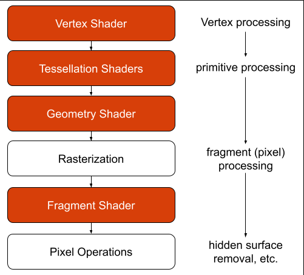
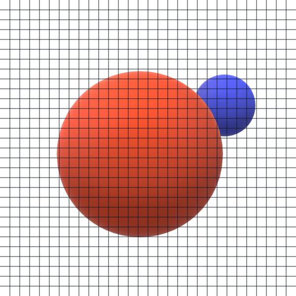

# CLOs
* CLO 2 - Describe the names and functions of the elements of the graphics pipeline, as well as the input and output of each stage.

# Introduction

I know, I know. I am throwing a lot of non-code stuff at you, and I am sorry, but it is important to have a mental model of how the *OpenGL Pipeline* is structured. This will help you better understand how your code will be processed by the GPU.

# OpenGL Pipeline

Why is it called a "pipeline"? This is just the term we use when it comes to how the data is processed. To put it simply, data goes in one end, has things done to it, and something comes out the other end (pixels on the screen).

You can also think about it as a conveyor belt in a factory assembly line. Raw materials or parts go into the assembly line. At set stops along the conveyor belt the product is changed in some way. For example, in a car factory, the first stop may be welding together the frame. The next stop could be adding the drivetrain. The next stop could be adding the engine. Then it could go onto finishing the interior before the final paint job.

Each stop has its own job to do and really doesn't really need to know what came before or what comes next other than in regard to its own tasks. Also, the factory doesn't run in reverse, the product always moves forward through the steps.

The OpenGL pipeline is similar to this factory. Every vertex in the scene will be sent through the pipeline, and it will be processed by the different stages along the way. Complex scenes could have *millions* of vertices that pass through the pipeline.

You may be curious how we can process so many vertices at once. Well, modern GPUs have been finely tuned to run *thousands* of parallel pipelines simultaneously. In this way, a GPU will be processing large chunks of the scene at the same time. As the data comes out the end of each pipeline it is assembled into a final image written to the screen buffer.

Here is a diagram showing the major parts of the OpenGL Pipeline:

  
<figcaption>OpenGL Pipeline Overview</figcaption>  

The stages of the pipeline that are in Beaver Orange are *programmable*. This means, we, as the developers, must tell the GPU what to do using GLSL (the OpenGL Shading Language). The stages that are in white are (on the whole) handled automatically by the GPU.

The application we write using the OpenGL API will pass off data directly to the Vertex Shader (required). The data will then pass through the two Tessellation Shaders and then the Geometry Shader (all are optional). Then it passes through the rasterizer before moving onto the Fragment Shader (required). Finally, the GPU performs Pixel Operations before writing to the frame buffer.

## Vertex Shader

This is the first required shader that you must write. The input for this shader is *one vertex* at a time. The output will be *one vertex*. Wait, we input a vertex and output a vertex; what's the point!? Well, we can do many things to the vertex between input and output. For example, we can transform it (e.g. for bump mapping). We can apply per-vertex lighting. When ever we are done with our manipulations, we must set `gl_Position`, which takes a `vec4`. A `vec4` is a defined type representing a vector with four parameters. When setting `gl_Position` the first three parameters will be x, y, and z. The fourth we will typically set to "1.0", which helps make the matrix math easier later.

## Primitive Assembly

While the Vertex Shader processes a single vertex at a time, the later stages will perform operations on OpenGL Primitives: points, lines, and triangles. Our application will specify which ones we are using at any given time, but the GPU itself handles grouping the vertices passed to it into the primitives. This makes the assembly one of the *fixed* parts of the pipeline.

For example, if you send in three vertices using `GL_POINTS`, the GPU will draw three individual points to the screen. If you were to send the same three vertices using `GL_TRIANGLES` the GPU would interpret them all as a unit and draw a triangle to the screen.

This is what we mean when we say "Primitive Assembly"; putting the vertices into groups as specified by the OpenGL API calls. This stage also 

## Tessellation Shaders

These shaders are a bit beyond the scope of this course, so we won't be writing any of these ourselves. Don't worry, as stated above, these shaders are optional so we can still write fully functional applications without them. That said, it is still worth knowing about them.

Tessellation Shaders are designed to subdivide areas of objects into more vertices. Why would we want to do this? One common usage of Tessellation Shaders is for improving the efficiency of a scene by using low-poly meshes (objects with a limited number of vertices) when rendered far from the camera and having the GPU "add" detail as the object moves closer to the user. This is often done with terrain generation, with the parts of the mesh further from the camera rendered with fewer vertices than those closer to the camera.

## Geometry Shader

Like Tessellation Shaders, Geometry Shaders are option and go beyond the scope of this course. Also like Tessellation Shaders, we really should have at least some understanding of Geometry Shaders.

Unlike Tessellation Shaders, Geometry Shaders are for changing the geometry of the primitives passed in, whereas the former focuses exclusively on subdivision. This allows Geometry Shaders to not only add vertices, but to also remove them. These shaders are often used for creating things like low-poly grass or 2D trees in the distance. The programmer can specify which vertices represent the base of blades of grass, and the Geometry Shader can create a line or string of triangles to represent it. For those who like technical terms, this is called *billboarding*.[^1]

## Rasterization

This is one of the *fixed* parts of the pipeline and we can't really modify it. This stage takes the output from the last shader used. In our case, this will be the output of the Vertex Shader converted into primitives. Remember, the Vertex Shader only outputs a single vertex, but other stages rely on primitives.

Typically, the primitives the *Rasterizer* will use will be triangles. Its job is to convert these primitives that represent parts of a 3D scene into *screen-space* (an x, y position) and calculate the depth (z position) of each primitive. These are called *potential-pixels* and are actually *fragments*.

Ultimately, the rasterization process produces a grid representing the frame buffer. It uses math to identify which part of which primitives would show up at which pixels on a computer screen.

We can simulate part of this process using an image and overlaying a grid over it.

Here are some 3D spheres:

<figcaption>A small blue sphere behind and to the right of a large red sphere</figcaption>  

The rasterizer takes the screen resolution and divides up the frame buffer to match. Let's look at how this scene would *look* to the rasterizer with a grid where each grid-square represents one pixel.

<figcaption>A small blue sphere behind and to the right of a large red sphere with a 20x20 pixel grid</figcaption>  

Yes, they are massive (20x20 pixels each), but this is just for demonstration purposes.

When the GPU sets out to turn this scene into something that can fit into the frame buffer, it needs to identify all the parts of the scene that *could* possibly show up for each pixel. For each of these *potential pixels*, the rasterizer creates a *fragment*. Fragments represent all the data that a single pixel needs to be drawn. This includes the x and y positions on the screen and depth, but also a color, surface normals texture coordinates, etc.

Why do we want the fragments to have a depth value?

**HIDE ANSWER: If you said, "Because we want to know which fragment to draw if there are more than one for a pixel," you would be correct! We don't want to waste time redrawing the same pixel over and over, so the GPU will use something called *Z-culling* where only the fragment closest to the camera is drawn. OpenGL doesn't do this by default and instead has to be told using `glEnable(GL_DEPTH_TEST);` Furthermore, while some GPUs perform some culling in the rasterizer, the phase mainly responsible is *Pixel Operations*.**

## Fragment Shader

This is the second *required* and also the *last* shader that you must write. If you have been keeping track, you will notice that there are only two shaders you need: vertex and fragment. The *Fragment Shader* will perform the final GPU processing to determine exactly what color a pixel will be. We do this by assigning a `vec4` to the GLSL variable `gl_FragColor`. 

As you may have noticed, we will be using `vec4`s *a lot*. Unlike when we used it for the Vertex Shader, where it contained values for x, y, z, and a final 1.0 (for math purposes), the `vec4` here contains an RGB color. But, wait! RGBs have three values, not four! You are right, but think back to our discussion of *Additive Color*, the final slot holds the alpha-value, which represents transparency. 

In most instances, this value will be "1.0" because we are likely z-culling. "But how do games and movies render things like windows?" you may ask. Great question! Typically, this is done with a two-pass approach, where one pass ignores the window and calculates the pixel color. Then, the next pass inserts the window object, but skips writing to the z-buffer, so the objects beyond the window aren't overwritten. The shaders then *blend* the window color/lighting/refraction with the values already in the buffer.

Let's take a look at our example scene that we put the grid over. For each grid-square, the Fragment Shader will determine what color to use. Notice how the balls aren't all one uniform color? That is because they are being lit by a light source above the spheres.

The Fragment Shader is going to be responsible for calculating how the light affects each fragment. This shader will also handle any texture mapping needed. Taking all these elements into consideration, we will tell the Fragment Shader how to blend all these factors into a final color.

For our little example the lighting color has already been applied and there are no textures, so now we just need to fill each box with the appropriate color. We are going to keep it simple and just use the average color that shows up in each grid-square. Once the fragment shader determines the correct color it sets `gl_FragColor` and passes it on to *Pixel Operations*.

## Pixel Operations

During this phase, OpenGL performs the final steps to push pixels to the screen. *Pixel Operations* does many things, but for now we want to focus on *Hidden Surface Removal* (HSR). This is where the fragment depth comes into play. 

As pixel colors come out of the Fragment Shader, OpenGL attempts to place them in the corresponding slot in the Frame Buffer. As pixels are drawn into the *Frame Buffer*, a *depth* value for that pixel is loaded in to the *Depth Buffer*. If a new pixel is generated for the same slot, OpenGL will only keep the one closest to the camera (if z-culling is enabled). By comparing the new pixel's depth value to that in the *Depth Buffer*, OpenGL is able to determine which one is closer to the camera. If any changes must be made, then both the *Frame Buffer* and *Z-Buffer* are updated before the next fragment is processed. 

As mentioned above, some GPUs perform z-culling *before* this stage, and it is handled by the hardware itself to discard multiple fragments at once if they are completely obscured. This happens after rasterization before any fragments are sent to the Fragment Shaders. This "Early Depth Test" is an optimization as it reduces greatly the amount of cycles wasted running shaders on fragments that will never be seen.

So, why do we still need *Pixel Operations*? Well, the early z-culling only works under fairly limited conditions. For example, if a scene incorporates transparency, which requires blending, the fragments can't be culled early. Given how advanced modern computer generated scenes are, we absolutely cannot count on early z-culling exclusively, so *Pixel Operations* is still required in most instances. Luckily, this phase is non-programmable, so even if we don't optimize our shaders for early z-culling, it will still be done here if we have turned on HSR with `glEnable(GL_DEPTH_TEST);`.

## Framebuffer

This isn't part of our pipeline, but it is the ultimate result so I felt it appropriate to include here. After Pixel Operations, the Frame Buffer is full of color values ready to be sent to the screen.[^2] We do this by calling `glfwSwapBuffers(window);`. This moves the current render buffer to the "back" and moves the just populated buffer to the "front." Now when we do our next rendering pass, we will clear the "back" buffer and start writing new data.

## Results

Now that we have swapped the frame buffers we can now display our scene! Behold our spheres!

<figcaption>A pixelated scene consistiong of a small blue sphere behind and to the right of a large red sphere</figcaption>

Isn't it *lovely*!? Wait, you aren't impressed? Sure, it is rather blocky, but that is because each "pixel" in our example is actually 20x20 pixels each. This was for illustrative purposes only, jeepers! The higher the number of pixels the frame buffer can hold, the more detailed the scene will appear. 

## Wrapping it all up

So, we just went over quiet a bit of information and much of it likely makes little sense at the moment, but trust me, as we progress through the course things will start falling into place. To help with that, here is a very succinct "Mental Model" of the pipeline:

Quick Mental Model of the Pipeline:

* Vertex Shader - Transform each and every vertex in the scene. This includes displacing vertices and assigning texture coordinates.
* Primitive Assembly - Group up the vertices in "shapes" (points, lines, triangles).
* Tessellation Shaders (optional) - Adds detail to objects by subdividing on the fly.
* Geometry Shader (optional) - Add or remove vertices from primitives.
* Rasterization - Which pixel does this polygon touch? Generate fragment for each.
* Fragment Shader - What color/effects need to be applied for this given pixel?
* Pixel Operations - Which candidate pixel actually will be written to the frame buffer?

[^1]: Taking a single point and expanding it into a 2D object that is always facing the camera, thus giving the impression of it being 3D.  
[^2]: Technically, the Frame-Buffer can send the data anywhere, including a file. This allows for some cool effects using something called multi-pass rendering. This allows for things like shadow mapping, mirrors, drawing outlines around objects, and things like light blooms and motion blurs.