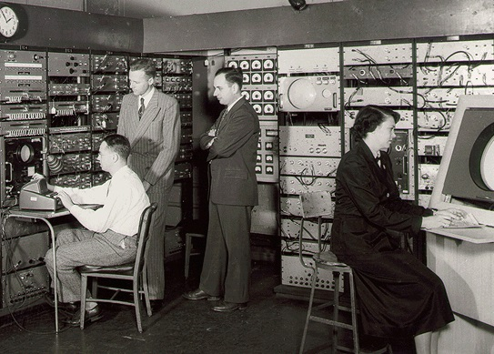
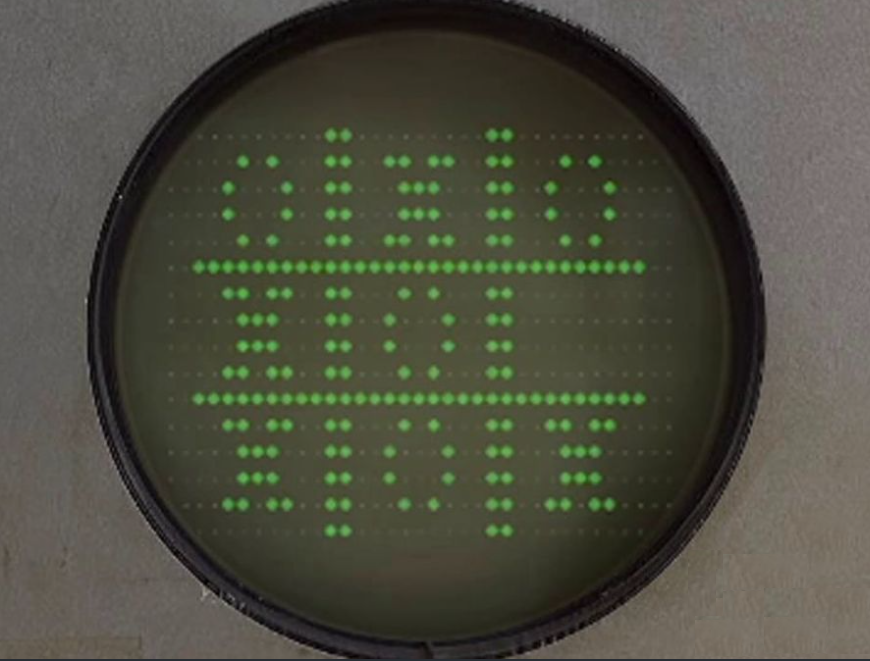
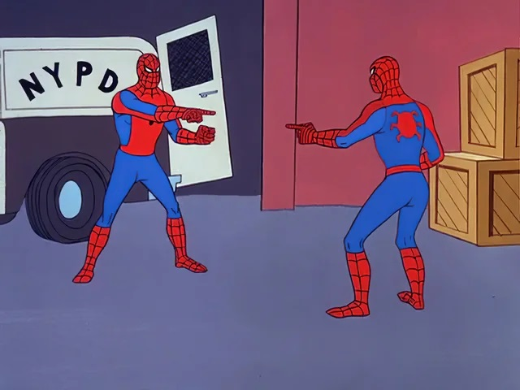
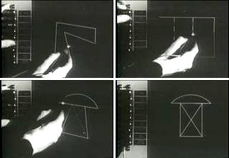
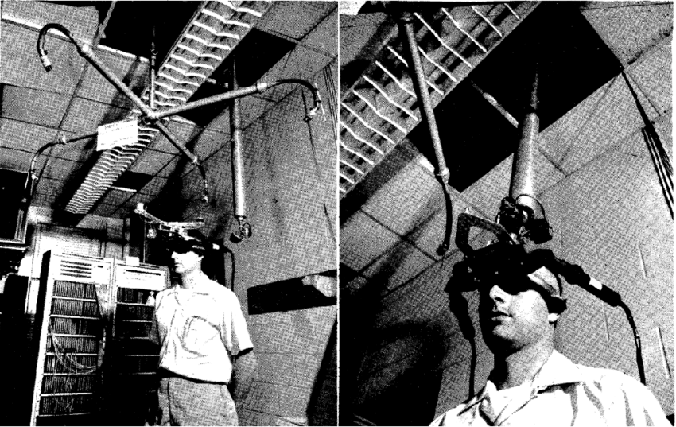
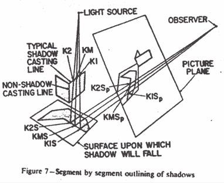
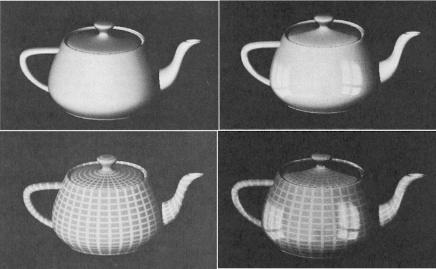
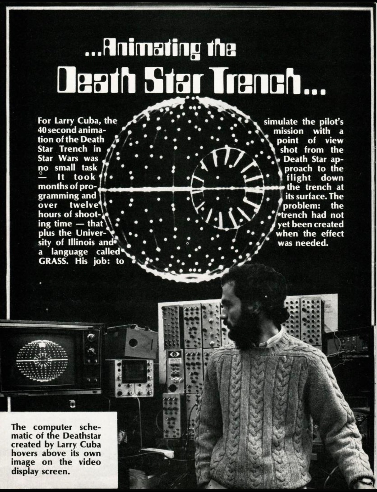

# Introduction
<figure>
<blockquote>

You can't really know where you are going until you know where you have been.

</blockquote>
<figcaption>- Maya Angelou</figcaption>
</figure>  

I will be honest, I have never had the pleasure of reading anything by Maya Angelou, but as a history major, I always loved this quote. Too often, we have our eyes set on the horizon that we forget what came before. We wouldn't be where we are today without those that paved the way. As Sir Isaac Newton stated,

<figure>
<blockquote>

If I have seen further it is by standing on the shoulders of Giants.

</blockquote>
</figure>

We are all part of a long tapestry of history. Just as nothing we achieve would be possible without the work of those who strove before us, nothing that comes next will be possible without what we do today. Take pride in knowing you are about to join the never-ending chorus of progress!

I am sorry, was that a bit much? Sometimes I get carried away in romanticizing all aspects of life. If you prefer something more *practical*, allow me to present a different framing.

Sometimes I find myself struggling to envision a solution to a problem; I can't find a road out, and I begin to think it is impossible. At times like these, I find it helpful to look back at how things were and the barriers that had to be overcome. By examining how prior programmers tackled seemingly insurmountable odds, I am both buoyed and humbled. Humans are infinitly resourceful, and we must never assume we can't *ever*, just can't *yet*.

Therefore, please induldge me as I chronocle some key milestones in the history of Computer Graphics. As I laid out in the **Why we are here Module**, my path to this course runs directly through video games, so this is where we will spend most of our time. I apologize in advance.

# Key Milestones
## 1950s
Behold the Whirlwind![^1]

  

<figurecaption>Whirlwind</figurecaption>  

This mighty beast had a price tag north of *$3 million* in 1951 dollars and occupied 2,500 sqft (more than the average single family home at the time). You see the woman (Ramona D. Ferenz) on the right? She is sitting in front of the very first real time Cathode Ray Tube (CRT) displays! 

The man on the left (Stephen H. Dodd) would program the computer and the output would display on the CRT display as lines and dotes. Unlike what you are using to view this page, this display was a vector display (as opposed to a raster display). The operator of the display would use a light gun to select targets during the air defense simulations the computer was used for.

One of the universal truths of the human condition is that any computer will be almost immediately co-opted for playing games. In 1952, A. S. Douglas repurposed one of the three monitors of the EDSAC[^2] to play "noughts and crosses" (British for tic-tac-toe). It was one of the first known computer games ever written.

  
<figurecaption>OXO running on the EDSAC computer at the University of Cambridge</figurecaption>  

Before we leave the 1950s, let's take a look at the first *real-time* computer game created: Tennis for Two. The game was written by William Higinbotham in 1958. Mr. Higinbotham worked on the Manhattan Project and specialized in civilian atomic power applications. In an effort to excite visitors to the lab, Mr. Higinbotham wrote a tennis simulator that used real physics (including wind resistance!). This was super impressive; just look at it!

**EMBED YouTube video: https://www.youtube.com/watch?v=6PG2mdU_i8k**

## 1960s

It is in 1960 that we first come across the phrase "Computer Graphics." William Fetter (a graphics designer at Boeing) is credited with the coining the phrase. Oddly enough, he himself attributes the origination to his coworker Verne Hudson.

In 1962, Steve Russell created *Spacewar!*, which is widely considered the very first "distributable" video game. The games discussed above were written for a particular computer and couldn't be installed on another. *Spacewar!* was designed for the PDP-1 minicomputer, which was designed for commercial sale.[^3] This meant that anyone with a PDP-1 could install the same software.

**EMBED STEVE RUSSELL VIDEO: https://www.youtube.com/watch?v=PnJvZHegg8I**

The next year, in 1963, computer graphics achieved a significant milestone: a graphical user interface (GUI). The program was called Sketchpad, and it was created by Ivan Sutherland as part of his PhD thesis.[^4] Not only was it a GUI first, Sketchpad also ushered in the era of Human Computer Interaction (HCI) and the program itself helped spawn the concept of Object Oriented Programming (OOP).

<figurecaption>Demonstration of using the light pen to draw on the display</figurecaption>

That same year saw the first computer-animated film titled *Simulation of Two-Gyro Gravity-Gradient Attitude Control System* (by E.E. Zajac of Bell Labs). I know, a real attention grabber! Despite the relatively dry nature of the film, I can't help but be super impressed by how well this animation works considering it was written using *punch-cards*.[^5]

**EMBED SIMULATION VIDEO: https://www.youtube.com/watch?v=GBlQb6Me_1k**

The early 1960s was also the time Pierre Bézier published his work on Bézier curves (yes, he named them after himself). If these sound familiar, it is because they are still used today to mathmatically define smooth curves between defined "control points." He used them for designing cars, but we will use them for creating smooth surfaces in our 3D scenes.[^6]

Remember Ivan Sutherland? He went onto found Evans & Southerland and developed the *Sword of Damocles*, the world's first head-mounted display. This would be one of many attempts to make real the dream of Virtual Reality (VR). While technologically impressive at the time, when you see it, you realize pretty quickly why it didn't gain mainstream adoption.

<figurecaption>Note the need to suspend the Sword of Damocles from the ceiling due to weight</figurecaption>

Right before the 1960s closed out, Arthur Appel wrote a paper title "Some Techniques for Shading Machine Renderings of Solids."[^7] In this siminal paper, Mr. Appel introduced to the world the concept of **ray-casting**: better known today as **ray-tracing**. The idea was to cast out rays from the "eye" and the first object touched in the scene by each ray would become the pixel painted to the screen. We will cover **ray-tracing** in greater depth later in the course.

<figurecaption>Figure from Arthur Appel's paper showing ray-casting</figurecaption>

## 1970s

Now we are getting to the era of computer graphics that I remember learning about as a little kid. And what better way to kick off the decade than *Pong*? The iconic white dot ping-ponging (ugh, I hate puns) back and forth across a screen is perhaps the most identifiable video game image outside of Nintendo's Mario. Introduced in 1972, *Pong* took arcades by storm (and spawned a massive lawsuit from Magnavox).[^8]

By this time, universities were getting into the game and were churning out research papers on 3D graphics techniques that are still used today. The University of Utah had established a computer graphics program back in 1965, and it was from here that we got the following topics:

* Gouraud shading (1971) - a method for interpolating shading on triangle meshes to smooth the surfaces.[^9]
* Z-buffer hidden-surface removal (1974) - a method to reduce the amount of rendering required for a scene by removing obscured pixels.[^10]
* Texture mapping (1974) - a method of taking a 2D texture and "wrapping" it around a 3D object.[^10]
* Phong reflection model (1975) - the standard method used today for lighting incorporating ambient, diffuse, and specular values.[^11]
* Bump mapping (1976) - a remixed versiond of texture mapping where a 2D texture is used to store height values to give flat objects the apperience of additional vertices.[^12]

Perhaps the most recongnizable thing to come out of Utah is a *teapot*. I know many of you are thinking, "What lunacy is this? What is so special about a *teapot*?" Well, I will accept your apologies once you cast your gaze below.

  
<figcaption>The Utah Teapot (aka Newell's Pot) in four different renderings</figcaption>

This is *the* reference model that all fledgling graphics programs use. Consider it the "Hello World" of graphics programs. It was designed by Martin Newell for his Phd thesis.[^13]

Meanwhile, over the Rockies at Xerox PARC, they were busy inventing the **framebuffer** to use in SuperPaint (1973). That same year, our friends from Evans and Sutherland produced the Shaded Picture System, which was one of the first raster computer system to generate 3D renderings. Both these developments ushered in the age of raster displays, which focused on displaying pixels. 

Up until this point, most of the displays we have been discussing were vector displays. Since raster displays use pixels, they can fall victim to "jagged" images whereas vector displays rely on mathmatical equations to create infantly scalable smooth images. The drawback to vector displays was that they were limited to lines and simple shapes, and couldn't diplay photorealistic colors.

In 1975, George Lucas founds Industrial Light and Magic. While their fame steamed (rightly) from their work with practicle effects and sound editing, they also began work in computer graphics. In fact, they snuck in one of the first 3D animations in a feature length film during *Star Wars*. 

  
<figurecaption>Magazine page showing the Deathstar wireframe and the creator Larry Cuba[^14]</figcaption>  

Let's wave goodbye to the '70s with *Space Invaders*. Created in 1978, this game was one of the first to use a microprocessor. This meant that the action on screen was dictated by coded software, not by physical logic gates like most arcade machines at the time. *Space Invaders* also ditched vector displays and popularized raster graphics: hence the blocky nature of the sprites.

## 1980s

The early 1980s saw the end of the first wave of home video game systems. Atari, riding high off it's success of the late '70s, like Yertle the Turtle, over extended itself and brought about a global recession in video games. Their sad tale ended with the burial of some 800k *E.T. the Extra-Terrestrial* cartridges in a landfill.[^15]

# Key Paradigms
## Hardware Era
## Software Rendering Era
## Fixed-Pipeline Era
## Programmable-Pipeline Era

[^1]:[The Whirlwind Computer at CHM](https://computerhistory.org/blog/the-whirlwind-computer-at-chm/)
[^2]:[EDSAC - Electronic Delay Storage Automatic Calculator](https://www.tnmoc.org/edsac)
[^3]:[PDP-1](https://www.computerhistory.org/pdp-1/)
[^4]:[No-code History: Sketchpad](https://instadeq.com/blog/posts/no-code-history-sketchpad-a-man-machine-graphical-communication-system-1963/)
[^5]:[Punched Cards](https://www.computerhistory.org/revolution/punched-cards/2)
[^6]:[The birth of Bézier curves and how it shaped graphic design](https://www.linearity.io/blog/bezier-curves/)
[^7]:[Some Techniques for Shading Machine Renderings of Solids](https://graphics.stanford.edu/courses/Appel.pdf)
[^8]:[The Case of the Video Game Lawsuit Racket](https://www.lexology.com/library/detail.aspx?g=97305af8-1f69-4f7f-a0cf-8e92dc05a0fb)
[^9]:[Continuous Shading of Curved Surfaces](https://ohiostate.pressbooks.pub/app/uploads/sites/45/2017/09/gouraud1971.pdf)
[^10]:[A Subdivision Algorithm for Computer Display of Curved Surfaces](https://ohiostate.pressbooks.pub/app/uploads/sites/45/2017/09/catmull_thesis.pdf)
[^11]:[Illuminatino for Computer Generated Pictures](https://users.cs.northwestern.edu/~ago820/cs395/Papers/Phong_1975.pdf)
[^12]:[SImulation of Wrinkled Surfaces](https://www.microsoft.com/en-us/research/wp-content/uploads/1978/01/p286-blinn.pdf)
[^13]:[The Most Important Object in Computer Graphics History Is This Teapot](https://nautil.us/the-most-important-object-in-computer-graphics-history-is-this-teapot-235818)
[^14]:[Animating the Death Star Trench](https://ballyalley.com/articles_and_news/animating_the_death_star_trench.pdf)
[^15]:[Atari: Game Over](https://www.youtube.com/watch?v=03oC6-zPZHQ)