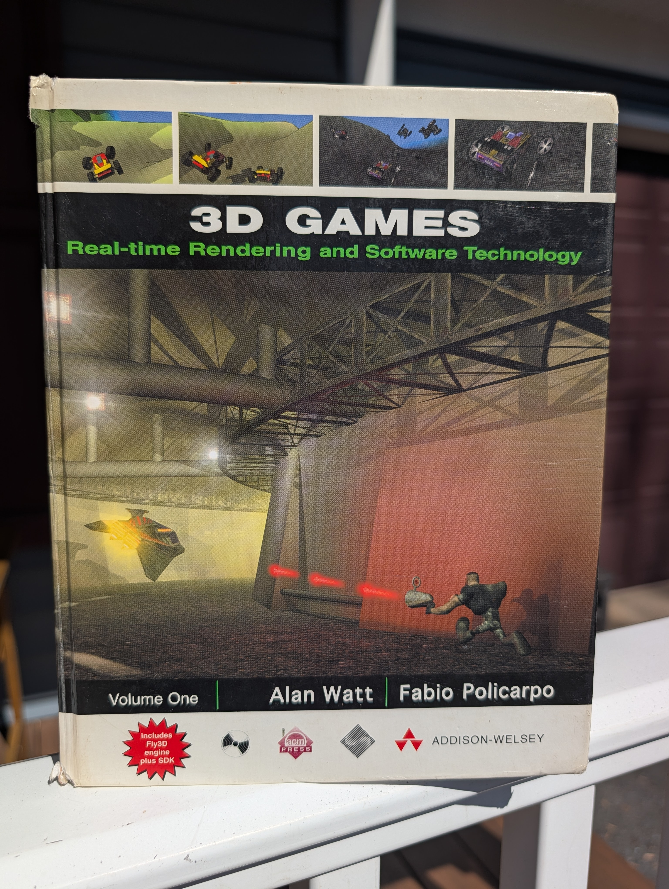
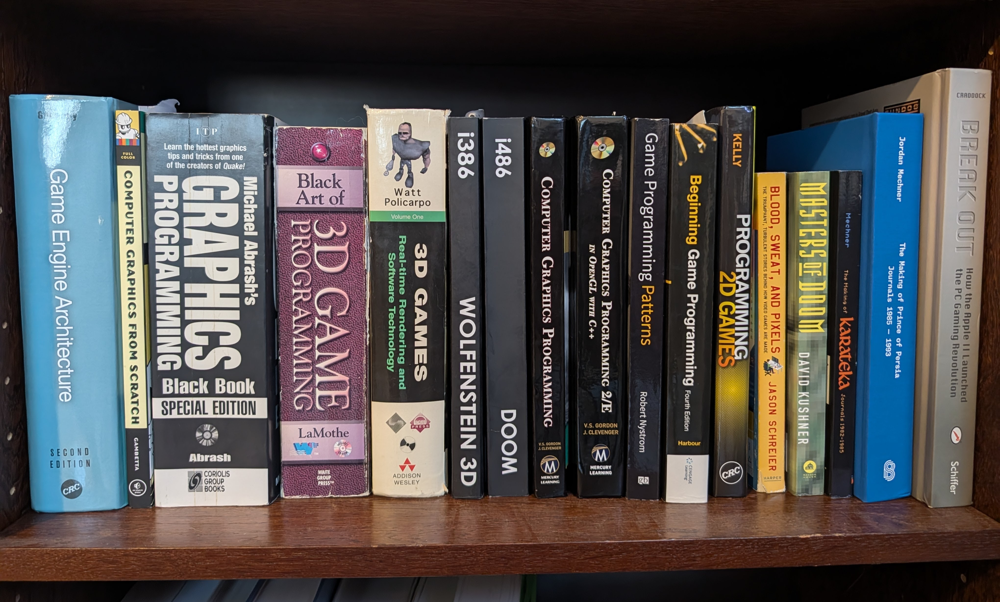

# Introduction
Over my many years of teaching, I have taught a wide array of subjects. I cut my teeth by teaching high school Latin. When Latin enrollment dropped, I taught Classical Studies and SAT Prep. In the Marines, I mentored junior Marines in everything from how to set up and fire a mortar to running a drug screening program. At OSU I have taught Web Dev, Cloud Computing, Software Engineering, and now Graphics. At GaTech I host seminars on Future Educators, Futurism, and Engineering in Popular Culture. No matter what I am teaching, one thing I always keep in mind is *the why*. 

By this time, I am sure you are all intimately familiar with [*stakeholder analysis*](https://en.wikipedia.org/wiki/Stakeholder_analysis). When crafting software we want to know what the stakeholders' requirements are and often focus narrowly on features. I contend that this is a mistake, and that we need to also examine the *motivations* of the stakeholders. It is our motivations that hold our *true* requirements.

Why would creating a course be anything different? OSU dictates the Course Learning Objectives (CLOs) that a course must meet. These CLOs have to align with our accrediting body (ABET). While these stakeholders are important, they are not my primary concern. My concern is *your* motivations. *Why* are *you* here? 

This will be the first offering of the completely redeveloped CS450/550 so I am only able to guess at your reasons for being here (it is an elective after all). My hope is to update the course dynamically to address the various motivations of *you* the students. With this in mind, please take time to explain your *why* on Ed ([INSERT ED LINK](www.addlink.com)).

# My Why
It would unfair (and ungentlemanly) to ask you to share your *why* and not to reciprocate. Additionally, I believe students benefit greatly from knowing the motivations of their instructors. Knowing my journey to this place positions you all to better understand my design choices and, honestly, makes me more *human*.

I am a child of the 90s. I grew up playing video games: both console and PC. My mind has always been geared toward tinkering and I wanted to understand the nuts and bolts of things. Watching 1s and 0s being turned into interactive worlds seemed like pure wizardry.

It wasn't until [Doom](https://en.wikipedia.org/wiki/Doom_(1993_video_game)), and later [Half-Life](https://en.wikipedia.org/wiki/Half-Life_(video_game)), that I was able to look under the hood and examine how these feats were achieved. To my great dismay, I discovered that I couldn't make heads or tails of the source code. From that moment my quest was to learn to program so I could unlock these dark secrets. 

I remember going to Waldenbooks in search for any materials that could help me on my quest. I still have the book I bought over 20 years ago!

If I am being honest, I bounced off hard from this book. Page 4 started talking about matrix math, which I didn't even know was a thing my sophomore year of high school. I concluded that I needed to build up my foundational knowledge before the mysteries of game programming would be unlocked.

Sadly, before I could do so, I was sidetracked by my love of Rome and all things ancient and ended up taking a different path: Classical Studies and History. But my love of programming never abated, and I kept writing code over the years. Like a magpie collecting shiny things, I ended up with a shelf dedicated to game design.

Unfortunately, I never found my way back to my initial motivations: until now. 

After decades of false starts and distractions, I was given a gift; Ben Brewster asked me to take over the graphics courses. It is now *my job* to finally fulfill my *why*. My heart swells knowing that my reason for learning to program has collided with my life's passion of teaching. I couldn't ask for a better subject to teach and I am excited to learn about your *why's* and to help you all fulfill your goals (hopefully in a more timely fashion than my own journey!).

