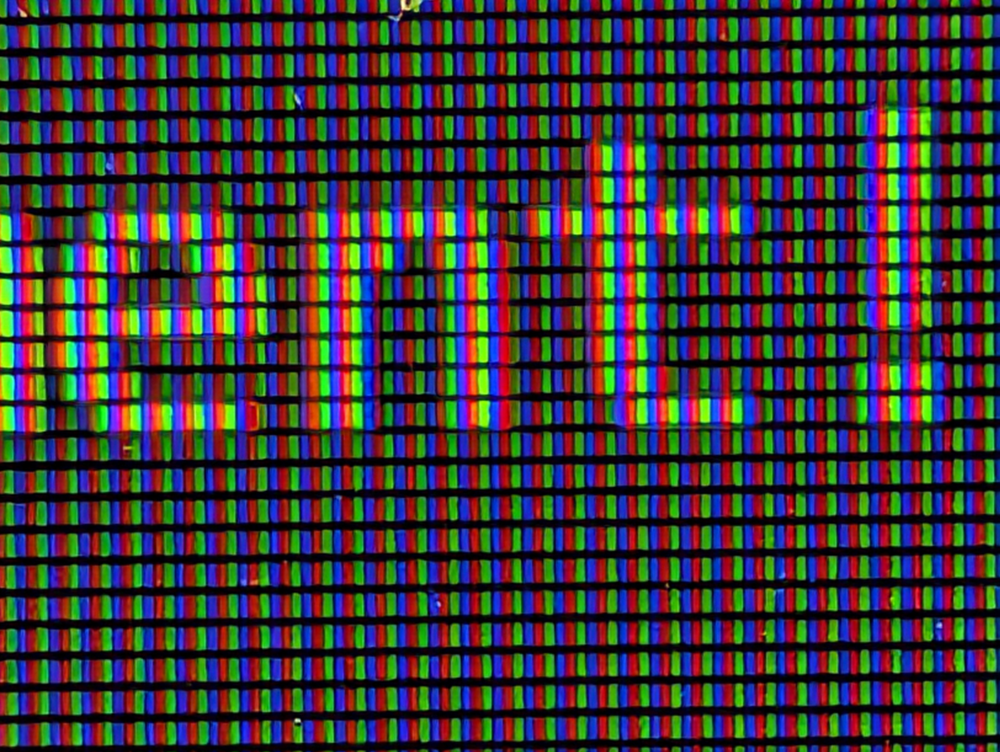

# Introduction

In order to write an OpenGL application, we need to use the OpenGL API. As mentioned, we will be using the C++ "flavor" of OpenGL's API. It will allow us to tell the computer what we want it to do on the way to displaying our 2D and 3D scenes. We will also need to utilize some of those frameworks we installed in Week 1. Remember, modern OpenGL has done away with much of the built-in functions and relies on developers specifying their own, or, more commonly, using 3rd party libraries.

# Getting Started

## Components to an C++ OpenGL Application

Let's start with a bird's eye view of what we need to have in our OpenGL application.
* Window Management - creating and destroying the window that will display our application
* Input Handling - monitoring for things like key presses or mouse clicks
* Error Checking - validating that things are working correctly

That's really it at the most basic level. Create a window to display our scene and gather input from the user before destroying the window when the application is closed. In order to these other steps, we will want to check to ensure things like windows are created correctly before we try to draw to them.

## Enough talk! Let's get to drawing!

OK! OK! I get it, too much exposition; you want to get started.

First, I want to stress that this class will use C++, but teaching the language is beyond the scope of this course. If you have learned another C-style language (e.g. Java or C#) you likely will have little trouble adjusting. If you have no experience with C-style languages, you may want to do a quick Google search for "C++ programming for **your_favorite_programming_language** programmers." You really just need a surface-level understanding of C++ to follow along with what we do here.

A good place to start is to take a look at our `test_install.cpp` and examine the parts. I highly recommend you open or print out this file to follow along during this exploration.

### Includes

The very first thing we need to have in our application's code are the *includes*. While we won't be using all of these for every project, it is worth getting into the habit of putting them all there. As a quick reminder for what each does:
* glew.h - loads all the function pointers from the GPU drivers
* glfw3.h - loads the functions that allow us to creat windows and manage input
* glm.hpp - loads all the math functions we will use for manipulating our scenes
* SOIL2.h - loads the functions needed to load textures easily in the proper formats

### Main
For now, we are going to skip over `init()` and `display()`, and move straight to `main()`. Don't worry, we will be coming back to this functions shortly.

The first line of `main()` is an if statement that calls `glfwInit()`. Clever readers can likely guess what this does based on the error message if this function returns a failed state: it initiates the GLFW functions.

Having checks like this in our code is always a good idea. We want to make as few assumptions as possible and exit at the earliest sign of a problem and not wait until things really come off the rails.

The next important line is where we create our window: `GLFWwindow* window = glfwCreateWindow(800, 600, "OpenGL Test", NULL, NULL);` Let's break this down.

We create a pointer to a `GLFWwindow` object and name it `window`. We then call `glfwCreateWindow` to create our window object. 

**NOTA BENE**[^1]: We are going to go over all of these parameters here, but if you ever find yourself forgetting what they are or in what order you should define them, you should go to  read the official documentation[^2] (or just Google the function name if you know it). Going to the source will save you time hunting through all the Canvas explorations looking for the needed information.
|Parameter Name | Value | Type | Purpose |
|----|----|----|----|
|width|800|int|width of the window (shocker!)|
|height|600|int|height of the window (double shocker!)|
|title|"OpenGL Test"|const char*|string shown in the window title bar|
|monitor|NULL|GLFWmonitor*|NULL indicates Windowed mode (vs. Fullscreen)|
|share|NULL|GLFWwindow*|Non-NULL would allow sharing contexts across windows (not used in this course)|

We then use this `window` pointer in the following if statement to verify that it was actually created.

One thing we didn't do in the `test_install.cpp` program is specify a version of OpenGL our code will be targeting. When testing our install, we wanted to keep it as simple as possible, but when you actually write your application you will want to specify which version of OpenGL it requires to run. 

Why is this need you may ask. Well, not all the features of OpenGL are supported by all GPUs or even platforms. For example, if you want to use *Geometry Shaders* you need at least OpenGL 3.2. In order to specify our version in our application, we actually specify it for the window we will create.

So, before creating our window, we want to add "hints". For this course, we want to target OpenGL 4.1. We are going to use this version because it is the last version supported by MacOS and we won't be actually writing any *Compute Shaders*, which were introduced in 4.3.

We will need to set both the *major version* (the number before the decimal) and the *minor version* (the number after the decimal). We do that with the following two function calls *before* creating our window.
* `glfwWindowHint(GLFW_CONTEXT_VERSION_MAJOR, 4);`
* `glfwWindowHint(GLFW_CONTEXT_VERSION_MINOR, 1);`

If for some reason the system we are trying to run this code doesn't support OpenGL 4.1, our window creation will fail. We would then need to investigate which version of OpenGL currently was available and update if necessary/possible. 

We now need to tell GLFW what our current *context* is. The context is just the current state of OpenGL we wish to use. To set the context, we will use our `window` pointer.
* `glfwMakeContextCurrent(window);`

After this statement, you will see `glewExperimental = GL_TRUE;` This needs to be done after we set our context in the previous function call. This tells GLEW (the OpenGL Extension Wrapper) to ensure all the necessary OpenGL extensions (including things like the Core Profile) are loaded. This can be very important if you are writing code to target MacOS.

We now need to verify that GLEW is working by calling `glewInit() != GLEW_OK` in an if statement. If it isn't OK, we display an error message and exit.

Now we need to enable *Vertical Sync* (VSync). We do this to help reduce *screen tearing*.[^3]

Next, we want to send our currentl window context to our `init()` function. Considering that `init()` is currently *empty*, this doesn't do anything for us at this time, but soon we will be using `init()` to do a lot of setup for our application and it will need the window context.

For now, we are going to skip ahead past the testing file's code about glm and SOIL2. These lines of code were only for testing purposes, and we will discuss how to use them at a later point.

Therefore, let us skip ahead to our *rendering loop*. This is just a fancy name for a while loop that executes until the window closes.
* `while (!glfwWindowShouldClose(window)) {...`

This loop will run until GLFW detects a condition that closes this window. This typically means clicking the "X" at the top of the window or through a keyboard command to close the window.

Typically, we will want the following three function calls (at the very least) in our `display()` function and in this order:
* `display(window, glfwGetTime());`
* `glfwSwapBuffers(window);`
* `glfwPollEvents();`

Now, let's go back to the top of the file and examine the `display()` function. Currently, it is *very* simple. We have just two calls.
* `glClearColor(0.84f, 0.25f, 0.03f, 1.0f);`
* `glClear(GL_COLOR_BUFFER_BIT);`

Notice that both of these start with `gl`. These are our first honest-to-goodnes OpenGL functions! YAY!

The first specifies what color we want to use when we *clear* the screen. When it comes to clearning, imagine you are wiping everything off the screen, and it is replaced with the `glClearColor`. 

Colors in OpenGL default to RGB (Red, Green, and Blue). RGB color is something called *Additive Color*. Many of you likely know how to mix colors using the primary colors (Blue, Red, and Yellow). Well, that doesn't work with computer screens. The monitor will use RGB color.

Don't believe me? Take your phone and zoom in on your screen to see that each pixel is made up of LEDs of red, green, and blue. Here is an example of me doing just that on this very document!

  
<figcaption>Close of my computer screen showing red, green, and blue LEDs</figcaption>

We won't go into detail on the science behind additive color, because we only need to know that we need to use RGB color for our work in this course.

Now, some of you may already be familiar with RGB colors. You likely have seen RGB colors formatted as either a series of three numbers ranged from 0-255 (ordered Red, Green, and then Blue). For example, (215, 63, 9) represents Beaver Orange. We can also represent this as a HEX number: #D73F09. 

In the code we have `glClearColor(0.84f, 0.25f, 0.03f, 1.0f)`, which represents Beaver Orange. But, wait! That doesn't look anything like either RGB or HEX color codes we just went over!

Yeah, OpenGL likes to have many things range from 0-1.0 (normalized floats). So, if we want to convert an RGB representation into something OpenGL can use, we will need to divide each RGB value by 255.0. You can do this by hand, write a function to do the conversion for you, or use an online converter.

But, wait! `glClearColor` had *four* parameters, not the expected three needed for RGB. You are right! What do you think that last float is going to be used for?

**Hide Answer: It is the Alpha value! This controls the *opacity* of color. A value of '1.0' is 100% opaque. Typically, we will stick with '1.0' when specifying colors and just let our shaders handle any translucency needed.**

Once we set our *clear color*, we want to actually clear out the frame buffer and replace all the pixels with our clear color. `GL_COLOR_BUFFER_BIT` represents the buffer that is currently targeted for color writing (see front and back buffer discussion below). When we use this built-in *enum* with `glClear()`, we wipe the buffer and replace it with beautiful Beaver Orange!

One last thing about the `display()` function. We don't just send the current context (`window`), but we also pass in the current time (`glfwGetTime()`). We don't use this in our sample code, but later we will need to know how much time has passed between rendering passes. This will help us maintain consistent, and therefore smooth, framerates.

We are almost done! We have just a few more elements to cover when it comes to creating an OpenGL app.

Under the `display()` function call, we have `glfwSwapBuffers(window);`. OpenGL is uses two buffers to manage the images on the screen. There is a **front buffer** *and* a **back buffer**. OpenGL writes into the *back buffer* during our `display()` function, and then that buffer is swapped into the *front buffer*. Why do you think it works this way?

**Hide Answer: What do you think would happen if OpenGL only used one buffer and wrote into it while also displaying it to the user? Well, we would end up with having some wild situations where part of the screen is being overwritten while part of the screen shows the last rendering pass. This would cause tearing and would make it very difficult for the viewer. So, the back buffer is only swapped once it is fully rendered and ready to be viewed.

The last element in `main()` is `glfwPollEvents()`. This is how we are going to monitor input from the user. Astute students may realize that our `main()` loop executes once for each frame rendered. We want to collect and then process any input the user has made since the last frame was generated. GLFW maintains an *event queue* and `glfwPollEvents()` pulls all the events that haven't been processed for processing. 

In our sample code, we don't do this manually, but GLFW has some default behavior built in, like closing the window if the "X" is clicked. This event would cause our `while` loop to terminate. We will be going into input processing more later in the course.

Finally, just like I am always telling my children, we need to clean up after ourselves. We do this by telling our application to destory the window (`glfwDestroyWindow(window)`) and to shut down GLFW (`glfwTerminate()`). Failing to do these two things won't cause the world to end, but it is the right and proper way of going about business and we want to be right and proper!

# Conclusion

[^1]: Nota Bene is Latin for "note well." In other words, "pay attention."
[^2]: [GLFW Documentation](https://www.glfw.org/docs/latest/)
[^3]: [Screen Tearing](https://www.reinterpretcast.com/screen-tearing)