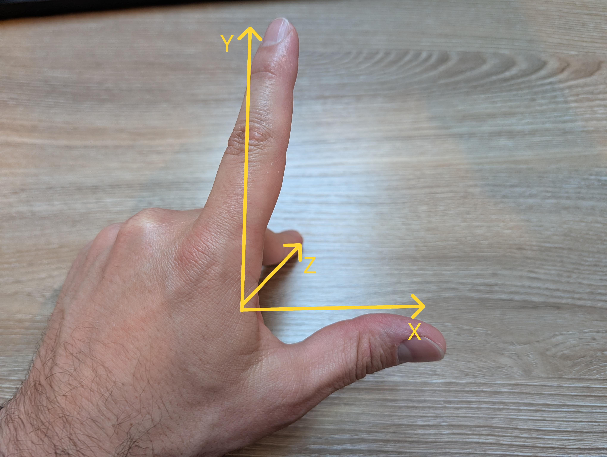
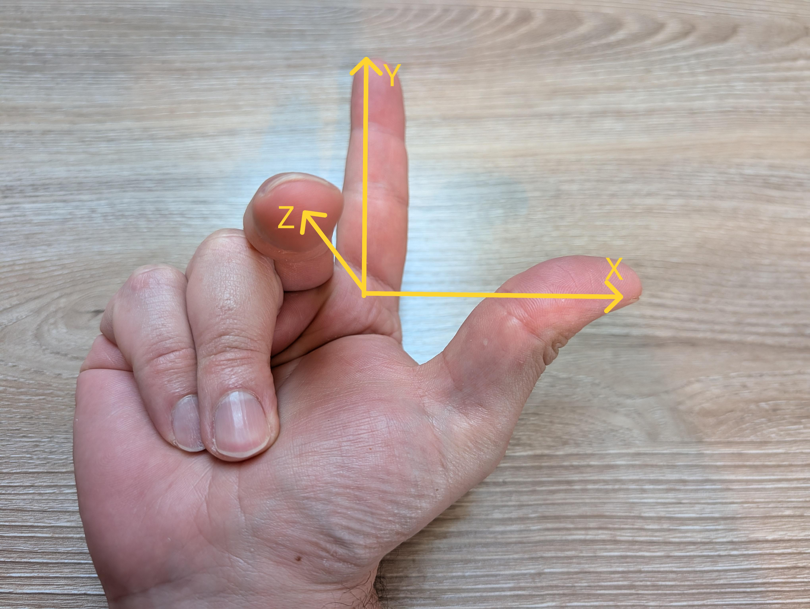
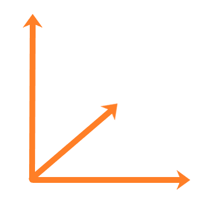

# Introduction

Whenever you step into a new world, it is important to learn the lay of the land. When it comes to Computer Graphics, we want to make sure we can describe where we are within the scene. In this exploration we are going to discuss *Coordinate Systems*. Make sure you understand these concepts well before moving forward, because knowing which way is up will save you a lot of headache later!

# Coordinate Systems

Likely, you all are very familiar with at least one coordinate system: the *Cartesian Coordinate System*. These are your standard x-y coordinates. A point can be described with by (X, Y), where X details where the point is horizontally, and Y details where the point is vertically. You also likely *instinctively* know which way both Y and X increase (to the right for X and up for Y).

So what happens when we move into 3D space and need to describe a point. If you thought "Add a Z coordinate!" you would be 100% correct! (X, Y, Z) describes a point in a 3D Cartesian coordinate system. Now, think to yourself, which way does Z increase?

If you don't feel confident in your answer, fear not! The truth is, there is no *right* answer. When talking about 3D space, we have to specify *which* of two configurations we are using: *right-hand* vs. *left-hand*.

So how can you tell one from the other? Well, you will see a lot of methods online describing how to use your thumb and fingers to highlight which configuration you are looking at, and many of them are confusing. I am going to share with you the one I use, but if you find something else online that makes more sense, use it. The goal is to have a mental model that *works for you*.

Below you will see two pictures of my hands. Please ignore any cuticle issues and the superglue all over my desk and focus on just the finger positions. The thumb will always be pointing in the positive X direction. The index finger will always point in the positive Y direction. The middle finger will always point in the positive Z direction. Simple right?

  
<figcaption>Left-handed configuration</figcaption>  

  
<figcaption>Right-handed configuration</figcaption>  

So, when you come across a random coordinate configuration in the wild, you will need to use your hands to identify if it is left-handed or right-handed. To do this, pick one of your hands and try to align the three axis as described above. If you can't without breaking something, then try the other one.

See if you can identify the handedness of the following set of axis. I am not giving you the axis labels either (so mean!):

  

**Find a way to hide the answer**
If you picked "Left-Handed" you would be correct!

# Configuration depends on the system used

OpenGL uses the right-handed configuration, so we are going to stick with that in this course, but it may interest you all to learn how other software works.

The following vendors use the right-handed configuration:
* Maya - 3D modeling and animation software
* Houdini - 3D modeling, animation, and VFX software
* Minecraft - uhh...its Minecraft
* Blender - open source 3D animation software
* Autocad - 3D design software
* GODOT - open source game engine
* Source - Valve's game engine
* NASA - North American Space Agency (they put people into space)

The following vendors use the left-handed configuration:
* Unity - commercial game engine
* Unreal Engine - the worlds most popular game engine
* ZBrush - 3D modeling software

I will be honest, it is a bit frustrating that the most popular game engines use left-handed configurations where pretty much everyone else agreed that right-handed was better. I mean, come on, who can argue with NASA? Anyone want to take a guess as to why Unreal Engine uses left-handed?

**HIDE ANSWER**
It is because DirectX uses left-handed coordinates and Unreal was developed to target Microsoft platforms from the start.

Now, who wants to be even more confused? If you raised your hand, you are my type of person. If you would rather not be confused...uhh...maybe just read this next part twice?

There is *another* wrinkle to handedness when it comes to coordinates. Remember how I said that the X axis will always point to the right? That was a lie. Different vendors orient the axis differently.

For example, NASA, which, despite this, is a great orginization, decided to buck all the others and point the X-axis *up*! So if you are trying to make head-or-tails of NASA coordinates, you will need to point your thumb up, your index finger toward you, and your middle finger to the right. Go ahead and try, but I am not paying any medical bills for strains! Luckily, NASA seems to be the only major player with this crazy configuration.

The following groups have the Y-axis point up:
* Unity
* ZBrush
* Maya
* Houdini
* GODOT
* Minecraft

Notice how there is a mix of both left-handed and right-handed vendors with the Y-axis pointing up? Yes, it is super confusing.

Likewise, the Z-axis up vendors also are split between left-handed and right-handed configurations:
* Unreal Engine
* Blender
* Source
* Autocad

It is very important you understand the coordinate systems of the software you use. It may be hepful to create a cheatsheet you keep on your guest so you can quickly check which direction the axis point in each system. Fortunately, if you are working in Unreal Engine, they have been making efforts to allow workflows that utilize different configurations because so many vendors don't use UE's unique configuration (left-handed *and* Z-up).

# Conclusion
Knowing which system of coordinates you are looking at is *super* important. It can be the difference of rendering your objects correctly or inside-out! For OpenGL and this class, we will be exclusively using the *right-handed* configuration with the Y-axis pointing *up*. This means that our z-axis will always be pointing out of the screen at us (menacing, I know).