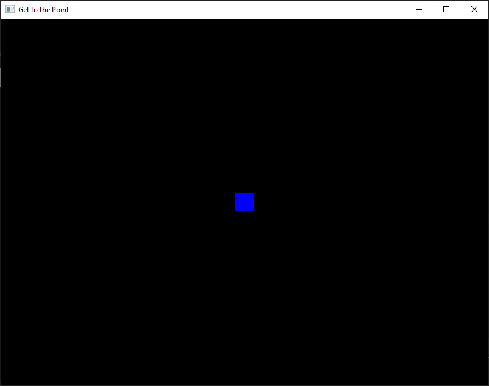

# CLOs
* CLO10 - Create and use an OpenGL vertex and fragment shader

# Introduction

So, we have been teasing you a bit about actually getting into OpenGL programming. We exhaustively have covered the layout and function of our starter program, which we used to test our tool installation. But we didn't *draw* anything; we just cleared the window with a specified color.

That all changes *now*! We are finally ready to *Get to the Point!* (editor's note: would you believe I loathe puns?). We are going to display our very first PIXEL!

# Setting Up

It is a good idea to follow along with all the examples in the course materials as we go. Therefore, we highly recommend that you create a new project for each exploration/example. Don't just continually write over the one start project; that path leads only to frustration.

Go ahead and use the template we set up in an earlier exploration to create a new OpenGL project. You can name it whatever you want, but I personally like to name it the same name as the "chapter" I am working on. In this case, "Get to the Point".

# Shader Code

While OpenGL, has ways of drawing without using *shaders*, in this course we are focusing 100% on the *programmable pipeline*. Therefore, we first need to write some quick shader code.

For now, we are going to keep our shader code *very* simple. Do you remember which shaders are required for every OpenGL application?

**HIDE ANSWER: The Vertex and Fragment Shaders!**

Shader code can be directly written into the `.cpp` file, but that is a bad habit to develop, so we are going to jump ahead to using separate files to hold our shader source code.

## Anatomy of a Shader

Shader source code uses GLSL (OpenGL Shader Language), which follows most of the same syntax requirements as C/C++. Let's look at a *generic* shader.

```GLSL
#version 410 core
in type in_variable_name;
out type out_variable name;

uniform type uniform_name;

// optional helper functions

void main() {
    // shader logic
}
```

The very first line of every shader program *must* specify the version of OpenGL targeted. For us, we will be focusing exclusively on OpenGL 4.1, so all of our shader programs will start with `#version 410 core`. The `core` keyword basically forces using the fully programmable pipeline by removing all the deprecated fixed-function methods.

Next, we may need to specify the information being passed into and out of the shader program. We do this with the `in` and `out` keywords. The "type" will change depending on what is required, but will often be some form of vector (`vec3` or `vec4`). Remember, OpenGL is a *pipeline* so the inputs come from earlier in the pipeline and the outputs are fed into the next portion of the pipeline.

**Nota bene:** There are some built-in `in` and `out` variables, such as `gl_Position`. A vertex shader must set this value before ending so the rasterizer knows where the vertex is in order to start building primitives.

After the `in` and `out` variables, we can specify any `uniform` variables we may need. Unlike the previous variables, *uniform variables* are specified at the application level and remain constant across all vertices/fragments during a given draw. We will often use these for keeping track of time for animations or even textures.

Each shader file will need to have a `main` function, but you can also write other functions as needed (just like in any C/C++ program). This is where you use the values passed in (if any) and specify the values passed out (if any).

## Our First Vertex Shader!

We are going to keep things simple for now and create the most basic vertex shader imaginable.

First, create a new file in your project and call it "shader.vert" In that file, paste the following:

```GLSL
#version 410 core
void main() {
    gl_Position = vec4(0.0, 0.0, 0.0, 1.0);
}
```

As we mentioned above, every vertex shader needs to specify a `gl_Position` before calling it quits. In this example, we are specifying that our vertex is at the origin, where X, Y, and Z all equal 0.0. 

If we can specify any point in a 3D world using only three values (X, Y, and Z), why do you we need a fourth value? That is a good question! It is for *convenience* (mostly). Later, we will see why having a `vec4` instead of a `vec3` is very helpful when it comes to matrix multiplication. For now, just trust the process.

That's it! That is the entire vertex shader! Easy, right!?

## Our First Fragment Shader!

Again, we are going to keep things simple for now. Create a new file and name it "shader.frag". Don't forget to add it to the project! In that file, paste the following:

```GLSL
#version 410 core
out vec4 color;
void main() {
    color = vec4(0.0, 0.0, 1.0, 1.0);
}
```

If you recall, the primary goal of the Fragment Shader is to determine the final color of the pixel before drawing to the screen. Later, we will use multiple values along the way to calculate a final pixel, but, for now, we are going to just manually specify it. Can you guess what color we are going to display?

**HIDE ANSWER: That's right! We set our pixel to be the color *blue*!**

If you have ever seen older OpenGL shader code, you may be expecting to see `gl_FragColor`, similar to how we saw `gl_Position` for the Vertex Shader. While it can still be used with the fixed-pipeline, we cannot use it since we are limiting ourselves to the programmable pipeline (remember, `core` forces this). Instead, the very first `out` specified will automatically be assigned to represent the final pixel color. Later, we will learn more directly how to use the keyword `layout` to explicitly specify where we want each `out` value stored.

# So...what do we do now?
We have now written two shader files (`shader.vert` and `shader.frag`) and added them to our project. Now we need a way to load this code into our application. If this were a C++ course, we would force you to noodle this out yourself, but since it isn't, we are doing the grunt work for you!

Go ahead and download the [get_to_the_point.cpp](../downloadable_files/get_to_the_point.cpp) file and add it to your project. Did you forget to add your shader files to the project? If so, do so now. You should have three files added:
* get_to_the_point.cpp
* shader.vert
* shader.frag

We have added the required code to get your shaders loaded and working. We will now dissect our application's code.

## Code Dissection!

### New Includes!

In order to load our source from a file, we need to make sure we add some includes.

```C++
#include <iostream>
#include <string>
#include <fstream>
```

### Globals!

We also need to define some globals. You may be screaming, "GLOBALS ARE BAD PROGRAMMING PRACTICE!", and you would correct *most* of the time, but this is an exception. We will use the following globals (technically one is a defined value) to allow us not to have to pass around values to each function we write.

```C++
#define numVAOs 1

GLuint renderingProgram;
GLuint vao[numVAOs];
```

`numVAOs` specifies the number of VAOs we will have. What is a VAO you ask? It is a *Vertex Array Object*. With the programmable pipeline, all data needs to be organized into buffers (*Vertex Buffer Objects* or *VBOs*), which are bound to a VAO. In our simple example here, we hardcoded our vertex into the shader itself so there was no need to define a VBO, but we still have to go through the motions to make OpenGL happy. We will learn more about *VAOs* and *VBOs* in another exploration.

Since OpenGL targets multiple platforms, it provides standardized type aliases (even for primitives). Here we see `GLuint`, which is simply OpenGL’s version of an *unsigned int*. 

We will often use `GLuint` to store the IDs that OpenGL assigns to important objects, such as the shader programs we compile and our Vertex Array Objects (VAOs). VBOs also receive ID numbers that get referenced through the VAO. Since multiple functions may need access to our renderingProgram, we make it a global.

### Loading Shader Source Code

Now, let's move onto loading our shaders into our application!

```C++
std::string loadShaderSource(const char *filePath) {
    std::string source;
    std::ifstream fileStream(filePath, std::ios::in);

    if (!fileStream.is_open()) {
        std::cerr << "Error: Could not open file " << filePath << std::endl;
        return "";
    } else {
        std::cout << "Loading shader: " << filePath << std::endl;
    }

    std::string line;
    while (std::getline(fileStream, line)) {
        source.append(line + "\n");
    }

    fileStream.close();
    return source;
}
```

Again, this isn't a C++ course, so we aren't going to spend a lot of time going over how C++ does things. Just know that this function is passed the path to the shader source (including the name of the file), and attempts to read it in as a `string`. This is then returned back out of the function so it can be used to compile the shader code.

### Building a Shader Program

We compile the shader code in order to build our *Shader Program*. We will not examine the `buildShaderProgram()` function.

The first thing we need to do is tell OpenGL to create shader programs, which will also assign them an ID number.

```C++
    GLuint vShader = glCreateShader(GL_VERTEX_SHADER);
    GLuint fShader = glCreateShader(GL_FRAGMENT_SHADER);
```

Notice, we need to specify which type of shader we want `glCreateShader` to produce. Again, we store the IDs in `GLuint` variables for later use.

Now that we have our shader program IDs, it is time to attach the source code to each! `glShaderSource` requires c-strings, so we must first convert our *normal* strings. This could be done inline in the `glShaderSource` call, but I prefer to keep things more legible.

```C++
    const char *vertShaderSrc = vertShaderStr.c_str();
    const char *fragShaderSrc = fragShaderStr.c_str();
```

You can see the conversion is simple and we stored the new c-strings in intermediary variables. We can now call `glShaderSource` to bind the source code to the shader program. This function takes four parameters:

* *shader* - shader program ID
* *count* - the number of strings in the program
* *string* - the array of pointers to the strings to be loaded
* *length* - NULL for null terminated strings, which we will be using

```C++
    glShaderSource(vShader, 1, &vertShaderSrc, NULL);
    glShaderSource(fShader, 1, &fragShaderSrc, NULL);
```

Now that our source is loaded, we need to compile it, just like any other program using `glCompileShader()`. We call the function twice (once for each shader), and pass in the shader program ID.

```C++
    glCompileShader(vShader);
    glCompileShader(fShader);
```

Next, we need to build our overall OpenGL program using `glCreateProgram()`. You may think it is silly to have to do this step, but as we create more complicated rendering systems, it may be wise to develop multiple types of rendering programs to handle different tasks. Those programs may require different shaders so we need to specify which shaders to add to which rendering program.

```C++
    GLuint vfProgram = glCreateProgram();
    glAttachShader(vfProgram, vShader);
    glAttachShader(vfProgram, fShader);
```

Here, you see we create a new variable and call it `vfProgram` (Vertex Fragment Program), but the name is ultimately up to you. `glCreateProgram()` tells OpenGL to create a new program and return its ID. We then use this ID when *attaching* our shaders (also by ID) using `glAttachShader`.

The last thing we need to do is *link* all the compiled shader code together, which is similar to how you compile and link a C++ program. We do this with `glLinkProgram(vfProgram)`.

The last thing our `buildShaderProgram()` function does is return the ID of our newly built program.

### init() Updates
In our first program, we left `init()` empty. We weren't drawing anything, so we didn't need to specify any rendering program. Now that we are drawing a vertex, we need to ensure everything is set up correctly.

This is where we call `buildShaderProgram()` and finally set the value for our global `renderingProgram` variable.

We also need to tell OpenGL how many VAOs to generate, and we need to tell it where to store them once generated (hint: in `vao`). We do this with `glGenVertexArrays(numVAOs, vao)`.

Then we need to tell OpenGL which VAO we want to have *active*. This basically tells OpenGL which vertex array we wish to use when we call `glDrawArrays()`. We specify which VAO to use by *binding* it with `glBindVertexArray(vao[0])`. Note, even though we hardcoded our vertex into the shader code, we still need to go through these steps. Also note that `glBindVertexArray` may need to be called in other places other than `init()`, depending on how we are organizing our application. It is very likely we will want to do the binding closer to the actually drawing function calls, but for now this is fine.

### display() Updates

When we call `glUseProgram(renderingProgram)` we are telling OpenGL which program we want to use when we begin drawing. We initiate the drawing using `glDrawArrays()`. Let's take a moment to look at the parameters:

* *mode* - GL_POINTS - tells OpenGL to draw each vertex as a single point
* *first* - 0 - specifies the index within the active VAO where we want to start drawing (often this will be 0)
* *count* - 1 - specifies the number of indices to draw (one for our program)

The shaders will be run on each vertex in the array: one after another. First, they will pass through the vertex shader and then the fragment shader. Remember, one of the reasons GPUs are so efficient, is that they don't have to wait for a vertex to be fully processed before pushing the next one into the pipeline. Therefore, we will have multiple vertices all flowing through our GPU on the way to the framebuffer.

# Let's DRAW!

The rest of `get_to_the_point.cpp` is the same as our initial setup code, but with some of the checks used to verify things were installed correctly removed. So, if you have been following along, you should have a new project (I named mine "Get to the Point") with two shader files and our OpenGL application code we just went over.

Go ahead and build the solution (F7) and then run it (Ctrl-F5). You should now see a window pop up displaying our single blue pixel! Depending on the resolution of your monitor, you may need to squint to see the tiny spec. 

You know what? This miniscule dot doesn't do our efforts justice. Let's really make it stand out! Go back into our `display()` function and add the following code before `glDrawArrays(...)`: `glPointSize(30.0f);`.

Now rebuild (F7) and rerun (Ctrl-F5) to see what this small change does. It should look like this:



You may have guessed what `glPointSize()` does; it adjusts the size of any pixel drawn. This really isn't something we want to get in the habit of doing. We would much rather use multiple vertices to define our shapes, which we will learn shortly. For now, it is just useful to make our efforts easier to see!

# Quick Recap

We covered 

# Looking Forward

Believe it or not, we really have learned a lot. Yes, I know you are thinking, "It is just a pixel! I want to render complex scenes not just a single engorged pixel!", but it is very important to understand the nuts and bolts well before moving on. 

In the coming explorations, we will learn:

* Rendering more than just pixels
* Transformations
* Animation
* Rendering objects
* Lighting
* Texture mapping
* Camera movement


