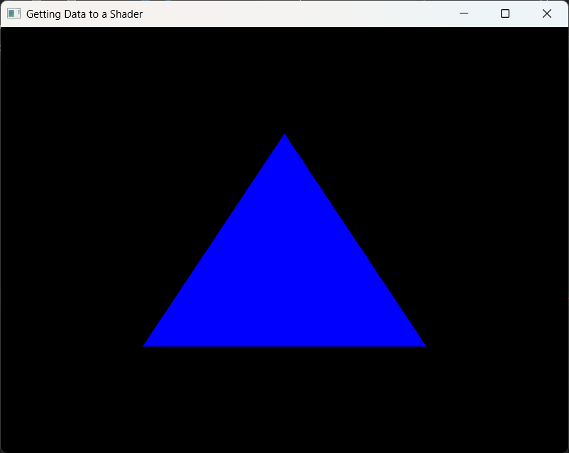
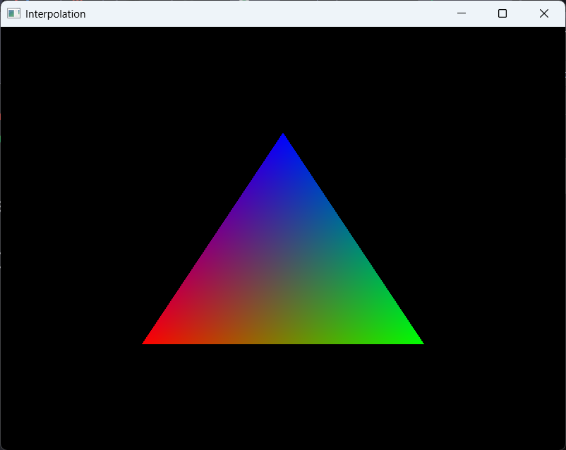

# CLOs
* CLO2 - Describe the names and functions of the elements of the graphics pipeline, as well as the input and output of each stage

# Introduction

In our last exploration ([Getting Data to a Shader](getting_data_to_a_shader.md)), we went over how we get vertex data to the shaders. By the end, we had a lovely blue triangle displayed (shown below).



We accomplished this feat by sending only *three* vertices. In our [Get to the Point](../week_2/get_to_the_point.md) exploration, we sent our vertex as a single point. This resulted in a *single* pixel being drawn (before we added `glPointSize(30.0f.)`). So, how did our three vertices result in *hundreds* of pixels being drawn?

The answer is *Interpolation*.

# Interpoloation

Think about how *you*, as a human, would go about drawing a triangle if provided graphing paper and a list of three points (X, Y). You likely would draw an axis in the middle of the paper and plot the points. You would then get a ruler and connect them (if you are sensible) or free hand it (if you are a chaos agent). Either way, you would end up *connecting the dots* to form your triangle. If you were then asked to fill it in, you would *hopefully* systematically draw your pencil back and forth between the edges from top to bottom to fill in the shape.

OpenGL does pretty much the same thing in the *Rasterizer*! This process is called *Interpolation*. Let's give it a nice definition!

> In OpenGL, interpolation refers to the automatic mathematical blending of data across the surface of a geometric primitive (such as a triangle) during the rasterization stage.

So, in our example from the last exploration, the *Rasterizer* does the calculations required to create our triangle (a type of *primitive*). If you think back to our coverage of the OpenGL Pipeline, we discussed how the Rasterizer does lots of math to figure out what part of the scene needs to fill each and every pixel on the screen. By default, the Rasterizer *smoothly* blends the attribute values, such as colors, texture coordinates, or surface normals.

Let's play around with some code to see *interpolation* in action!

## Let's Interpolate!

For this fun exercise, please create another project using our template, and call it "Interpolation". Add to the project the following files:

* `interpolation.cpp`
* `shader.vert`
* `shader.frag`

We want to start with the same functionality as we had at the end of [Getting Data to a Shader](getting_data_to_a_shader.md). If you didn't actually complete the "Your Turn!" portion, you will need to do so now. Otherwise, you can just copy and paste all the code from the previous project into this one (don't reuse the files).[^1]

We are going to keep things fairly simple for this demonstration, just so you can begin to grasp the concept. In future explorations, we will be interpolating lots of things at once.

One of the easiest things to demonstrate interpolation with is *color*. Do you recall from the last exploration that I mentioned that a common *vertex attribute* is color? We are going to send our vertex shader another set of *vertex attributes*, which will then be passed along to the Rasterizer on the way to the fragement shader. 

So, near the top of your `.cpp`, below where we declared our vertices, add the following:

```C++
float colors[] = {
      1.0f, 0.0f, 0.0f,
      0.0f, 1.0f, 0.0f,
      0.0f, 0.0f, 1.0f,
};
```
Anyone want to take a guess as to what these values represent?

**HIDE ANSWER: That's right! We are looking at three colors: red, green, and blue (respectively).**

Since we have another set of vertex attributes (in addition to position), we need to ensure we have enough VBOs. This means we need to increase our `numVBOs` to `2`.

Now, since we have two VBOs we need to manage, we need to make sure we do things in the correct order. We will still generate all our buffers at once (the same way we did before with `glGenBuffers(numVBOs, vbo)`) after generating our VAOs. We will still bind our position VAO (`vao[0]`) and our first VBO (`vbo[0]`). We will still load our buffer data. We will still set our vertex attribute pointer. We will still enable our first vertex attribute array (`glEnableVertexAttribArray(0)`). But we will not move onto unbinding our VAO and VBO.

*Instead*, we are going to start the process over at the binding stage. *This* time, we are going to be binding our *second* VBO. We don't need to rebind our VAO, since we want both VBOs associated with the same VAO, so we restart by binding our next VBO (`vbo[1]`).

```C++
// Bind Color VBO
    glBindBuffer(GL_ARRAY_BUFFER, vbo[1]);

    // Fill Color VBO with vertex data
    glBufferData(GL_ARRAY_BUFFER, sizeof(colors), colors, GL_STATIC_DRAW);

    // Set Color attribute
    glVertexAttribPointer(1, 3, GL_FLOAT, GL_FALSE, 3 * sizeof(float), 0);
    glEnableVertexAttribArray(1);
```

Notice, most of this is the same as it was when we were setting up the position vertex data (the arrays both hold three floats). The big difference is we are using the second VBO (`vbo[1]`). We also use `glEnableVertexAttribArray(1)` to set the *second* attribute (of the same VAO `vao[0]`), which is typically associated with color.

If we were to run this now, we would still have our blue triangle because none of this new data is being received by our shaders. Let's change that!

In our vertex shader we need to add:

* a new `layout` - `layout(location = 1) in vec3 color;`
* an `out` variable to send the color to the fragment shader - `out vec4 fragColor;`
* assign a value to our new `out` variable in `main` - `fragColor = vec4(color, 1.0f);`

Notice how we use a `vec4` for out `out` variable and then we modify the color by adding a fourth element (`1.0` as the alpha value), because the fragment shader's output needs to be a `vec4`. We could do the modification in either the vertex or fragment shader, but in our situation it doesn't matter where.

 Now, we need to set up our fragment shader to receive this new attribute data:

* a new `in` variable - `in vec4 fragColor`
* a way to use this new variable to set the color - `color = fragColor;`

If you did everything correctly, you should see the following when you build and run your program:



Again, if you aren't getting the expected output, reach out on the discussion boards and we will help you troubleshoot.

# Wrapping Up

How cool is that!? We didn't have to do *anything* other than specify the color of each vertex and OpenGL did the rest. In later explorations, we will see how interpolation can be used on other things like textures and surface normals, which will really help our scenes look sharp!

I highly encourage you to play around with the code we have created here to see how things work. Remember, the best way of learning is breaking things and figuring how to put them back together! Some suggestions of things to try:

* Tie the color to the XY position of each vertex (hint: take into consideration screen aspect ratio)
* Apply a sin() operation to the color, based on the x position: `color = sin(fragColor * gl_FragCoord.x);`
* *Discard* pixels if the red value is too high: `if(fragColor.r > 0.5f) { discard;}` - using `discard` prevents the pixel from being rendered (think `break`)
* Combine all of them!

Next, we are going to learn how to get some movement into our scenes with simple animation.

[^1]: I wonder how many of you go back and change the window name in the code to match the project name.