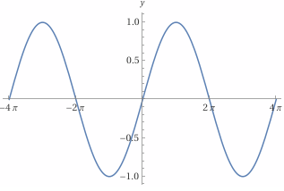

# CLOs

* CLO3 - Create a dynamic 3D scene using OpenGL

# Introduction

You have been *very* patient with me when it comes to learning the basics before getting to the *juicy* bits, so thank you. Hopefully, this exploration will begin to scratch that itch you have to start creating something exciting. We are now going to learn a simple way to animate our scenes.

# It's time to use `currentTime`

Remember *way* back when we first set up our OpenGL application code, and we went over all the parts? We set up our `display()` function to take the current `window`, but also the `currentTime`. At the time, we didn't use `currentTime`, because it wasn't time to go over *time*. But *now* is the time, to take the time, to discuss how we can use time to animate a scene![^1]

There are multiple ways of keeping track of time, but the easiest is to use our GLFW framework's built-in function: `glfwGetTime()`. This function returns a `double` that we then pass into `display()`. Some of the functions we will be using will want floats, so it is a good idea to *cast* the value into a new *float* variable (right at the start of `display()`).

```C+++
float t = static_cast<float>(currentTime);
```

Now, *time* can be used in multiple ways and in multiple places. Most of the time, we will use *time* when calculating where to position our objects in our scene. Why do you suppose we need to keep track of *time* when it comes to positioning moving objects?

**HIDE ANSWER: Imagine we wanted to move an object through the scene at a constant speed. Now, if we just updated the position by the same value `X` each time display is called, then the speed of the object is *directly* tied to the frame rate. What happens if a frame is "dropped"[^2]? Our object misses a positional update and therefore ends up in the wrong location. By using *time* to calculate where the object *should* be, the motion becomes *independent* of frame rate. If a frame is skipped, the object will be in the correct spot based on the clock.**

We are going to be animating our triangle from the previous exploration. Go ahead and create a *new* project with *new* files. You can copy and paste the code you had from the *Interpolation* exploration for the `.cpp` and both shader files.

We will be using GLM's *translate* function to move our triangle, so we need to add a new header file at the top: `#include <glm/gtc/matrix_transform.hpp>`. Next, we need to add `float t = static_cast<float>(currentTime);` at the beginning of `display()`. We are now ready to use *time*!

# Passing the Time

We need some way to get *time* into the shaders, so our scene can be rendered. There are multiple ways of doing this. We can precompute the effects of time in the CPU, or we can do it in the shaders themselves. Which we pick depends on how we intend to use time. Since this is not CS457/557 (*Computer Graphics Shaders*), we will mostly be doing stuff in our application code.

Therefore, in order to *pass the time* to the shader, we will need to apply any time effects to our *Model Matrix* (discussed in greater detail shortly) before passing it into the pipeline. In our last few programs we have been storing our *Model Matrix* data in `mvp`. Since we haven't covered transforms yet, I am just going to give you the code to add to your program with limited explanation. Add the following code around the existing `glm::mat4 mvp = glm::mat4(1.0f);`.

```C++
float cycle = fmod(t, 2.0f);
float yOffset = 0.5f - abs(cycle - 1.0f);
glm::mat4 mvp = glm::mat4(1.0f);  // This line already is in your code
mvp = glm::translate(mvp, glm::vec3(0.0f, yOffset, 0.of));
```

That's it! What do you think this code does? Really give it a good noodling before you build and run the program. What happened to our triangle? Were you correct?

**Hide Answer: You should have seen the triangle bouncing between the top and bottom of the window. If you did not, please go back over your code to check that everything is correct**

Quickly, let's take a look at what we did. We defined a *cycle* that represents two seconds (`fmod(t, 2.0f)`). This value will go from 0 &rarr; 1 &rarr; 0 &rarr; 1. We then use this value to determine which direction we want to move the object (`float yOffset = 0.5f - abs(cycle - 1.0f);`). This produces a value between -0.5 and 0.5. We then use `translate` to apply our *transform* to our `Model Matrix`.

Everything else could stay the same as we already had code to fill the uniform variable with our `mvp` variable. The vertex data is still sent as is to the shader, where the *translation* is applied using matrix math. This allows us to use the same vertices to represent multiple objects, but with different positions (more on this later).

You know what? That motion seems very bouncy. I bet we can smooth it out some. Replace the `yOffset` calculation with `0.5f(t * glm::pi<float>())`. This time, when you run it, pay close attention to speed of the triangle at the top and bottom of its animation. It seems smoother, doesn't it?

To understand why this is the case, let's look at a `sin` graph.



Notice how the *slope* of the line decreases as it gets closer to the top and the bottom of the wave? The code we just swapped in harnesses this feature of sin waves to *smooth out* our animation. As you dig deeper into animation, you will discover sin (and cos) waves everywhere!

Speaking of cos, let's use it to add some lateral movement to our triangle! Add the following code and then update translation function call to include `xOffset`.

```C++
float xOffset = 0.5f * cos(t * glm::pi<float>());
...
mvp = glm::translate(mvp, glm::vec3(xOffset, yOffset, 0.0f));
```

Build and run this new version of your project. Behold! You now have an orbiting triangle! Take some time and play around with different ways to calculate the `yOffset` and `xOffset`. Some suggestions:

* What happens if you flip the x and y offsets to use cos and sin (respectively)?
* What happens when you change the constant you multiply the sin/cos result by?
* What happens if you multiply `t` by `2` in one of the sin/cos functions?
* What happens if you divide `t` by `2` in one of the sin/cos functions?

# Using Time to Change Colors

We can also use time to change the color based on position! For this, we need to do a few things. In order to follow along, you may need to undo some of your experimentations suggested above.

We need to update our Vertex Shader to add a new uniform.

```C++
uniform vec3 posColor;
```

We also want to change how we calculate `fragColor` with `vec4(posColor, 1.0f)`.

Back in our application, we need to set a new location variable. Let's put this right next to our other one.

```C++
GLint mvpLoc = -1; // existing variable
GLint posColorLoc = -1 // New variable
```

Now, we need to fill this variable. Do you recall how?

**HIDE ANSWER: In `init()` we need to add `posColorLoc = glGetUniformLocation(renderingProgram, "posColor");` right after where we filled `mvpLoc`.**

Back in `display()`, let's create a new variable that contains a *normalized* ([0.0, 1.0]) value based on `yOffset`.

```C++
float yOffsetNormal = (yOffset + 0.5f) / 1.0f;
```

We will use this value to fill a new vector to represent our color.

```C++
glm::vec3 posColor = glm::vec3(yOffsetNormal, 0.0f, 1.0f - yOffsetNormal);
```

Finally, we need to set the uniform variable with our new vector.

```C++
glUniform3fv(posColorLoc, 1, glm::value_ptr(posColor));
```

That is it for our application changes, now we need to update our Vertex Shader. I am just going to give you entire shader code while noting the changes.

```GLSL
#version 410 core

// Vertex Attribute (from VBO)
layout(location = 0) in vec3 pos;
layout(location = 1) in vec3 color;

// Uniform
uniform mat4 mvp;
uniform vec3 posColor;  // our new color variable

out vec4 fragColor;

void main() {
    //	fragColor = vec4(color, 1.0f); // previous way we set color
    fragColor = vec4(posColor, 1.0f);  // new way we set color
    gl_Position = mvp * vec4(pos, 1.0f);
}
```

Notice, we are leaving in place our previous `color` variable, but it really isn't necessary. Now that all our code is complete, take a moment to think what these changes will do to the color of the triangle. Pay close attention to how we filled `vec3 posColor`.

**HIDE ANSWER: As the Y value increases, the amount of red in our color increases. As Y decreases, the more blue comes through. The triangle is pure red at the top of the animation, purple in the middle, and blue at the bottom.**

I am going to again suggest that you experiment with how to play with color in connection with the *time*. Some suggestions:

* Can you make the triangle fade in and out?
* What happens when you mix in some portion of `xOffset`?
* Can you find a way to *mix* a time variable into the `color` variable we pass in via the VBO?[^3]

# Wrapping up Time

In our quick exploration, we discussed how we can use the current clock time of the computer to move our objects. In our examples, we applied a *translation* to the *Model Matrix* based on time, and then sent that to the shader. We also explored how we can use time to manipulate colors inside a shader. It was all fairly simple, but from these basic building blocks, we are able to create very dynamic scenes.

[^1]: [Get on with it!](https://www.youtube.com/watch?v=sXE8LdXzeHM)
[^2]: A "dropped" frame is one that is never displayed due to bottlenecks in either the CPU or GPU.
[^3]: [The Book of Shaders: Mix](https://thebookofshaders.com/glossary/?search=mix)