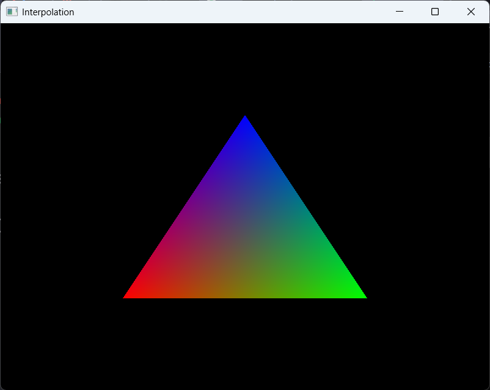
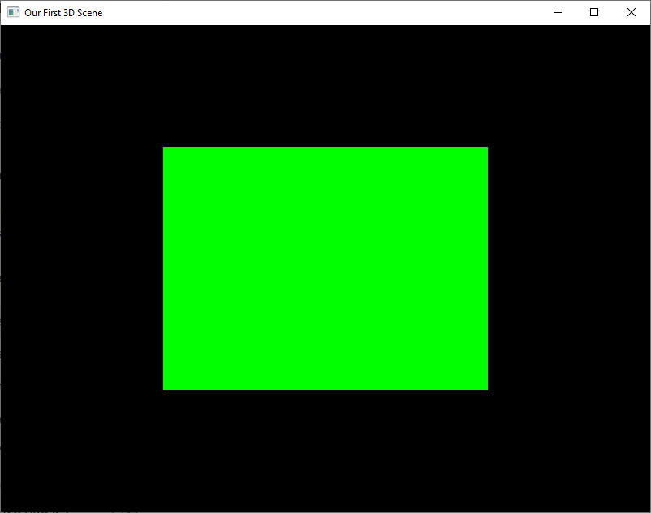
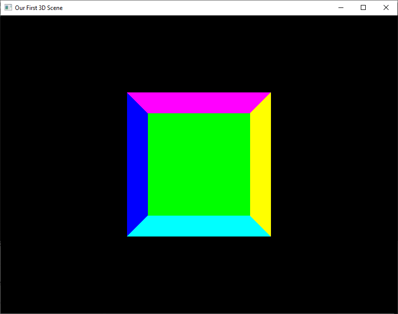
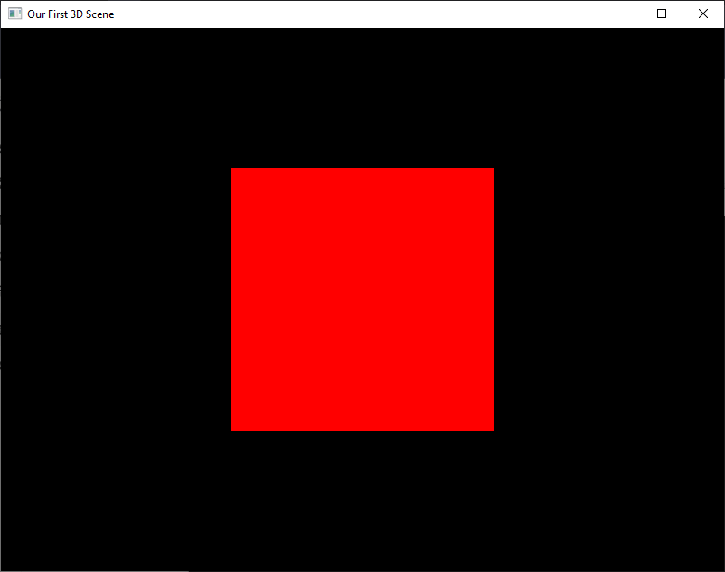
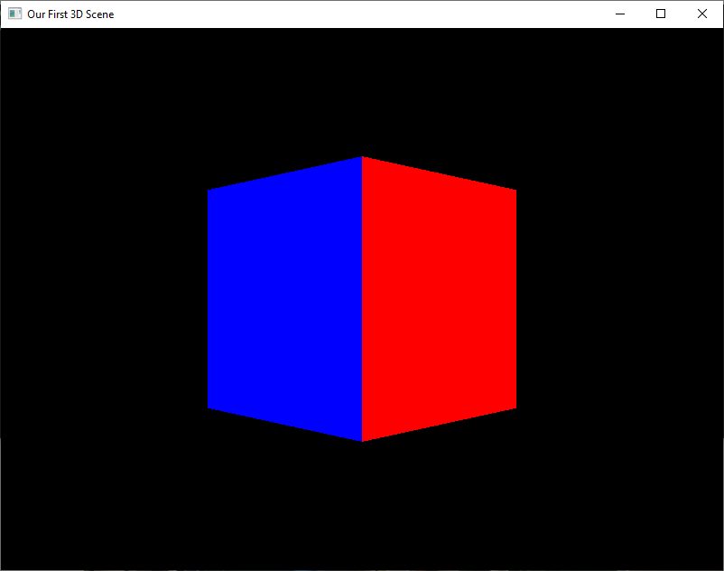
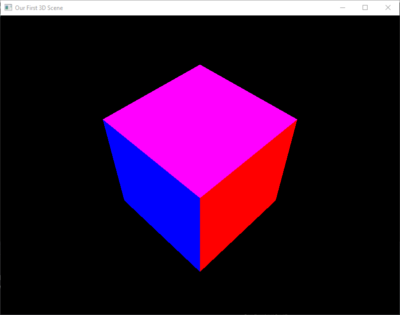
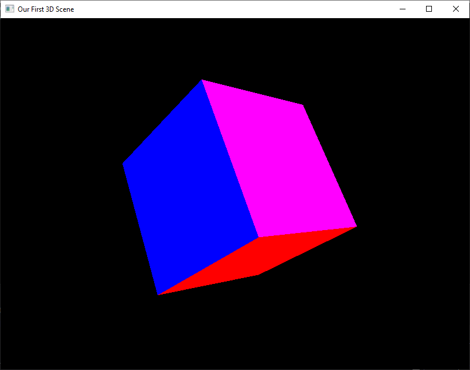

# CLOs
* CLO3 - Create a dynamic 3D scene using OpenGL
* CLO6 - Use OpenGL functions to create and apply single and compound transformations
* CLO11 - Explain how the GLM computer graphics math library is used to create and apply transformations

# Introduction

Today is the day! The day you have all be waiting for! The day we *finally* put something 3D onto our screens. 

I apologize for how long it has taken us to get here, but, as you have seen, OpenGL programming requires *a lot* of technical details to get up and running. Additionally, we couldn't display a 3D object without first learning about the *Model*, *View*, and, most importantly, *Projection* matrices. At this point in the course you have learned how to...

* create a window
* write a shader (vertex *and* fragment)
* pass vertex attributes/data into the pipeline (VAOs and VBOs)
* draw triangles
* apply color
* animate a simple object based on time
* construct transform, view, and projection matrices

Now it is time to put *all* of these together in order to render a cube!

# Where to start

To make things easier, I want us to start with the code we created during our *Interpolation* exploration ([interpolation.cpp](../downloadable_files/interpolation.cpp)). We are going to be editing almost every function we have used up until this point. Therefore, if you are unsure about how some of the earlier pieces work, please go back to [Anatomy of an Application](../week_2/anatomy_of_an_application.md) and refresh your memory.

Go ahead and create a new project for this work and add the linked `.cpp` and rename it to something like `our_first_3d_scene.cpp`. To make your life easier, I am also supplying the shader code so we are all starting from the same point. Save these as `shader.vert` and `shader.frag`.

* Vertex Shader

```GLSL
#version 410 core

// Vertex Attribute (from VBO)
layout(location = 0) in vec3 pos;
layout(location = 1) in vec3 color;

// Uniform
uniform mat4 mvp;

out vec4 fragColor;

void main() {
    gl_Position = mvp * vec4(pos, 1.0f);
    fragColor = vec4(color, 1.0f);
}
```

* Fragment Shader

```GLSL
#version 410 core

in vec4 fragColor;
out vec4 color;

void main() {
    color = fragColor;
}
```

Once you have all the files ready, go ahead and run your program; we want to make sure we are starting off correctly. You should see the following:



Let's begin!

# Defining Our Object

In the existing code, we specify three vertices to define our triangle. How many vertices do you think we are going to need to define our cube?

**HIDE ANSWER: If you said eight vertices (one for each corner), you would be wrong. We are going to need 36! Since we are drawing triangles, we need to define two triangles for *each* face of the cube. Each triangle requires *three* vertices. So, six vertices per side and a total of six sides, results in 36 vertices.[^1]**

Go ahead and replace `float vertices[]` at the top with:

```C++
float vertices[] = {
    // Front face
    -0.5f, -0.5f,  0.5f,
     0.5f, -0.5f,  0.5f,
     0.5f,  0.5f,  0.5f,
     0.5f,  0.5f,  0.5f,
    -0.5f,  0.5f,  0.5f,
    -0.5f, -0.5f,  0.5f,

    // Back face
    -0.5f, -0.5f, -0.5f,
    -0.5f,  0.5f, -0.5f,
     0.5f,  0.5f, -0.5f,
     0.5f,  0.5f, -0.5f,
     0.5f, -0.5f, -0.5f,
    -0.5f, -0.5f, -0.5f,

    // Left face
    -0.5f,  0.5f,  0.5f,
    -0.5f,  0.5f, -0.5f,
    -0.5f, -0.5f, -0.5f,
    -0.5f, -0.5f, -0.5f,
    -0.5f, -0.5f,  0.5f,
    -0.5f,  0.5f,  0.5f,

    // Right face
     0.5f,  0.5f,  0.5f,
     0.5f, -0.5f,  0.5f,
     0.5f, -0.5f, -0.5f,
     0.5f, -0.5f, -0.5f,
     0.5f,  0.5f, -0.5f,
     0.5f,  0.5f,  0.5f,

    // Bottom face
    -0.5f, -0.5f, -0.5f,
     0.5f, -0.5f, -0.5f,
     0.5f, -0.5f,  0.5f,
     0.5f, -0.5f,  0.5f,
    -0.5f, -0.5f,  0.5f,
    -0.5f, -0.5f, -0.5f,

    // Top face
    -0.5f,  0.5f, -0.5f,
    -0.5f,  0.5f,  0.5f,
     0.5f,  0.5f,  0.5f,
     0.5f,  0.5f,  0.5f,
     0.5f,  0.5f, -0.5f,
    -0.5f,  0.5f, -0.5f
};
```

Next, since we already have code to pass in vertex colors, let's update those as well:

```C++
float colors[] = {
    // Front face (red)
    1.0f, 0.0f, 0.0f,
    1.0f, 0.0f, 0.0f,
    1.0f, 0.0f, 0.0f,
    1.0f, 0.0f, 0.0f,
    1.0f, 0.0f, 0.0f,
    1.0f, 0.0f, 0.0f,

    // Back face (green)
    0.0f, 1.0f, 0.0f,
    0.0f, 1.0f, 0.0f,
    0.0f, 1.0f, 0.0f,
    0.0f, 1.0f, 0.0f,
    0.0f, 1.0f, 0.0f,
    0.0f, 1.0f, 0.0f,

    // Left face (blue)
    0.0f, 0.0f, 1.0f,
    0.0f, 0.0f, 1.0f,
    0.0f, 0.0f, 1.0f,
    0.0f, 0.0f, 1.0f,
    0.0f, 0.0f, 1.0f,
    0.0f, 0.0f, 1.0f,

    // Right face (yellow)
    1.0f, 1.0f, 0.0f,
    1.0f, 1.0f, 0.0f,
    1.0f, 1.0f, 0.0f,
    1.0f, 1.0f, 0.0f,
    1.0f, 1.0f, 0.0f,
    1.0f, 1.0f, 0.0f,

    // Bottom face (cyan)
    0.0f, 1.0f, 1.0f,
    0.0f, 1.0f, 1.0f,
    0.0f, 1.0f, 1.0f,
    0.0f, 1.0f, 1.0f,
    0.0f, 1.0f, 1.0f,
    0.0f, 1.0f, 1.0f,

    // Top face (magenta)
    1.0f, 0.0f, 1.0f,
    1.0f, 0.0f, 1.0f,
    1.0f, 0.0f, 1.0f,
    1.0f, 0.0f, 1.0f,
    1.0f, 0.0f, 1.0f,
    1.0f, 0.0f, 1.0f
};
```

Yes, this is a silly way of storing this data, especially if we want to have multiple objects in our scene. We will learn how to save this in a file and load it, but for now, this keeps things simple.

Now that we have these updated, let's see what happens when we run the code! Spoiler: it won't display a cube. Seriously, run the code to see the results and try to noodle through *why* it is displaying what it is.

**HIDE ANSWER: In our `glDrawArarys` call, we explicitly tell OpenGL to draw `3` vertices. In order to get it to draw our cube, we need tell it to draw `36`. Go ahead and make that change!**

Now that you have told OpenGL to use 36 vertices, you should end up with:



My eagle-eyed students may notice that this green box isn't actually square, but *rectangular*. This is caused by us using the *Identity Matrix* as a standin for our *Model-View-Projection Matrix*. Once we have properly applied all of those, we should get an actual cube.

# Placing our object

Up until now, our objects have been placed into our scene using their own *Model Space* coordinates. This means, they have been centered on the origin. To make our lives easier when we set up our camera, let's push our cube back *away* from the eventual camera location.

To do that, we need to add a *translation* to our `model` object. Find where we define `mvp` as the *Identity Matrix*. Replace the code with the following:

```C++
glm::mat4 model = glm::mat4(1.0f); // Always start with the identiy matrix
model = glm::translate(model, glm::vec3(0.0f, 0.0f, -3.0f));
glm::mat4 mvp = model;
```

To use `glm::translate` we need to pass it a model and a position vector. In this example, we are passing in our cube and telling OpenGL to push the entire object along the negative Z-axis by 3.0f.

Please note, we are just reusing the `mvp` variable to keep things simple. In truth, this is only the `Model Matrix`. Before we are done, we will refactor our code and *do it right*.

If we were to run this now, we would be met with a black screen. This is because we haven't applied a projection matrix and the "view volume" is limited to a default of [-1, 1] in every direction. Therefore, we pushed our cube outside the viewable area. 

Let's fix that!

# Projection!

Hold up, we just defined our `M` (`Model Matrix`), so why are we skipping `V` (`View Matrix`) and jumping straight to `P` (`Projection Matrix`)? Great question! To keep things simple, we are going to keep our camera stationary and in the default position (centered on the origin looking down the negative Z-axis). This means, we don't have to specify a `View Matrix`.

Do you remember *where* we want to define our *Projection Matrix*?

**HIDE ANSWER: That's right, in `init()`! Since the projection matrix doesn't change from one frame to the next, we only need to calculate it once. We will later see that resizing a window will require us to recalculate the projection matrix, but we will write code to handle that.**

Before we begin, let's look at how we create a projection matrix using GLM.

```C++
glm::mat4 proj = glm::perspective(
    glm::radians(45.0f),              // FOV
    800.0f / 600.0f,                  // aspect ratio (hard-coded for now)
    0.1f,                             // near plane
    100.0f                            // far plane
);
```

`perspective()` needs four things:

* an angle representing the Field of View (FOV)
* an aspect ratio of the framebuffer (aka window)
* distance to the near plane (0.1f is pretty standard)
* distance to the far plane (100.0f is more than enough for our purposes)

Notice how we specify an aspect ratio using width and height? Let's create some variables to make this easier to update and maintain. At the top of the file where we have declared our global variables, let's add three more.

```C++
int windowWidth  = 800;
int windowHeight = 600;
float aspect     = (float)windowWidth / (float)windowHeight;
```

Since we have them, let's go ahead and use them where we create our window in `main()`:

```C++
GLFWwindow* window = glfwCreateWindow(windowWidth, windowHeight, "Our First 3D Scene", NULL, NULL);
```

Now, back to creating our projection matrix. Since we want to create this in `init()`, but use it in `display()`, we need to declare it as a global. Back up to the top!

```C++
glm::mat4 proj;
```

With our global declared, we can now fill `proj` in `init()`. 

```C++
proj = glm::perspective(
    glm::radians(45.0f),     // FOV
    aspect,                  // aspect ratio
    0.1f,                    // near plane
    100.0f                   // far plane
);
```

We have now replaced the hardcoded aspect ratio calculated with our variable. This will be helpful later when we want to handle window resizing.

We need to do one last thing before we can run our program again. We have to actually apply the projection matrix (`proj`) to our `model` matrix. Back in `display()` change the calculation of `mvp` to:

```C++
glm::mat4 mvp = proj * model;   // using default view matrix
```

Before you run the code, what do you supspect you will see? Take a look at the way we defined both the faces and the colors. Try to predict what will be displayed.

**HIDE ANSWER: Did you predict you would see a red square representing the front face of our cube? That is a very reasonable thing to think, but that isn't what we are seeing. Let's explore why!**

If you did everything correctly, you should see:



Would you believe you are looking at the *inside* of the cube? We can see the top, bottom, left, right, and back of the cube, but not the front (which would be red). This is because we forgot about the *Depth Buffer*.

If you remember back to our discussion about the [OpenGL Pipeline](../week_2/opengl_pipeline.md), we discussed how the Rasterizer is responsible for managing `z-culling`. By default, OpenGL draws pixels to the screen as they come. If two pixels would be draw in the same spot, the first one is overwritten by the second.

In our program, we render the front first and then each of the other sides. This means that *all* the red is replaced with what is behind. In order to have this handled correctly, we need to tell OpenGL to check for *depth*. This will result in any pixels that are further away from the camera than the pixel currently stored in the buffer being discarded.

In `init()` we need to add `glEnable(GL_DEPTH_TEST)` *somewhere*. Where we put it doesn't really matter as `init()` is called after we initialize our `window` variable, which is required. So, put it wherever it brings you joy.

By default, `GL_DEPTH_TEST` uses `GL_LESS` as the *Depth Function*. This means that the Rasterizer will only place pixels into the framebuffer if the depth (distance from the camera) is less than the current pixel stored. Note, "ties" are resolved using the current pixel, not the new pixel.

If we were to run this now, we would again be presented with a blank screen. That is because we are only clearing the color buffer:

```C++
glEnable(GL_DEPTH_TEST);
```

OpenGL also maintains a depth buffer that stores the distance of each pixel from the camera. Because we never clear it, the depth values from previous frames remain. Every new fragment fails the depth test and is discarded, so nothing appears in the color buffer.

The simple fix is to update the clear call in `display()`;

```C++
glClear(GL_COLOR_BUFFER_BIT | GL_DEPTH_BUFFER_BIT);
```

If we run this now, we should be presented with a *red* square.



Perfect! We now have the front face correctly displayed and it is indeed *square* (compare it to the green *rectangle* we started with). Sadly, I feel like we are back to square one. You know, and I know that we are looking at a cube because we wrote the code. If we were to show this to someone else as *proof* that we were working in 3D, they may think we were crazy.

# Transform and roll out!

What do you think of adding some *rotation* to demonstrate that this is indeed a *cube*? The code we will use is:

```C++
// rotate the mode 45 deg around the Y-axis
model = glm::rotate(model, glm::radians(45.0f), glm::vec3(0.0f, 1.0f, 0.0f));
```

I have given you the code, can you figure out where to put it? Should it go *before* or *after* the *translation*? Try both and report back! I'll wait.

[^2]

If you actually did as I requested and tried the *rotation* in both places, you realize that only one resulted in the desired outcome (shown below) and one resulted in a blank screen (not shown, because...duh).



So, why did one order work and not the other? If you think back to our discussion on 3D Math, the order in which matrices are multiplied is important. We multiply matrices right to left, so we want our *first* transform to be on the *right*.

In our example with the cube, we want to rotate *first* and then translate. This allows our object to rotate around the world origin and then get pushed back. If we reverse that order, it gets pushed back and *then* rotates around the origin as if it was on the edge of wheel. This is why we ended up with a blank screen when calling `rotate` first; the cube actually rotated out of view!

So, when programming transforms, it is *very* important to understand the order you wish the transforms to be applied and then call the functions *in reverse*.

```C++
glm::mat4 model = glm::mat4(1.0f); // Always start with the identiy matrix
model = glm::translate(model, glm::vec3(0.0f, 0.0f, -3.0f));
model = glm::rotate(model, glm::radians(45.0f), glm::vec3(0.0f, 1.0f, 0.0f));
```

You know what? This still looks like we could have just drawn flat shapes. This doesn't *scream* 3D to me. There must be something more we can do to prove that we are working in 3D.

# Let's Get Dynamic

One thing that always separates flat images from 3D ones is *motion*. How about we add some *spin* to our cube? We can do this using what we learned last week.

We already have the cube rotated 45&deg; around the Y-axis. Let's animate our cube so that it spins around the X-axis. Again, I am going to give you the code, but it is up to you to determine where to put it!

```C++
model = glm::rotate(model, glm::radians((float)currentTime * 45.0f), glm::vec3(1.0f, 0.0f, 0.0f));
```

Our `display()` function already has `currentTime` passed in, so we can just use it however we want. Above, we are rotating the cube 45&deg; every second. We specify the vector we want to rotate around using `vec3(X, Y, Z)`.

If you put the code in the correct spot (between the translation and first rotation), you should have something that looks like this:



If you put the animated rotation *after* the other rotation, you likely are seeing this:



Notice how the cube no longer looks like it is rotating directly at the camera. That is because the X-axis rotation happens first. This is why it is very important to think about the order of the transforms you apply.

We now have a very convincing 3D scene we can show off. The only thing left to do is refactor the code to use the previously discussed `MV + P` approach to sending matrices to the shaders.

# Refactor Time!

As mentioned in our 3D Math Overview, we don't want to combine all our matrices before sending them off to the vertex shader. When we set out to do shading/lighting, it will be very useful to have `MV` separated from `P`. Therefore, we need to make some minor changes to our program to get ourselves ready for next week.

The first thing we need to do is update our vertex shader code to accept *two* matrices: `mv` and `p`. Replace our current uniform declarations with the following:

```GLSL
uniform mat4 mv;
uniform mat4 p;
```

Now, we need ot update how we calculate `gl_Position`. Despite us calling the combined matrix `MVP`, we want to arrange them in reverse when multiplying: `P * V * M`. Note, our `mv` variable would be constructed using `V * M` before passing it to the shader.

```GLSL
gl_Position = p * mv * vec4(pos, 1.0f);
```
Back in our application code, we will need update our `mvp` associated variables to be `mv` and declare a new `p` variable. Here is a refresher of where we need to make our changes.

* Global Declarations
  `mvpLoc` needs to be renamed `mvLoc`
  `pLoc` needs to be declared
* Get Uniform Location in `init()`
  * `mvpLoc` needs to be changed to `mvLoc` and the string from "mvp" to "mv"
  * `pLoc` needs to use `glGetUniformLocation` using "p" as the string
* Define `mv` in `display()`
  * we need to define our `mv` variable using `glm::mat4 mv = model;`
  * we already defined `proj` in `init()`
* Set Uniform Variables in `display()`
  * `mvpLoc` needs to be changed to `mvLoc` and `value_ptr(mvp)` to `value_ptr(mv)`
  * 'pLoc' needs to be set using `value_ptr(proj)`

After making these changes, you should be able to run your program again and produce the same results. If you get a blank screen, check to make sure your vertex shader is correct and the rest of the variables have been updated/declared in the application.

# Protect your program from the user!

Remember how I mentioned that we only ever have to calculate the projection matrix once unless the window is resized? I think it is time to experience how our program will behave if we change the window shape/size. Go ahead and run your program and then manipulate the size/shape by dragging out a corner or edge.

Notice how the cube is no longer centered in the window? This is because our projection matrix uses an aspect ratio to calculate how to display the scene. When we change the window size, but don't update the projection matrix, we end up with unintended behavior.

Luckily, there is an easy way to protect our scene from the user's tamperings! GLFW has the ability to trigger a function callback when the framebuffer is resized: `glfwSetFramebufferSizeCallback(...)`. We will need to write our own callback and then set it using the just mentioned function.

```C++
void framebuffer_size_callback(GLFWwindow* window, int width, int height) {
    // Avoid a divide-by-zero error if the window is minimized
    if (height == 0) {
        return;
    }

    // Update all our window size globals
    windowWidth = width;
    windowHeight = height;
    aspect = (float)width / (float)height;

    // Tell OpenGL the new dimensions
    glViewport(0, 0, width, height);

    //Calculate our new projection matrix
    proj = glm::perspective(
        glm::radians(45.0f),           // FOV
        aspect,                        // aspect ratio (hard-coded for now)
        0.1f,                          // near plane
        100.0f                         // far plane
        );
}
```

Go ahead and place this entire function before `init()`. Then, in `main()` right after `glfwMakeContexCurrent(window)` we need to call:

```C++
glfwSetFramebufferSizeCallback(window, framebuffer_size_callback);
```

Build and run this new version of our program. Now, every time we resize the window, our scene responds appropriately. This is just one of those quality of life additions that really make your program stand out. 

# Explore some more!

While we covered a great deal during this exploration, there is *a lot* of things to learn *by doing*. I highly recommend that you spend some time adding transforms/animations to our cube before you move onto the next lesson. Some things to try:

* Try animating the translation as well as the rotation. Which order should you do it in?
* Try rotating the object in multiple directions as once.
* Try to get the cube to "orbit" around the camera. This would require it to go out of view on one side and then back on the other.
* If you come up with anything fun, please share on the discussion board!

Next we will discuss moving the camera around our objects. This will be very helpful to show off how shading/lighting works. 

[^1]: Later we will learn how to be more efficient and *reuse* vertices using *EBOs*.
[^2]: Generated using Gemini Pro. Yes, that is me (Eric). No, that is not my actual setup.

# Reminders of things to cover
* Depth buffer stuff
 * glEnable(GL_DEPTH_TEST)
 * glClear(GL_DEPTH_BUFFER_BIT)
* Framebuffer resize code
* gtc vs ext include