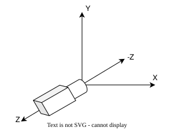
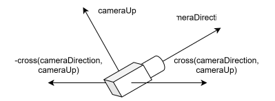

# CLOs
* CLO4 - Dynamically alter the viewing of a 3D scene using OpenGL.

# Introduction

We just learned how to get keyboard input to interact with our scene. Now, we want to go a step further and actually add the ability to *move* through our creations. Before we get to the code, let's refresh our understanding of how the camera in OpenGL works.

By default, the OpenGL camera is located at (0.0, 0.0, 0.0) and pointed down the negative Z-axis.

<div align="center" markdown="1">



</div>

When we first learned about the OpenGL camera during our [3D Math Overview](../week_4/3d_math_overview.md) exploration, I *kinda* lied to you. I said that we *move* the camera, but that isn't entirely accurate.[^1] We *actually* move the *entire world* around so that the camera never moves.

Wild, I know! That said, going forward I will continue to talk about *moving* the camera. This is just to make it easier to conceptualize what we are doing.

Before we move on, go ahead and create a new project for this lesson. We want to start with *copies* of the same code we finished with in our [Taking Control](../week_5/taking_control.md) exploration.

# Building a Camera

So, how do we move the camera? You may recall from our *space* discussion, that we use the *Model Matrix* to move from *model space* to *world space*. We then use the *View Matrix* to move from *world space* to *view space*. Therefore, we need to create our *View Matrix*.

You may have noticed that this exploration is called "LookAt Me Now!" No, that isn't a typo. We will be using GLM's `lookAt()` function to generate our view matrix. Let's look at what it will look like.

```C++
glm::mat4 view = glm::lookAt(cameraPos, cameraTarget, cameraUp);
```

The `lookAt` function takes three parameters (each a `vec3`):

* `cameraPos` - where the camera is located in our scene[^2]
* `cameraTarget` - where the camera is pointing
* `cameraUp` - which direction is "up" relative to the camera

We are going to need to access to the camera variables in multiple functions, so that means we need *globals!*.

```C++
glm::vec3 cameraPos = glm::vec3(0.0f, 0.0f, 3.0f);
glm::vec3 cameraDirection = glm::vec3(0.0f, 0.0f, -1.0f);
glm::vec3 cameraUp = glm::vec3(0.0f, 1.0f, 0.0f);
float cameraSpeed = 0.25f;
```

The above code places our camera centered on the XY-axis, but pulled back a bit (remember, we are aiming in the negative direction). It also specifies the direction it is pointing (`cameraDirection`), which is different than what we had above when calling `lookAt()`. 

This is because `cameraTarget` is a specific point in the world. Normally, we aren't locking our camera onto a particular point in our scene. Instead, we just want to "look at" something directly in front of the camera. Therefore, `cameraDirection` is a vector we add to our `cameraPos` to calculate the needed point (1.0f in front).

We define `cameraUp` with a vector pointing directly along the positive Y-axis. This is typically what you will want in any 3D world, unless you are writing a flight sim and need the ability to adjust *roll*.[^3]

Finally, we need a variable to store how fast we want our camera to go when pressing movement keys.

Let's go ahead and build a camera in our code. Make sure you declare our globals before moving into `display()`. Where do you think we should generate our `View Matrix`?

**Hide Answer: That's right! A `View Matrix` only needs to be generated *once* per frame. We could do this either in our loop in `main()` or at the beginning of our `display()` function. Since we need to access it in `display()` I prefer to generate it there.**

Therefore, right *before* `glUseProgram(renderingProgram)` add:

```C++
glm::mat4 view = glm::lookAt(cameraPos, cameraPos + cameraDirection, cameraUp); 
```

Again, take note that we are adding `cameraDirection` to `cameraPos` to generate the value `lookAt()` needs.

We now need to use the *View Matrix* to create our *Model-View Matrix* (`mv`). In our previous projects, we *faked* this by just using `model` by itself. We now want to fix this fakery.

```C++
glm::mat4 mv = view * model;
```

Pay attention to the order of the multipliaction. In the shader, we want to apply the *Model Matrix* to our vertex *before* we apply our *View Matrix*. Therefore, we need to have `model` all the way on the right of the operation.

Go ahead and run our new code. You should see the same cube as before, but a little further away. Why is that?

**Hide answer: We moved the camera back from the origin.**

# Move It!

OK, we have built our camera. Now it is time to move it! We are going to keep it simple at first, then move into something more complex. For now, we are going to use the same approach we did when we programmed our "Pause" key.

You are free to map the movement to any keys you wish, but I am an old-school FPS player so I am going to use WASD.[^4] We need to go back to our `key_callback()`. The first thing we want to do is refactor our `if` statement.

```C++
if (action == GLFW_PRESS) {
    if (key == GLFW_KEY_P) {
        togglePause();
    }
}
```

Since all the key mappings we want to program for our camera also require `action == GLFW_PRESS`, it makes sense to pull that out of the key specific if statements. Now, add the following under our "P" key mapping:

```C++
if (key == GLFW_KEY_W) {
    cameraPos += cameraSpeed * cameraDirection;
}
if (key == GLFW_KEY_S) {
    cameraPos -= cameraSpeed * cameraDirection;
}
if (key == GLFW_KEY_A) {
    cameraPos -= glm::normalize(glm::cross(cameraDirection, cameraUp)) * cameraSpeed;
}
if (key == GLFW_KEY_D) {
    cameraPos += glm::normalize(glm::cross(cameraDirection, cameraUp)) * cameraSpeed;
}
```

Let's unpack this. The first two `if` statements cover forward and backward movement (respectively). These movements are fairly straightforward to calculate as we want to move along the same vector the camera is pointing (`cameraDirection`). We simply multiple our `cameraSpeed` by the directcional vector and then add/subtract it to move forward/backward.

Moving side-to-side is a bit tricky. Unlike for forward/backward, we don't have a direction vector already defined, we need to calculate it using vector *cross product*. Remember back to our [3D Math Overview](../week_4/3d_math_overview.md) and what the cross product was used for. If we cross two vectors we will get a new vector that is perpendicular to *both*. 

Luckily, we already have the needed vectors in `cameraUp` and `cameraDirection`. 

<div align="center" markdown="1">



</div>

To move left, we use the *negative* cross product. To move right, we use the *positive* cross product. We *normalize* the resulting vectors so they return to a length of 1.0f. Then, just like with forward/backward we multiply our vector by `cameraSpeed`.

Go ahead and run our new code. When you press the movement keys, the view should move ever so slightly. We can even move *into* the cube and see it from the inside out!

We have movement, but it feels clunky. I don't like having to press a movement key each multiple times to move forwards. It would be *so* much easier to be able to hold the key down and let go once I have moved as far as I wanted. Hey! Let's do that!

# Continous Motion

As you can tell, I like to introduce concepts and link them directly to what came before. That is why we reused the "key press" approach we used with our "Pause" button. Now that we understand the math of movement, let's refactor so we can press and *hold* a button.

Either comment out (or delete) the WASD key mappings from `key_callback()`. We are going to create a new function right under it with our new key mappings called `processInput()`. Before we write it, we need to discuss the conceptual differences between a *press* vs. *hold* event.

Whenever a key is pressed, GLFW calls the set callback with the event data (key, action, etc.). Holding a key down only counts as *one* press, so we need a different approach.

We are going to want to check for a key press for *each frame*. GLFW has a function we can use for this: `glfwGetKey()`. This function takes two parameters:

* *window* - the window we are checking for key presses
* *key* - the key for which we want to check the status

It returns either `GLFW_PRESS` or `GLFW_RELEASE`. So, if we want to check to see if `W` is pressed we would use `if (glfwGetKey(window, GLFW_KEY_W) == GLFW_PRESS) {...}`. Let's write `processInput()`:

```C++
void processInput(GLFWwindow* window)
{
    if (glfwGetKey(window, GLFW_KEY_W) == GLFW_PRESS)
        cameraPos += cameraSpeed * cameraDirection;
    if (glfwGetKey(window, GLFW_KEY_S) == GLFW_PRESS)
        cameraPos -= cameraSpeed * cameraDirection;
    if (glfwGetKey(window, GLFW_KEY_A) == GLFW_PRESS)
        cameraPos -= glm::normalize(glm::cross(cameraDirection, cameraUp)) * cameraSpeed;
    if (glfwGetKey(window, GLFW_KEY_D) == GLFW_PRESS)
        cameraPos += glm::normalize(glm::cross(cameraDirection, cameraUp)) * cameraSpeed;
}
```

Since we need to check for button presses *each frame*, we can put this either in `display()` or in our render loop in `main()`. I prefer the latter, and calling `processInput(window)` right after we check to see if we are paused just *feels* right. Go head and call our new function wherever you wish and run our changes.

You should now be able to zip around the scene by pressing and holding down the movement buttons. It may be *zipping* a bit too quickly for some of you. This is because our movement speed increases linearly with framerate. The more frames your computer generates, the faster you will move.

This is not ideal; we want our movement to be consistent across all users. To fix this, we need to link our movement speed to *time*. We are going to need more globals...

Back up to the top! We want to remove our `cameraSpeed` variable as a global (we will calculate it per frame). We want to then add:

```C++
float deltaTime = 0.0f;
float lastFrame = 0.0f;
```

We are going to use these variables to calculate the amount of time that has passed between frames. Since we need to calculate these values *between* frames, we will do this in our render loop in `main()`. Before our call to `processInput()` add:

```C++
float currentFrame = static_cast<float>(glfwGetTime());
deltaTime = currentFrame - lastFrame;
lastFrame = currentFrame;
```

We need to get the *start time* of the current frame using `glfwGetTime()`. We can then use this value to determine the amount of time that has passed between frames (`deltaTime`). Finally, we need to update the timestamp of `lastFrame` for our next loop by setting it to the current time.

Since we removed `cameraSpeed` as a global, we need to declare it in `processInput()`. Add `const float cameraSpeed = 2.5f * deltaTime;` to the start of the function. Basically we are tying the amount of movement for each frame to the time elapsed (`deltaTime`) from the previous frame (`lastFrame`).

If you run this now, you should notice the movement speed has changed. If you have a high refresh rate your movement should have slowed. If you have a very low refresh rate the movement should have increased. If you don't notice any change, then you were in the Goldilocks Zone.

Yay! We can move around our scene, but we are still missing a really important feature: the ability to *turn* the camera. Let's fix that.

# Pitch and Yaw, Y'all!

There are two types of *turns* we need to program. The first is *Pitch*, which is pivoting the camera up and down. The second is *Yaw*, which is pivoting the camera from side to side. We could implement these using key presses like we did for our directional movement, but that is boring! Let's go all out and implement *mouse-look*!

Previously, our camera was always oriented down the negative Z-axis, so we never had to update our `cameraDirection` variable. With mouse-look, we will need to calculate a new direction in realtime. 

Before we start writing code, I want us to look at the math. Note, I said *look*, not understand. This isn't a math course, so you only need to implement the known algorithms. As we change *pitch* and *yaw* we need to update our `cameraDirection` vector using the following:

* `x = cos(yaw) * cos(pitch)`
* `y = sin(pitch)`
* `z = sin(yaw) * cos(pitch)`

Again, no need to know *why* this works, just that it *does* work. For those interested, we are basically turning Spherical Coordinates into Cartesian Coordinates. Enough brain busters, let's get to coding!

Anyone want to take a guess where we are going to start?

**Hide Answer: GLOBALS!**

Gosh darn globals![^5] I am going to show these to you in chunks and explain each as we go.

```C++
float yaw = -90.f;  // default down the negative Z-axis
float pitch = 0.0f; // default straight ahead
```

`yaw` is the side-to-side rotation. Here, we set it to default looking down the negative Z-axis. `pitch` is the up-and-down rotation. We want to start looking straight ahead.

```C++
float lastX = windowWidth / 2.0f;  // centered horizontally
float lastY = windowHeight / 2.0f; // centered vertically
```

We need to keep track of the last X and Y mouse coordinates (in Screen Space) so we can compare it to the current mouse event. The bigger the difference between mouse events, the larger the turn speed. We set the starting values to be the middle of the screen.

```C++
bool firstMouse = true;
const float mouseSensitivity = 0.1f;
```

The flag `firstMouse` will be used to reject the first mouse event registered. This is simply a quality-of-life feature that prevents wild jumping of the camera when we load our program. `mouseSensitivy` is used to determine how much of the mouse movement on the screen we want to translate into camera movement. If you want to require smaller movements of the mouse to register camera movement, increase this value.

```C++
bool mouseLookEnabled = false;
```

Our last global is a flag we will use to toggle mouse look on and off. We are going to set it to *off* initially.

Now that we have our globals set, let us *use* them to update the `cameraDirection`. We need to write a function that we can call when our program registers a *mouse event*. Place this near the `togglePause()` function we wrote earlier.

```C++
void updateCameraDirection()
{
    cameraDirection.x = cos(glm::radians(yaw)) * cos(glm::radians(pitch));
    cameraDirection.y = sin(glm::radians(pitch));
    cameraDirection.z = sin(glm::radians(yaw)) * cos(glm::radians(pitch));
    cameraDirection = glm::normalize(cameraDirection);
}
```

What you see above is simply the math we *looked* at before. The one addition is we `normalize` the direction vector. This is to ensure that it remains a *unit vector* (magnitude of 1.0f). This is important because we only want it to tell us the direction of movement, not play any part in *how much*.

To capture our mouse events, we will use a *mouse callback* (similar to how we mapped keys). Let's define our new function and then discuss. Place this function near `key_callback()`, but below the function we just wrote.

```C++
void mouse_callback(GLFWwindow* window, double xposIn, double yposIn)
{
    if (!mouseLookEnabled) {
        return;
    }
    
    float xpos = static_cast<float>(xposIn);
    float ypos = static_cast<float>(yposIn);

    if (firstMouse) {
        lastX = xpos;
        lastY = ypos;
        firstMouse = false;
    }

    float xoffset = xpos - lastX;
    float yoffset = lastY - ypos;   // reversed
    lastX = xpos;
    lastY = ypos;

    xoffset *= mouseSensitivity;
    yoffset *= mouseSensitivity;

    yaw   += xoffset;
    pitch += yoffset;

    // Constrain pitch
    if (pitch > 89.0f)  pitch = 89.0f;
    if (pitch < -89.0f) pitch = -89.0f;

    updateCameraDirection();
}
```

Our function takes three parameters:

* `window` - the window that registered the event
* `xposIn` - the x-coordinate of the mouse at the time of the event
* `yposIn` - the y-coordinate of the mouse at the time of the event

First, we want to check to see if we have mouse-look enabled. If we don't, we need to skip updating `cameraDirection`.

```C++
if (!mouseLookEnabled) {
        return;
    }
```

Next, we store the passed in X and Y coordinates in `float` variables (makes the code easier to read).

```C++
float xpos = static_cast<float>(xposIn);
float ypos = static_cast<float>(yposIn);
```

If this is our first mouse event, then we want to set our `lastX` and `lastY` to match the passed in X and Y values. This will ensure that our first *offsets* are zero, so our camera will always start in the center of the scene. We also flip the `firstMouse` flag.

```C++
if (firstMouse) {
    lastX = xpos;
    lastY = ypos;
    firstMouse = false;
}
```

We now need to calculate the difference between our last mouse position and the current one. We then update our `lastX` and `lastY` variables for the next mouse event.

```C++
float xoffset = xpos - lastX;
float yoffset = lastY - ypos;   // reversed
lastX = xpos;
lastY = ypos;
```

We then need to adjust our offsets based on our mouse sensitivity.

```C++
xoffset *= mouseSensitivity;
yoffset *= mouseSensitivity;
```

We can now apply the offsets to our current `yaw` and `pitch`.

```C++
yaw += xoffset;
pitch += yoffset;
```

We do need to be careful to ensure that we aren't flipping upside down (this isn't a space sim!). We do this by preventing `pitch` from reaching &plusmn;90&deg; If you want to get crazy and don't get disoriented easily, feel free to leave this part out!

```C++
// Constrain pitch
if (pitch > 89.0f)  pitch = 89.0f;
if (pitch < -89.0f) pitch = -89.0f;
```

Last, but not least, we have to actually update our `cameraDirection` vector.

```C++
updateCameraDirection();
```

Whew! That was a lot, but we still have a bit to go. We still need to write the code to toggle mouse-look. We will do this in our `key_callback()` function.

```C++
if (key == GLFW_KEY_M) {
    mouseLookEnabled = !mouseLookEnabled;

    if (mouseLookEnabled) {
        std::cout << "Mouse-look: ENABLED" << std::endl;
        glfwSetInputMode(window, GLFW_CURSOR, GLFW_CURSOR_DISABLED);
        firstMouse = true;   // prevent jump when re-enabling
    } else {
        std::cout << "Mouse-look: DISABLED" << std::endl;
        glfwSetInputMode(window, GLFW_CURSOR, GLFW_CURSOR_NORMAL);
    }
}
```

I chose to use the `M`, but you can pick whatever floats your boat. Each time the key is pressed, we need to flip the value of the `mouseLookEnabled` flag.

If mouse-look is toggled on, we want to tell GLFW to hide the cursor. We do that with `glfwSetInputMode(window, GLFW_CURSOR, GLFW_CURSOR_DISABLED);` This isn't necessary, but is a profession touch. We then want to reset our `firstMouse` flag.

If we are toggling mouse-look off, we want to restore the cursor: `glfwSetInputMode(window, GLFW_CURSOR, GLFW_CURSOR_NORMAL);`

We are in the homestretch! The last thing we need to do is register our callback in `main()`. Add the following right below were we set the key callback: `glfwSetCursorPosCallback(window, mouse_callback);`

# We Did It!

Hopefully, when you build and run your code you can now use the mouse to move the camera (remember, mouse-look is *off* by default). You are now free to fly around our spinning cube. If you feel the mouse movement is too sluggish/jumpy, play around with the mouse sensitive constant. You can also update the speed factor we use for our WASD button presses to make directional motion faster/slower.

Some other things to try:

* Add a button press to move the camera straight up/down (think jump/crouch).
* Invert the mouse-look direction; I personally use an inverted mouse in FPS games
* Animate the camera movement so that it pans around the cube (remember `cameraTarget` can be specified without `cameraDirection`)


[^1]: I can't utter that phrase without thinking of [this scene from ID4](https://tv.getyarn.io/yarn-clip/f5364a72-2e63-4e4c-9bce-55f714f10543)
[^2]: Yes, it is always at the origin, but where is it "effectively" in our scene.
[^3]: [Roll, Pitch, and Yaw](https://howthingsfly.si.edu/flight-dynamics/roll-pitch-and-yaw)
[^4]: Refers to ordering of the keys used in traditional First Person Shooters. `W` (Forward), `S` (Back), `A` (Left), and `D` (Right).
[^5]: I remember a time when I was taught that globals were sloppy programs! But needs must.