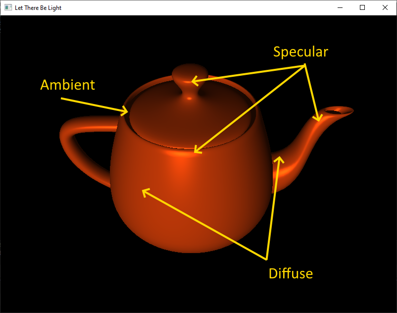
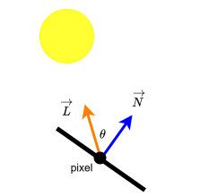
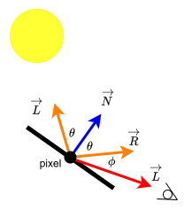
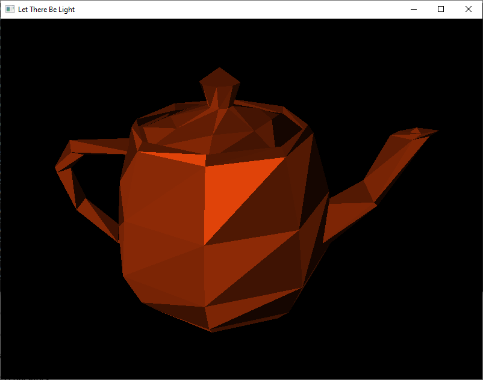
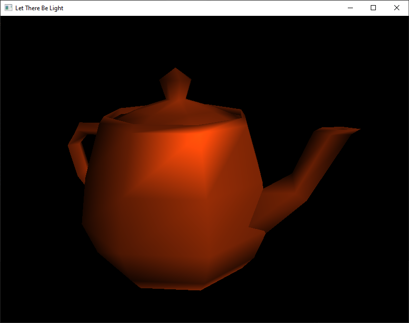
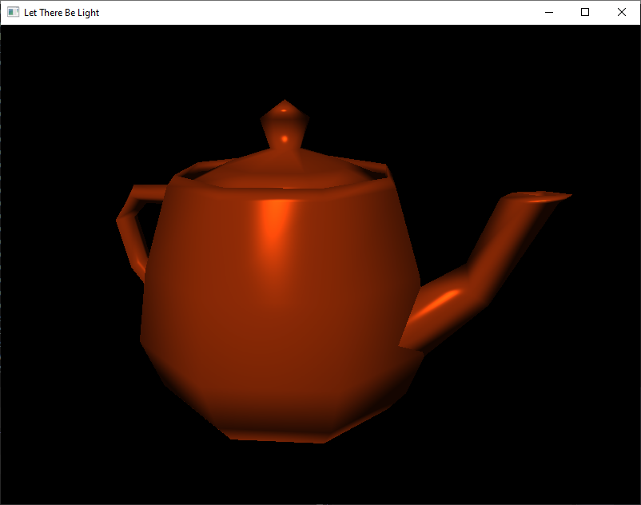
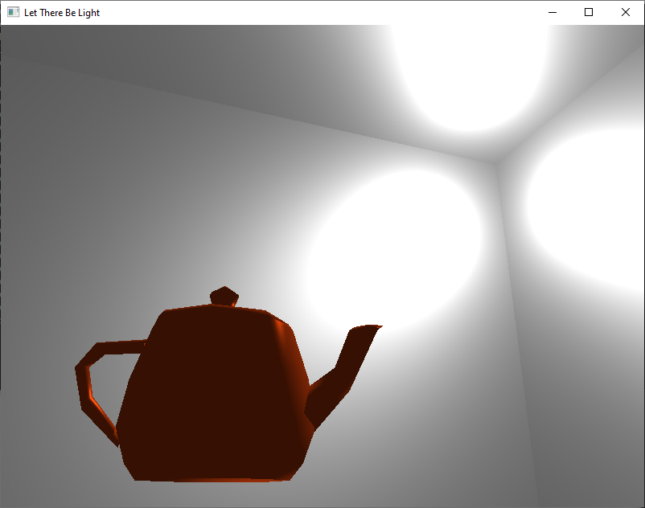
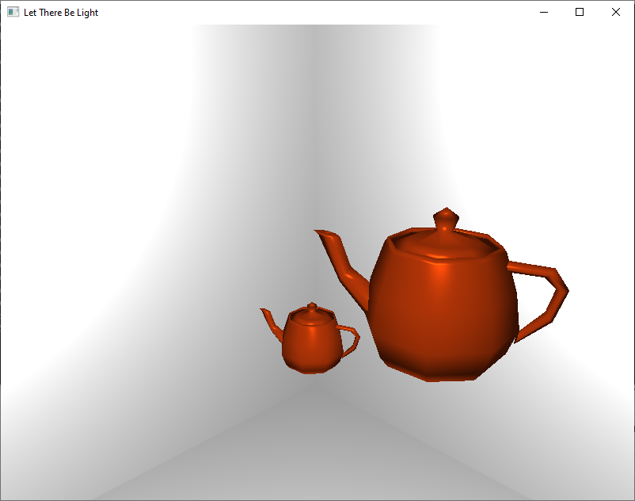
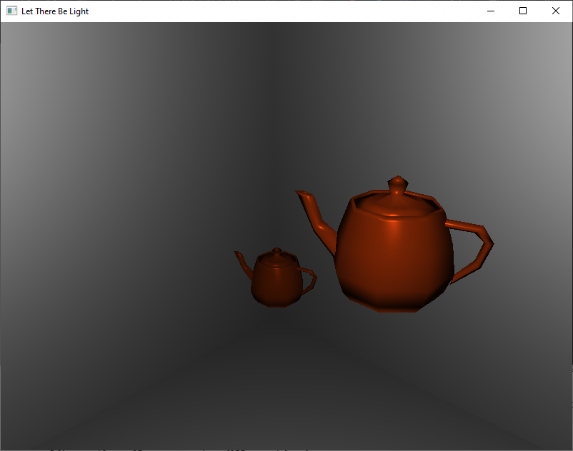

# ClOs
* CLO7 - Use OpenGL to perform light-source shading

# Introduction

You may be surprised to learn that we have covered almost all the *Course Learning Objectives* already. One of the outstanding objectives is to learn about *light-source shading*. Lighting is something that can really make a scene pop, and honestly is not that hard to implement. We are going to start with some theory (and a little math). Then, we will jump into actually putting lights into our scene. You will notice that I use "lighting" and "shading" interchangeably. This is because both terms are used to describe the algorithms we will be using.

# Let There Be Light!

In the real world, light is made up of *photons*. They possess the ability to act as both *waves* and *particles*. As photons bounce around the world, they pick up color, which we can detect once they reach our eyes.[^1]

Modeling this behavior in a digital environment has been one of the most researched aspects of Computer Graphics. If you recall our discussion about [Graphics History](../week_1/graphics_history.md), many of the breakthroughs coming out of Utah dealt with shading/lighting. Until fairly recently, most lighting techniques required varying levels of fakery.[^2]

Part of creating a convincing fake is to examine how light behaves under different conditions. Let's take a moment to categorize a few different "types" of lights.

# Types of Light

Below are the main types of light sources you will see in an OpenGL program. In this lesson we are going to limit ourselves to using *Ambient* and *Positional* lighting.

## Global Ambient

*Ambient* light simulates light that has bounced around a space so many times that there is no identifiable source. In a way it feels like *ambient* light comes from everywhere and nowhere. Almost every scene will have some level of *ambient* light. No matter how dark the scene is, the user needs to be able to see *something*, so we will need at least some *ambient* light value.

## Directional or Distant

Whereas *ambient* light comes from everywhere, *directional* light has a definite source. This source *outside* our scene: a great distance outside it. The best example of a *directional* light source is the Sun. Rays from the Sun come in at a specific angle, which is consistent across the entirety of your observable area. No matter how far you move in a scene you cannot change the angle of light impacting the objects. *Directional* lights also have the same intensity across the entire scene.

## Positional

*Positional* lights also have a source, but unlike *directional* lights, the source is located *within* our scene. A simple example would be a lightbulb hanging from the ceiling. The angle of light impacting objects will depend on their relative positions in the world. Also, *positional* lights' intensity (brightness) grows smaller the further away from the light position one gets (called *attenuation*).

## Spotlight

These lights have both a position and a direction. *Spotlights* have a *cone* of light that they emit, and only objects that fall within it are illuminated. I always think of the Bat Signal when I imagine a *spotlight*. The light shoots out in a very tight cone and draws a circle on a cloud to summon The Dark Knight. If you have ever attempted to make shadow puppets, you know that not all light sources are effective; a flashlight works great, but a chandelier does not.

# Modeling Light in OpenGL

In this lesson, we are going to go over three fairly simple (but fairly convincing) lighting models:

* *Flat*
* *Gouraud*
* *Blinn-Phong*

All three of these fall under the *ADS Model* of lighting. The model's name comes from its use of values for:

* *Ambient* - simulates the low-level "everywhere" light value
* *Diffuse* - simulates the brightness based on the angle of light hitting the object
* *Specular* - simulates the shininess of an object by producing highlights

There is a *fourth* value we will be using, but it is attached to the object (not the light source): *shininess*. This value specifies how much light an object should reflect.

These concepts are easier to understand with a visual:



Here is a quick rundown of how changing each of these values will affect the look of our objects.

| Ambient ||
| --- | -- |
| Increase | entire object becomes brighter, including the dark side | 
| Decrease | the darkside of the object gets darker |
| Set to Zero | anything part of the object not hit by light is pure black |

| Diffuse ||
| --- | --- |
| Increase | the lit side becomes brighter and you can see more of the shape |
| Decrease | the lit side becomes darker and the object looks flatter |
| Set to Zero | Only ambient and specular light object: mostly dark with highlights |

| Specular | |
| --- | --- |
| Increase | highlight becomes brighter |
| Decrease | highlight becomes dimmer |
| Set to Zero | no shininess, matte finish |

| Shininess ||
|---|---|
| Low (8-16) | Soft highlight |
| Medium (32-36) | "Classic" highlight |
| High (128+) | Very tight and sharp highlight |

# Lighting Math

I know the word "math" can be scary, but we really aren't dealing with a lot of complexity in our algorithms. In the end, we need to identify how much light is hitting each pixel. We will use the following equation:

$$I_{result} = I_{ambient} + I_{diffuse} + I_{specular}$$

$I$ stands for *Intensity* of the light hitting the pixel. This value will then be multiplied by the color value of the pixel to either brighten it or dim it.

$I_{ambient}$ doesn't need to be calculated because it is set directly by us: $Light_{ambient}$. Think of this as the "minimum" intensity value.

$I_{diffuse}$ is calculated using $Light_{diffuse} * cos(\theta)$. $\theta$ is the angle between the light source and the surface normal. We don't actually need to calculate $\theta$ as we can just use $( \widehat{N}  \bullet \widehat{L})$.

<div align="center" markdown="1">



</div>

Our shaders will be able to calculate $\widehat{N}$ by multiplying the surface normal by the *Normal Matrix* (discussed later). The shaders can also calculate the $\widehat{L}$ by subtracting the *fragment position* from the *light position*. Finally, we only care about surfaces facing the light, so we limit our results to where $cos(\theta) \ge 0$ with $max((\widehat{N}\bullet\widehat{L}))$. Our final equation is:

* $I_{diffuse} = Light_{diffuse} * max(\widehat{N}\bullet\widehat{L})$

$I_{specular}$ is the most complicated to calculate. If you look at the diagram below, you will see that we are looking to determine how much of the reflection ($\overrightarrow{R}$) makes it into the eye ($\overrightarrow{L}$) using $cos^n(\phi)$. 

<div align="center" markdown="1">



</div>

In this calculation, $n$ is the *shininess* of the object. The higher the shininess, the faster the specular *falloff* (resulting in narrower highlights). As with *Diffusion*, we can skip calculating $\phi$ and jump straight to $max(0,(\widehat{R}\bullet\widehat{V})^n)$. Our final equation is:

* $I_{specular} = Light_{specular} * max(0,(\widehat{R}\bullet\widehat{V})^n)$

Calculating $\overrightarrow{R}$ is fairly simple by *reflecting* $\overrightarrow{L}$ over $\overrightarrow{N}$. It is even simpler to produce $\overrightarrow{V}$ because it is the negative of our *fragment position*, which our shader will have.

**WARNING** When it comes to actually write our shaders, we are going to be *faking* our specular calculations. While it is conceptionally simple to determine $\overrightarrow{R}$, it does require some overhead to produce. IN 1977, James Blinn realized that we only needed $\overrightarrow{R}$ in order to calculate $\phi$.

His new approach generates a new $\overrightarrow{H}$, which is halfway between $\overrightarrow{L}$ and $\overrightarrow{V}$. He realized that the angle $\alpha$ between $\overrightarrow{H}$ and $\overrightarrow{N}$ is roughly $\frac{1}{2}\phi$. Calculating $\overrightarrow{H}$ is simply $\overrightarrow{L} + \overrightarrow{V}$, and $cos(\alpha)$ is calculated with $\widehat{H}\bullet\widehat{N}$. Using the *Blinn-Phong* approach, we can rewrite our equation:

* $I_{specular} = Light_{specular} * max(0,(\widehat{H}\bullet\widehat{N})^n)$

As with all the math in this course, I just want you to be familiar with how it is derived. You won't be asked to reproduce the calculations, you only need to be able to apply the equations. 

# Getting our Object Ready

In order to get our objects lit, we need to update our Object Class to process lighting. Make copies of your `object.hpp` and `object.cpp`, and name the copies `object_light.hpp` and `object_light.cpp`. Make sure you update the `#include` inside the `object_light.cpp` to reflect the name change.

The first thing we want to do is define a *Struct* to hold our lighting information. This will make passing it to `draw()` much easier. Put this at the top of the header file *before* the class declaration.

```C++
struct Light {
    glm::vec3 position {0.0f, 0.0f, 0.0f};
    glm::vec3 ambient  {0.15f, 0.15f, 0.15f};
    glm::vec3 diffuse  {0.8f, 0.8f, 0.8f};
    glm::vec3 specular {1.0f, 1.0f, 1.0f};
};
```

You should recognize each of these from our discussion above. The values here are useful for demonstrating our different shading algorithms. Since we will be included in `object_light.hpp` in our application, we will have access to this Struct there as well.

Next, we need to have a way of assigning a *Shininess* value to our objects. Therefore, create a new public data member: `float shininess = 32.0f;` (a good default value). We also need a way to set this, so declare a new public member function: `void setShininess(float s);`

Finally, we need a way to get our lighting information to our shaders. We are going to be passing our lighting information using the struct we defined above. Update the `draw()` header to the following:

```C++
void draw(const glm::mat4& view, 
              const glm::mat4& projection,
              const Light& light) const;
```

Now, let's move to `object_light.cpp`. Whenever you update a header, you should immediately make the `.cpp` match. Therefore, let's write our `setShininess()` function. I placed it right under `setColor()`.

```C++
void Object::setShininess(float s) {
    shininess = s;
}
```

We also have to update our `draw()` call to match the header.

```C++
void Object::draw(const glm::mat4& view,
                  const glm::mat4& projection,
                  const Light& light) const
{...}
```

In order to *use* the light information `draw()` now takes, we have to set up some new uniforms. First, we need to convert our light position into *View Space*. We do this the same way we convert our *Model Matrix*: by multiplying by the *View Matrix*.

```C++
// We must transform the light position into view space
    glm::vec3 lightPosView = glm::vec3(view * glm::vec4(light.position, 1.0f));
	
    GLint lightPosLoc = glGetUniformLocation(program, "uLight.position");
    if (lightPosLoc >= 0)
        glUniform3fv(lightPosLoc, 1, glm::value_ptr(lightPosView));
```

Note, while we convert `light.position` to a `vec4` for the transform, we only want a `vec3`. Our shader code will require a vector for light positions.

Next up is to set uniforms for all the light data and the object's shininess.

```C++
    GLint lightAmbLoc = glGetUniformLocation(program, "uLight.ambient");
    if (lightAmbLoc >= 0)
        glUniform3fv(lightAmbLoc, 1, glm::value_ptr(light.ambient));

    GLint lightDiffLoc = glGetUniformLocation(program, "uLight.diffuse");
    if (lightDiffLoc >= 0)
        glUniform3fv(lightDiffLoc, 1, glm::value_ptr(light.diffuse));

    GLint lightSpecLoc = glGetUniformLocation(program, "uLight.specular");
    if (lightSpecLoc >= 0)
        glUniform3fv(lightSpecLoc, 1, glm::value_ptr(light.specular));

    GLint shininessLoc = glGetUniformLocation(program, "uShininess");
    if (shininessLoc >= 0)
        glUniform1f(shininessLoc, shininess);
```

That is the end of the changes we need to make to our Object class. The uniforms we just set still need to be defined in our shaders. Let's do that now.

# Shading Algorithms

We are going to cover three shading algorithms in this lesson. You will quickly see that the math we discussed above is roughly the same across them all. The differences are *where* the math is done (Vertex vs. Fragment) and *what* is interpolated.

## Flat

I want to start us off with *Flat Shading*. You are not likely to use this in any real situation, unless of course you want your graphics to look *retro*. For *Flat Shading* the algorithm...

* is done in the Vertex Shader
* doesn't interpolate color

This means that for every triangle in our object, the entire face will share the same lighting data, resulting in one color. A picture is worth a thousand words...



Let's look at the shader code. I am presenting it in its entirety; try to noodle through it before moving on to the breakdown. Notice that we are changing how we name our variables. We add a prefix of `a` or `u` to indicate where each came from. You will need to update your `draw()` function's `glGetUniformLocation()` calls to match.[^3]

```GLSL
#version 410 core

layout (location = 0) in vec3 aPos;
layout (location = 1) in vec3 aNormal;
layout (location = 2) in vec2 aTexCoord;

uniform mat4 uMV;
uniform mat4 uP;
uniform mat3 uN;

struct Light {
    vec3 position;
    vec3 ambient;
    vec3 diffuse;
    vec3 specular;
};
uniform Light uLight;

uniform vec3  uObjectColor;
uniform float uShininess;

flat out vec3 lightingColor;   // <-- flat = no interpolation
out vec2 texCoord;

void main()
{
    vec3 fragPos = vec3(uMV * vec4(aPos, 1.0));
    vec3 N = normalize(uN * aNormal);
    vec3 L = normalize(uLight.position - fragPos);
    vec3 V = normalize(-fragPos);
    vec3 H = normalize(L + V);

    vec3 ambient  = uLight.ambient;
    vec3 diffuse  = max(dot(N, L), 0.0) * uLight.diffuse;
    vec3 specular = pow(max(dot(N, H), 0.0), uShininess) * uLight.specular;

    lightingColor = (ambient + diffuse + specular) * uObjectColor;
    texCoord = aTexCoord;

    gl_Position = uP * uMV * vec4(aPos, 1.0);
}
```

The `layout` and first three uniforms are the same as last time. Next, you will see that we define the same `struct` in our shader as we did in our Object class. This is what allows us to pass in all the lighting data using one uniform: `uniform Light uLight;` We also add a uniform to hold the object's shininess.

When it comes to our `out` variables, we still have `texCoord`, but we also added: `flat out vec3 lightingColor;`. Since we are doing our lighting algorithms in the Vertex Shader, we need a way to send the light-adjusted color value to the Fragment Shader. The `flat` keyword here tells the Fragment Shader to *not interpolate* the value across the face. This is how we ended up with one color per face.

In `main()` the new things we are doing are:

* "fix" our object normals by applying the inverse normal matrix (`uN`)
* calculate the vectors we need for calculating $I_{result}$ as described previously
* calculate $I_{ambient}$, $I_{diffuse}$, and $I_{specular}$
* calculate the final lighting color by multiplying $I_{result}$ with our `uObjectColor`

The `lightingColor` value is passed along to the Fragment Shader where it used to color each pixel of the triangle face.

```GLSL
#version 410 core

flat in vec3 lightingColor;
in vec2 texCoord;

uniform sampler2D uTex;
uniform int useTexture;

out vec4 FragColor;

void main()
{
    vec3 color = lightingColor;
    if (useTexture == 1)
        color *= texture(uTex, texCoord).rgb;

    FragColor = vec4(color, 1.0);
}
```

The above Fragment Shader code should be self-explanatory. Remember, by using the `flat` keyword for `lightingColor`, the Fragment Shader *will not interpolate*. This results in the entire face having the same color value. The next two shaders we will examine will leverage the power of interpolation to smooth out the shading.

## Gouraud Shading

Back in 1971, a Frenchman by the name of Henri Gouraud came up with an algorithm for smooth shading.[^4] The lighting algorithm is done in the Vertex Shader. The algorithm calculates the lighting at each vertex and then uses the Rasterizer to interpolate the color across the entire face.

This results in a much smoother looking object.



The Vertex Shader code is pretty much the same thing, but without `flat` on the `lightingColor` variable.

```GLSL
#version 410 core

layout (location = 0) in vec3 aPos;
layout (location = 1) in vec3 aNormal;
layout (location = 2) in vec2 aTexCoord;

uniform mat4 uMV;
uniform mat4 uP;
uniform mat3 uN;

struct Light {
    vec3 position;
    vec3 ambient;
    vec3 diffuse;
    vec3 specular;
};
uniform Light uLight;

uniform vec3  uObjectColor;
uniform float uShininess;

out vec3 lightingColor;        // ordinary smooth interpolation
out vec2 texCoord;

void main()
{
    vec3 fragPos = vec3(uMV * vec4(aPos, 1.0));
    vec3 N = normalize(uN * aNormal);
    vec3 L = normalize(uLight.position - fragPos);
    vec3 V = normalize(-fragPos);
    vec3 H = normalize(L + V);

    vec3 ambient  = uLight.ambient;
    vec3 diffuse  = max(dot(N, L), 0.0) * uLight.diffuse;
    vec3 specular = pow(max(dot(N, H), 0.0), uShininess) * uLight.specular;

    lightingColor = (ambient + diffuse + specular) * uObjectColor;
    texCoord = aTexCoord;

    gl_Position = uP * uMV * vec4(aPos, 1.0);
}
```

The Fragment Shader code is *exactly* the same, but with the `flat` keyword.

```GLSL
#version 410 core

in vec3 lightingColor;
in vec2 texCoord;

uniform sampler2D uTex;
uniform int useTexture;

out vec4 FragColor;

void main()
{
    vec3 color = lightingColor;
    if (useTexture == 1)
        color *= texture(uTex, texCoord).rgb;

    FragColor = vec4(color, 1.0);
}
```
 In the screenshot above, notice how you can still make out the vertices and edges of triangle in the highlighted areas. This is because `specular` values are non-linear ($max(0,(\widehat{H}\bullet\widehat{N})^n)$) and therefore can't be reproduced in the middle of a face (interpolation is linear). We can create even *smoother* shading if we calculate the lighting in the Fragment Shader.

## Phon-Blinn

In 1973, Bui Tuong Phong created an algorithm that calculated the lighting *per-pixel* (vs. *per-vertex* with Gouraud Shading). In 1977 James Blinn came up with his modified approach (mentioned above). Both techniques allowed for the normals to be interpolated across the entire triangle. This allows for more accurate *specular lighting*. We are taking this a step further and also doing *per-pixel* light vector calculations. 



Notice how the *specular* highlights don't follow the triangle edges any more. Blinn-Phong shading really makes it hard to see *any* triangles unless you are looking at the outline. In this way, Blinn-Phong can take low-poly objects and make them look much higher resolution.

The shader code is roughly the same, but the role the Vertex and Fragment shader have is reversed.

```GLSL
#version 410 core

layout (location = 0) in vec3 aPos;
layout (location = 1) in vec3 aNormal;
layout (location = 2) in vec2 aTexCoord;

uniform mat4 uMV;
uniform mat4 uP;
uniform mat3 uN;

out vec3 fragPos;
out vec3 normal;
out vec2 texCoord;

void main()
{
    fragPos  = vec3(uMV * vec4(aPos, 1.0));
    normal   = uN * aNormal;
    texCoord = aTexCoord;

    gl_Position = uP * uMV * vec4(aPos, 1.0);
}
```

We still have to "fix" the vertex normals and move our coordinates into *Clip Space* (using the *Projection Matrix*). Other than that, the Fragment Shader will do the rest.

```GLSL
#version 410 core

in vec3 fragPos;
in vec3 normal;
in vec2 texCoord;

struct Light {
    vec3 position;        // already in view space
    vec3 ambient;
    vec3 diffuse;
    vec3 specular;
};
uniform Light uLight;

uniform vec3  uObjectColor;
uniform float uShininess;
uniform sampler2D uTex;
uniform int useTexture;

out vec4 FragColor;

void main()
{
    vec3 N = normalize(normal);
    vec3 L = normalize(uLight.position - fragPos);
    vec3 V = normalize(-fragPos);
    vec3 H = normalize(L + V);

    vec3 ambient = uLight.ambient;
    vec3 diffuse = max(dot(N, L), 0.0) * uLight.diffuse;
    vec3 specular = pow(max(dot(N, H), 0.0), uShininess) * uLight.specular;

    vec3 lightingColor = (ambient + diffuse + specular) * uObjectColor;
    if (useTexture == 1)
        lightingColor *= texture(uTex, texCoord).rgb;

    FragColor = vec4(lightingColor, 1.0);
}
```

We had to move all the lighting code into the Fragment Shader (including the `struct` definition). Since uniforms are set for the entire pipeline, we don't have to adjust any of our `draw()` code to switch between the different types of shading.

## Shading Differences

You have seen the code for each type of shading algorithm. I also provided a screenshot for each. While this helped highlight the differences, seeing the lighting *in motion* makes it even more clear. Below are three GIFs. In each, the same object is shown using all three shading techniques. With each GIF, the poly-count of the teapot increases.


Some things to note:

* Gouraud Shading produces a "strobing" effect with the *specular* lighting
* Increasing the poly-count produces better highlights with Gouraud Shading, but the "strobing" gets faster
* The highlights for the Blinn-Phong remain relatively the same
* You have to look hard at the outline of the Blinn-Phong to notice the difference

As you can see, Blinn-Phong creates *very* convincing lighting on objects: not matter the poly-count.

# Your Turn

You will notice that I haven't provided you with as much *application* code in this lesson. The goal is that as you get more familiar with OpenGL, I can focus almost entirely on the new concepts and you will manage the rest. To be clear, I don't expect you to remember everything we have done thus far, but going back to review will only re-enforce your understanding.

That said, here are some things to get your going.

## Object Files

In this lesson I used various versions of the teapot module:

* [teapot_low.obj](../downloadable_files/objects/teapot_low.obj)
* [teapot_med.obj](../downloadable_files/objects/teapot_med.obj)
* [teapot_high.obj](../downloadable_files/objects/teapot_high.obj)

Using different ones helps demonstrate the differences in shading techniques.

In your program, you will need to...

* create your own shader files (e.g. `blinn_phong.vert` and `blinn_phong.frag`)
* declare objects
* initialize them in `init()`
  * set which shader you want to test out
  * set color and shininess
* use them in `display()`
  * declare a `Light` object 
    * set a position
    * change the default values if desired
  * place, transform, animate
  * draw them (don't forget to pass the `light` object)
* Cleanup the objects you create at the end of `main()`

If things aren't working out as you expect, you may have not updated all the appropriate uniform variables. Any failure to get a uniform location will result in that uniform being empty in the shader, greatly affecting the results. You can test this by adding an `else` to each `if` where you are checking the uniform location is `>= 0`.

For example:

```C++
GLint mvLoc = glGetUniformLocation(program, "uMV");
if (mvLoc >= 0)
    glUniformMatrix4fv(mvLoc, 1, GL_FALSE, glm::value_ptr(mv));
else
    std::cout << "Failed to get uMV location" << std::endl;
```

These would be good to put in either way; I left them out initially to keep the code easier to read.

I highly recommend creating multiple of the same object, but with each of the shaders. This will allow you to really experience the differences between the approaches. Also, make sure you use our movement controls to move around the object to see how the highlights change based on the camera position.

# But wait! There's More

I don't know about you, but I am tired of having an empty background for our models to inhabit. Let's add a cube to act as a room. To help with this, I have created a special `room.obj` files. This is the same thing as the previous cube object we used, but this one has the normals pointing inward. Anyone know why that is necessary?

**Hide Answer: The math we used for our ADS algorithm only illuminates triangles that have normals that face the light. The default `cube.obj` has the normals pointing outward, so you will only see *ambient* light if you use that model.**

After declaring the object and loading it, you can place it in `display()` using:

```C++
// Draw the cube (room)
room.resetTransform();
room.setPosition(glm::vec3(0.0f, 0.0f, 0.0f));
room.scale(glm::vec3(10.0f));

room.draw(view, proj, light);
```

Now, as long as you place your light and other objects within the scaled boundaries of the room object, you should see it illuminated along with the rest of your scene.

I like to place the light in the upper corner of the room to see how the light plays off the walls.



It's amazing how much a difference adding lighting (and a room!) makes with our scenes! But there's more!

Remember how I said that *Positional* lights have the light dim the further you get from the light source? We aren't currently doing that. In the image below, the light exposure of both teapots is roughly the same.



If we add *Attenuation* to our lighting model, we can make the light realistically fall off the further away an object is. See the following image for an example.



Notice how the lighting in the far corner is basically the same as our *ambient* value? That means barely any light is reaching that far. Likewise, the teapot further from the light is dimmer. The math for this is very easy.

$$attenuationFactor = \frac{1}{k_c + k_ld + k_qd^2}$$

* $d$ - distance from the light
* $k_c$ - constant factor (overall brightness)
* $k_ld$ - linear term (how fast the light fades at medium distances)
* $k_qd^2$ - quadratic term (how fast the light fades at long distance)

Some helpful usage tips:

* To make the light extend further lower the *linear* and *quadratic* terms
* To make the light fade faster increase the *linear* and *quadratic* terms
* To increase the overall brightness decrease the *constant* term (can be $<1$)
* Increasing the *linear* while decreasing the *quadratic* will result in the mid-range being darker, but the far-range staying lit further away
* Decreasing the *linear* while increasing the *quadratic* will result in the mid-range being brighter, but the far-range becoming darker sooner

You can implement *attenuation* in any of the shader types we covered. You just need to put it in the shader that handles the ADS calculations (i.e. vertex for Flat and Gouraud, fragment for Blinn-Phong).

We are going to add this to our light `struct` and pass it in as a uniform.

```C++
struct Light {
    glm::vec3 position {0.0f, 0.0f, 0.0f};
    glm::vec3 ambient  {0.15f, 0.15f, 0.15f};
    glm::vec3 diffuse  {0.8f, 0.8f, 0.8f};
    glm::vec3 specular {1.0f, 1.0f, 1.0f};
    glm::vec3 attenuation {1.0f, 0.09f, 0.03f};
};
```

We are using a `vec3` to pass in all three values: *constant*, *linear*, and *quadratic* (x, y, z respectively). You will need to update the `struct` at the top of `object_light.hpp`. If you want to use anything other than the default, you will need to specify them in the `display()` function where you set the other light parameters. Finally, you need to add a new uniform variable in the Object `draw()` call.

```C++
GLint lightAtenLoc = glGetUniformLocation(program, "uLight.attenuation");
    if (lightAtenLoc >= 0)
        glUniform3fv(lightAtenLoc, 1, glm::value_ptr(light.attenuation));
```

Also in the shader code, declare three new variables and assign them the appropriate values from `vec3 attenuation`.

```GLSL
float constant  = uLight.attenuation.x;
float linear    = uLight.attenuation.y;
float quadratic = uLight.attenuation.z;
```

Then in `main()` you add the code to calculate the distance to the light and then to plug in all the values into our equation.

```GLSL
// Distance attenuation (point light)
float distance = length(uLight.position - fragPos);
float attenuation =	1.0f / (constant + linear * distance + quadratic * distance * distance);
```

Now, we just need to multiply both `diffuse` and `specular` by this `attenuation` variable. Note, *ambient* light isn't attenuated, it comes from "everywhere".

```GLSL
vec3 diffuse = max(dot(N, L), 0.0) * uLight.diffuse * attenuation;
vec3 specular = pow(max(dot(N, H), 0.0), uShininess) * uLight.specular attenuation;
```

That's it! Everything else runs as normal. If you don't want to use attenuation, you can just set `attenuation` to `1.0`. You could also set up code to toggle it when pressing a button.[^5]

# Lights Out

If I am being honest, this lesson ended up being much more indepth than I had first imagined. This is a good thing, we really dug deep into how lighting is calculated. Again, I refrained from *handing* you the code to get all this working. Please make sure you are actually applying these techniques during/after the lesson review. If you struggled with anything, please reach out on the discussion board for help.

Given the open-ended nature of this lesson, please push yourselves to create some complex scenes. You could even make the light move!


[^1]: Technically, they don't "pick up" color. Instead, the energy they have is changed by the materials they interact with. High-energy photons are blue to violet. Low-energy photons are red and orange.
[^2]: *Ray Tracing*, which mimics photons to some degree, has become the gold standard of lighting, with Nvidia and AMD both creating specialized chips to manage the massive calculations. These *Physically Based Rendering* (RBR) techniques are beyond the scope of what we can implement in this course, but are worth exploring.
[^3]: We don't have any GLSL error checking running at the moment, so catching misnamed variables will be tricky.
[^4]: Henri Gouraud's original algorithm didn't make use of the $\widehat{H}$ that Blinn discovered. We are going to use it anyway to keep things simpler.
[^5]: To do this, you need to add a uniform variable to act as a flag and then check to see if it set before calculating attenuation. You should be able to use what we have already covered to set up the key-press trigger, the toggle variable, and set the uniform from our application. Super fun challenge!
