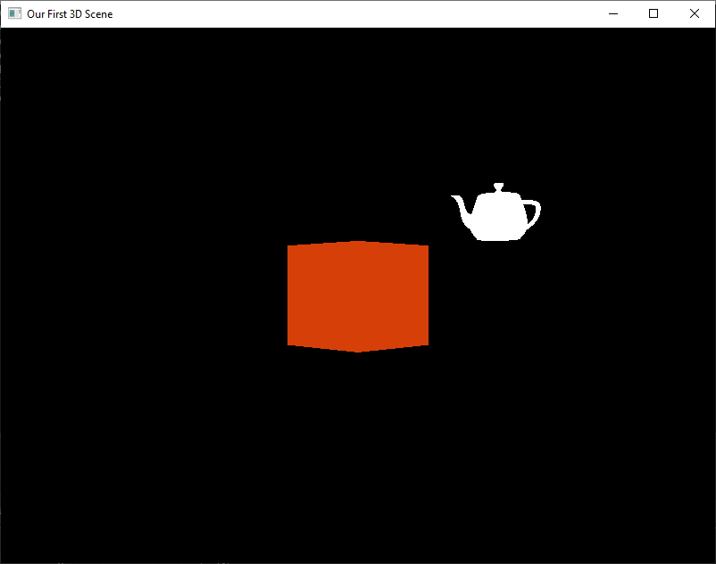
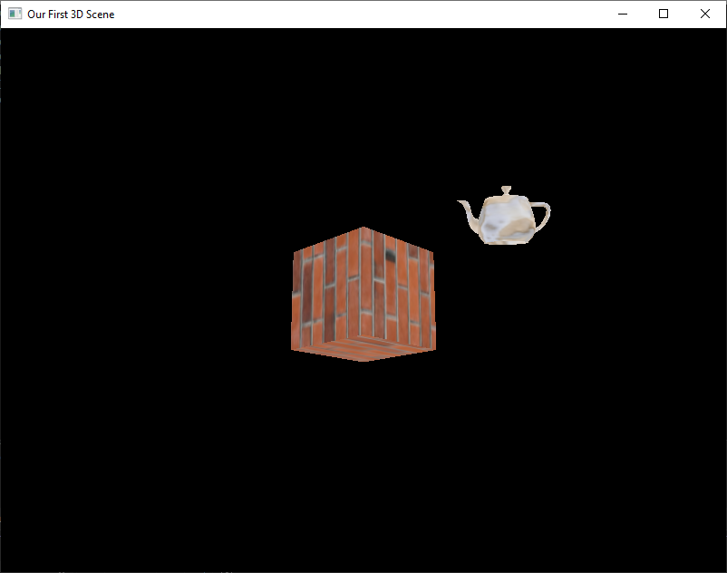

# CLOs
* CLO9 - Explain the ways Vertex Buffer Objects can improve your display performance

# Introduciton

Up until this point, we have stored our ojbects' vertices as hardcoded arrays in our application code. This is not *the way*. The moment we want to have more than a few objects, our code becomes bloated and unwieldy. There has to be a better way.

Of course there is! In this lesson, we are going to learn how to load object data (not just vertices) from an `.obj` file. We will then store that data in a *mesh* object that will handle all the complicated VAO/VBO steps. Not only will this make writing code easier, but it will also make our `display()` function much easier to read.

# OBJ Files

There are many different ways to store object data for use with a 3D application, but we are going to focus on `.obj` files. This file format first introduced in the late 1980s by Wavefront Technologies. It started out as a proprietary format, but has sense moved to being open file format. 

Without going into great detail, each `.obj` file contains:

* vertex positions (x, y, z)
* texture coordinates (s, t)
* vertex normals (nx, ny, nz)
* face list

*Vertex positions* should be self-explanitory at this point. *Texture coordinates* will be covered later, but are basically the coordinates within the 2D texture associated with each vertex. *Vertex normals* will be used when we cover lighting, but are simply unit vectors pointing directly out from each vertex. 

The *face list* takes a bit more to explain. Remember how we had to dupicate our vertices to create our cube? Well, when creating object files, we want to keep them as small as possible so we don't want to do that. Therefore, the data arrays don't contain duplicates. So how do we produce our triangles (aka faces)? The *face list* is made up of *indices* for each array. So, when reading data from the `.obj` file, we will read in something like `1/1/1 2/2/2 4/4/4`. This means grab the first, second, and fourth vertex positions (also the texture coordinates and vertex normals).

This *indexing* helps reduce the data we need to store. This also allows the data to be *interleaved*. We can mirror this storage in our own program, but requires the use of EBOs, which we haven't covered yet. Therefore, we are going to take this single *flat* array and store the three types of data in *separate* arrays.

# Getting by with a little help from our friends

To help us, we are going to use a framework called *TinyObjLoader*. Go ahead and download the `tiny_obj_loader.h` file from it's [GitHub repo](https://github.com/tinyobjloader/tinyobjloader). We are going to want to add this to our Visual Studio Template.

The easiest way to do this is to create a new project using our OpenGL Template. Once it is created and saved, you need to navigate to where the project folder is in the File Explorer. Once you locate it, you need to identify the folder holding the `.vcxproj` file. Next to this file you want to copy the header file we just downloaded. 

Go back to Visual Studio, and right click on "Header Files" in the Solution Explore and click "Add Existing Item..." Navigate to where you just copied the header file and add it to the project. We need to do it this way so that when we export the template, the header file will be included and not just linked.

We now need to tell Visual Studio where to look for header files we write or add. Right-click on the Solution name in the Solution Explorer (on the right) and select "Properties". Find where it says "VC++ Directories" and select it. Click where it says "Include Directories" and then the down arrow that appears. Select edit, and on a new line add `$(ProjectDir)`. Save and apply the changes.

Now, click "Project" and then "Export Template..." You want to make sure the template is called "OpenGL Template" when you export. You will be warned that there already is a template with this name and that proceeding will result in it being deleted and replaced. This is actually what we want. Click "Finish" and overwrite the existing template.

Now you should be able to close Visual Studio and create a new project with our updated template. Do this now and create a project called "Loading Objects". Before moving on, make sure that the header file was successfully added to the template.

# Housing our Objects

In order to leverage the benefit of loading objects from a a file, we need somewhere to store them. Sure, we could declare a bunch of disconnected data structures, but this would get super messy *very* quickly. Instead, we are going to be defining an *Object Class* to manage all our data.

We are about to look at *a lot* of code. Much of it *should* look familiar as we are just repurposing existing code into a class. We are also going to be setting up this class for future work. I will do my best to explain the main changes, but you really need to take the time to examine the code on your own so you understand what is going on.

## Header

You should be familiar with *Classes* when it comes to programming, but if you aren't a C++ programmer, you may not know how to write one. The first thing we need is called a *Header File*. This is going to hold our object *declaration*. We are going to store this code in [object.hpp](../downloadable_files/object.hpp).

```C++
// object.hpp
#pragma once

#include <string>
#include <vector>
#include <GL/glew.h>
#include <glm/glm.hpp>

#define numVAOs 1
#define numVBOs 3

class Object {
public:
    std::vector<float> vertices;
    std::vector<float> normals;
    std::vector<float> texCoords;
    int numVertices = 0;

    GLuint VAO[numVAOs];
    GLuint VBO[numVBOs];

    GLuint program = 0;
    GLuint textureID = 0;
    glm::mat4 modelMatrix{1.0f};

    Object() = default;

    bool init(const std::string& vertPath,
              const std::string& fragPath,
              const std::string& objPath);

    bool loadTexture(const std::string& path);

    void setPosition(const glm::vec3& pos);
    void translate(const glm::vec3& delta);
    void rotate(float degrees, const glm::vec3& axis);
    void scale(const glm::vec3& s);
    void resetTransform();

    void draw(const glm::mat4& view, const glm::mat4& projection) const;
    void cleanup();
    void setColor(const glm::vec3& c);

private:
    std::string loadShaderSource(const char* filePath);
    GLuint buildShaderProgram(const char* vertPath, const char* fragPath);
    bool loadOBJ(const std::string& path);
    void setupBuffers();
};
```


 ## Data Members

While this is not how the computer uses a header file, I want you to think of it as a "menu." The header will list all the things that our class will hold and how we will access it. Let's start with the variable declarations.

* `vertices` - will hold our vertex data (x, y, z)
* `normals` - will hold the unit vectors perpendicular to the vertex (used for lighting)
* `texCoords` - will hold the coordinates used to map textures to a vertex
* `numVertices` - will be updated with the number of vertices loaded
* `program` - will hold the ID of the shader program built by the object
* `textureID` - will hold the ID for the texture our object will use (covered later in the term)
* `VAO[numVAos]` - will hold our Vertex Attributes the same way as before
* `VBO[numVBOs]` - will hold our buffers the same as before, but they will hold different things
* `modelMatrix` - is used as our starting point as we did with our previous transforms
* `color` - will allow us to define an RGB color for our object (in case no texture is loaded)

## Member Functions

Now, let's look at the some of the new functions.

* `init()` - used to specify shader and object file names
* `loadTexture()` - used to specify texture file name (provided for later use)

We are going to be moving the transforms into the class itself. This will keep `display()` much cleaner. They will behave exactly the same as before, but this time our object keeps track of its own *Model Matrix*.

* `setPosition()` - set's the object's world position
* `translate()` - translates object
* `rotate()` - rotates object (takes degrees)
* `scale()` - scales the object
* `resetTransform()` - undoes all transforms (useful for animation)

The object will also be in charge of drawing itself. This means that it will handle loading the rendering program, binding VAOs and VBOs, and calling `glDrawArrays()`.

* `draw()` - handles all the steps needed to get our data to the vertex shader
* `cleanup()` - deletes the buffers, vertex arrays, and the rendering program (used when shutting down the application)
* `setColor()` - allows us to set a default object color

The functions listed above are *Public*, meaning we as the programmer can call them directly. Below, are the *Private* functions, which only objects can call from within themselves. The first two reuse code we wrote earlier this term.

* `loadShaderSource()` - loads shader source from a file
* `buildShaderProgram()` - handles all the steps of creating a shader program (loading sources, compiling, attaching, linking, and deleting)
* `loadOBJ()` - uses *TinyObjLoader* to pull data from the `.obj` file and store it in our data arrays. It also counts how many vertices our object has (required for our draw call)
* `setUpBuffers()` - handles the generation of our vertex array and buffers. It also binds the buffers and uploads the data. We handled this ourselves earlier, so it should look familiar.

# Implementation

I am not going to go over all the code in [object.cpp](../downloadable_files/object.cpp) because much of it we already went over and are just moving it into a class structure. I will highlight parts that I think are worth extra attention. You should load up the linked file in an editor and follow along.

The first thing we need to note is that in order to use *TinyObjLoader* we have to add some `#define` statements. These are required to make sure everything works correctly. We then include the header we downloaded earlier.

```C++
#define TINYOBJLOADER_IMPLEMENTATION
#define TINYOBJLOADER_DISABLE_FAST_FLOAT
#include "tiny_obj_loader.h"
```

## Transforms

Take a quick look at the code for our object transforms. You should immediately notice that our object member functions are just *wrapping* the GLM functions. We will use these the same way as we would the direct GLM calls.

## Drawing

This is one of the neater functions we have in this class. This function takes only the view and projection matrices and handles the rest. It loads the program that the object `init()` function builds. It then finds the uniform variable locations and loads the appropriate data into each. The class attempts to load six uniforms:

* `mv` - *Model-View Matrix*
* `p` - *Projection Matrix*
* `n` - *Normal Matrix* (used for shading/lighting)
* `tex` - tells the GPU which texture to use in the shader
* `objectColor` - passes in the object color (default white)
* `useTexture` - a flag to specify if a texture is to be used

`draw()` then binds the object's VAO and calls `glDrawArrays()` before unbinding the VAO. These are *all* steps that we went over in earlier lessons.

## Loading the Object

The *meat* of this class is `loadOBJ()`. It is here that we lean heavily on `TinyObjLoader` to streamline formatting. Let's go over the important parameters of this function.

* `attrib` - these are the *vertex attributes*. They will include position, normals, and texture coordinates.
* `shapes` - it is possible for an `.obj` file to contain multiple "shapes" (or parts). This is beyond the scope of this course, so we will stick with single shape files
* `materials` - it is possible to store a bunch of settings in a *materials* file (`.mtl`). When we get to lighting, we are going to see that there are a bunch of types of color we need to specify (ambient, diffuse, and specular) as well as shininess. These can all be combined into one file: making it easier to apply different lighting behaviors to different objects. For now, we won't be using any materials, which will result in a warning on the console, which we can safely ignore.

Once `LoadObj()` has run its course, we enter into a loop to build our three attribute arrays: `vertices`, `normals`, and `texCoords`. If you recall, `.obj` files contain a list of "faces" which use indexing to reference vertices, normals, and texture coordinates. The code we have in our Object class reads in the faces and then gathers the appropriate data for each index contained within each face.

## Setting Buffers

The last function I want to go over is `setupBuffers()`. Again, this should look vary familiar. In our previous work, we had two VBOs to deal with (position and color). Now we have three: position, normal, texture coordinates. Notice, we no longer have color. This is because we are moving into more "real world" approaches, which rely on textures to define pixel color.[^1]

## Implementation Review

I can't stress enough how important it is for you to take the time to look over the code provided. Seriously, sit down and try to follow the logic. Compare it directly to previous code we wrote. Note the similarities and the differences. Going forward, we won't be looking at it much. Therefore, this may be your last chance to figure out how all these pieces fit together; such is the blessing and curse of *encapsulation*.[^2]

# Using Our Object Class

Now it is time to put all that new code to work! As we are accustomed, let's build off our latest work: [lookat_me_now.cpp](../downloadable_files/lookat_me_now.cpp). Create a new project using our *updated* template (make sure `tiny_obj_loader.h` is automatically added).

Go ahead and download both files: [object.hpp](../downloadable_files/object.hpp) and [object.cpp](../downloadable_files/object.cpp). We are also going to want some object files to play with: [cube.obj](../downloadable_files/cube.obj) and [teapot.obj](../downloadable_files/teapot.obj). Finally, we should have some textures to load with our new code: [brick.jpg](../downloadable_files/brick.jpg) and [ceramic.jpg](../downloadable_files/ceramic.jpg). 

Save all these files into your project directory. You will want to manually add our `.hpp` and `.cpp` to "Header Files" and "Source Files" respectively (right-click and "Add existing item..."). We don't need to add the other files to the explorer.

## Rip it out!

Before we start with our new objects, we need to remove *a lot* of the existing code. It is both frightening and exhilarating when we clean house. Be brave!

First, we want to remove everything from our last header (`#include <fstream`>) until `int windowWidth`. This section covers our old object vertices and colors. It also included the globals used with our VAOs, VBOs, and uniform locations.

Next, we need to delete our `loadShaderSource()` and `buildShaderProgram()` functions. Both of these are now part of the object class, so won't be used anymore.

Scroll down to `init()` and get ready to be bold! Delete *everything* except our projection matrix declaration and `glEnable(GL_DEPTH_TEST)`. We will be coming back to this shortly; after we do some more gutting.

Next on our victim list is `display()`. We want to trash *everything* except for our `glClear()` call and our declaration of our `view` matrix. Again, all of the removed code now lives in our Object class. We will return here as well to transform and draw our new objects.

## We can rebuild it, we have the technology[^3]

While destruction is thrilling, *creation* is where the real joy in life resides. Let's fix what we broke (and make it *better*).

Back to the top we go! In order to use our new Object class we have to add it to the file: `#include "object.hpp`. Right below that, we want to declare some objects to play with. You can pick whatever you want (even download your own object files), but I am going to be using the following:

```C++
Object cube;
Object teapot;
```

At the moment, these objects are empty, we need to fill them. This is done in `init()`. The Object code includes some helpful error checking, so we are going to both initiate our objects at the same time we check to see if it was successful (`object.init()` returns a `bool`). Add the following at the beginning of `init()`.

```C++
if (!teapot.init("shader.vert", "shader.frag", "teapot.obj")) {
    std::cerr << "Failed to load cube" << std::endl;
}
        
if (!cube.init("shader.vert", "shader.frag", "cube.obj")) {
    std::cerr << "Failed to load cube" << std::endl;
}

cube.setColor(glm::vec3(0.84f, 0.25f, 0.03f));
```

As you can see, `object.init()` needs us to pass in the filenames (and paths if not in the same directory) for both shaders and the `.obj` we want to use. We are skipping loading textures for now, but we have set our cube to be *Beaver Orange*. What color will the teapot be? The answer is found in the Object code.

**Hide Answer: The default color for any object is white. This will be helpful when we cover mixing colors with textures.**

In `display()` we need to replace the transforms/animations we deleted. We also need to add our second object! I am providing some sample transforms for you, but feel free to experiment. Under our `view` declaration we want to add our code.

```C++
    teapot.resetTransform();
	teapot.setPosition(glm::vec3(5.0f, 2.0f, -20.0f));
    teapot.scale(glm::vec3(0.5f, 0.5f, 0.5f));
	teapot.rotate((float)currentTime * 45.0f, glm::vec3(0.0f, 1.0f, 0.0f));
    
	teapot.draw(view, proj);

    cube.resetTransform();
    cube.setPosition(glm::vec3(0.0f, 0.0f, -10.0f));
    cube.rotate((float)currentTime * 45.0f, glm::vec3(1.0f, 0.0f, 0.0f));
    cube.rotate(45.0f, glm::vec3(0.0f, 1.0f, 0.0f));

    cube.draw(view, proj);
```

Let's break this down. Since we are animating these objections, we need to make sure we call `resetTransform()` on each of our objects. If we fail to do this, the rotations will compound over and over again.[^4] Now we can proceed with placing our objects in their world location (`setPosition()`). We can then transform them to our hearts content using our Object member functions. 

I have recreated the same animation we had for the cube in our last lesson. Take a moment to compare this new version to the previous one. This new code should be much easier to read.

For the teapot, I decided to push it back into the distance, scale it down by half (it was a huge object), and then give it a rotation around the Y-axis. You can use these transforms or play around with your own.

After we are satisified with all the transforms, we need to call `draw()` for each object. We pass into `draw()` both the `view` and `proj` matrices. In our previous code, we calculated the `mv` matrix in `display()` and then passed it along to the shader. Now, this handled by `draw()`. I can't get over how neat this code looks now.

The last thing we have to do is tidy up after ourselves. AT the bottom of `main()`, before we destroy the window, we need to call `.cleanup()` on each of our objects.

```C++
cube.cleanup();
teapot.cleanup();
```

## Don't Forget the Shaders!

I *almost* forgot to provide you the new shader code needed to make all this happen! You may recall we are now using *three* VBOs and a few more uniforms than in the past. Let's update our shaders to reflect this.

First, the Vertex Shader:

```GLSL
#version 410 core

// Vertex Attribute (from VBO)
layout(location = 0) in vec3 pos;
layout(location = 1) in vec3 normal;
layout (location = 2) in vec2 texCoord;

// Uniform
uniform mat4 mv;
uniform mat4 p;
uniform mat3 n;

out vec2 fragTexCoord;

void main() {
    gl_Position = p * mv * vec4(pos, 1.0f);
    fragTexCoord = texCoord;
}
```

As you can see, we now have three locations: `pos`, `normal`, and `texCoord`. We also have added `uniform mat3 n` to hold our *Normal Matrix*. We are going to use the Fragment Shader to apply our texture, so we need to declare `out vec2 fragTexCoord` to pass along the vertex attribute. By now you should be able to deduce what `main()` does here.

Next, the Fragement Shader:

```GLSL
#version 410 core

uniform sampler2D tex;
uniform vec3 objectColor;
uniform int useTexture;

in vec2 fragTexCoord;
out vec4 fragColor;

void main() {
    vec3 base =	objectColor;

    if (useTexture == 1) {
 	    base *=	texture(tex, fragTexCoord).rgb;
    }
    fragColor = vec4(base, 1.0);
}
```

Here we have three uniforms. The first is `tex`, which is the actual texture data loaded onto the GPU. The second is `objectColor`, which contains the object color we can adjust with `.setcolor()`. The last uniform is `useTexture`, which is a flag to let our shader know if there is any texture to apply at all.

We have one `in` variable, which comes from our Vertex Shader: `fragTexCoord`. As with any Fragment Shader, we need an out variable to set the final pixel color: `fragColor`.

If `useTexture` is set to `1` we multiply the color from the texture by the object color. If we aren't using any texture, then `fragColor` remains the object color passed in. What do you think happens if there are both a texture and color specified?

**Hide Answer: Remember RGB values are *normalized* with a range of [0.0, 1.0]. So, when we multiply the base color by the texture color, we are still guaranteed to have a valid RGB vector. Basically, the object color will *tint* the texture colors. When we are done, I encourage you to play around with this.**

## Hold your breath!

Now, build and run your project. If you followed my example code, you should have something like this:



Isn't it *awesome*?! We now have *two* objects where we had one before. I hope you can see how much easier our Object class makes adding additional objects. Since the class handles all the nitty-gritty, we can focus on crafting our scene.

These objects are fairly plan, let's spice them up!

## Adding Texture

Even though we will be covering textures later this term, it would be a shame not to take our new code for a spin! Go back to `init()` and add the following.

```C++
// Under the teapot initiation (below the if)
if (!teapot.loadTexture("ceramic.jpg")) {
    std::cerr << "Failed to load texture\n";
}

// Under the cube initiation (below the if)
if (!cube.loadTexture("brick.jpg")) {
    std::cerr << "Failed to load texture\n";
}
```

Also comment out the `cube.setColor()` line. I want you to see the texture without any *tinting*. Later, you can come back an play around with how the color mixes with the texture.

If everything was done correctly, you should see:



Take some time and use the keyboard/mouse controls we set up last time to fly around your scene. We are really cooking with gas now!

# Object Wrap-up

This was a really deep topic we just covered. If this was your first time writing a *class* (especially in C++) things probably are still fairly confusing. While there was a lot of new code, much of it was just refactored from what we did before.

When designing this course I had considered providing this class from the start, but I feel doing things "by hand" first helps cement all the steps in OpenGL. Now that we can easily load objects, we can really start to populate our scenes as we see fit. Once we have examined lighting and had an in-depth look at texturing, we will have a full toolkit to create just about anything we want.

Before you leave, try experimenting. Our new Object class will make this easy, so go wild! Some suggestions:

* Create multiples of the same object, but with different textures/colors
* Find `.obj` files online and create dense scenes
* Create complex animations (e.g. the Moon orbiting the Earth)
* Use a program like Blender or TinkerCad to create your own `.obj` files (e.g. recreate your house)

Make sure you share your experiments on the discussion board!

[^1]: That said, I did add a non-standard `setColor` function to the class so we can still display objects before we learn about textures.
[^2]: [Encapsulation](https://en.wikipedia.org/wiki/Encapsulation_(computer_programming))
[^3]: [Lee Majors, am I right?](https://www.youtube.com/watch?v=BthNjd_jUl4)
[^4]: For a good time, remove these resets and see what happens!
