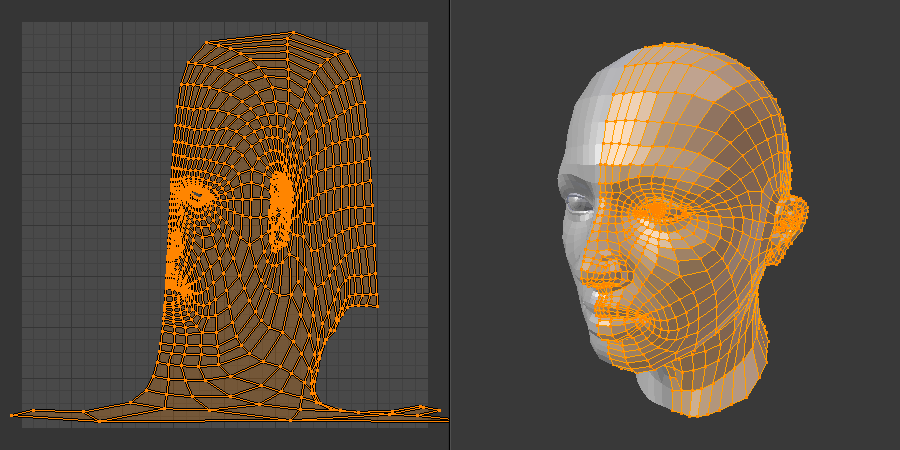
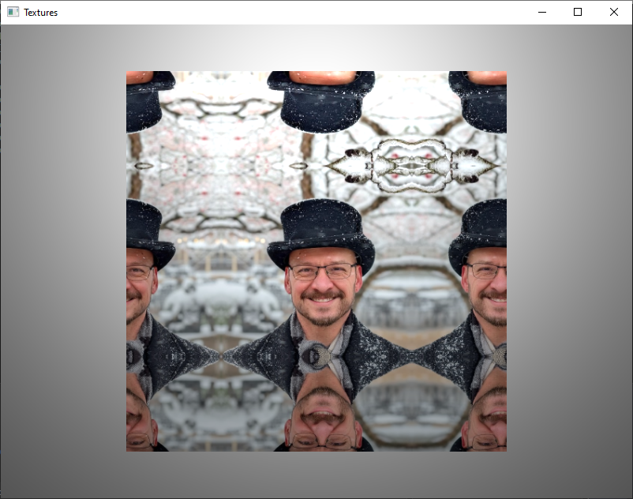
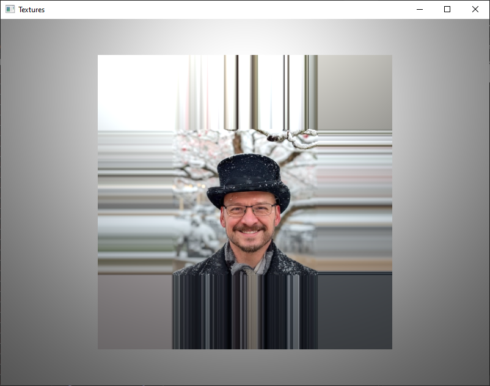
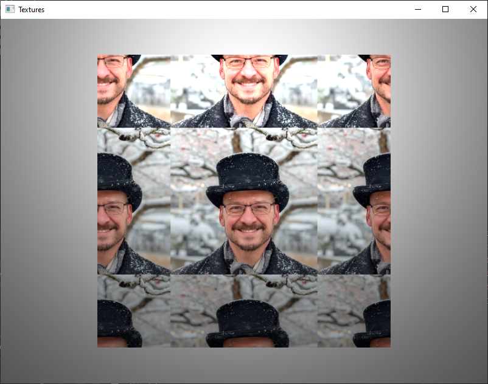
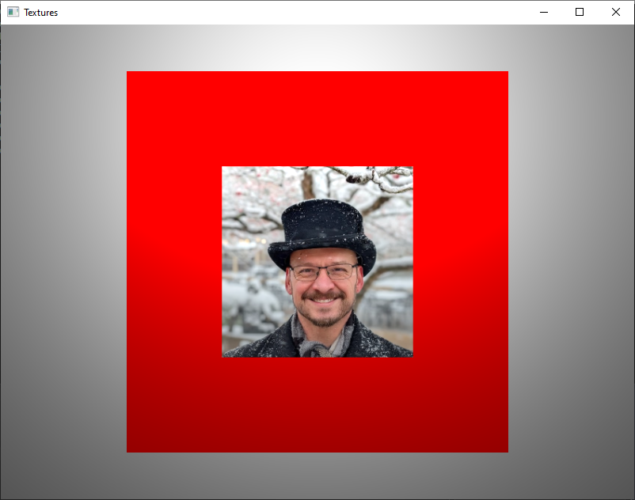
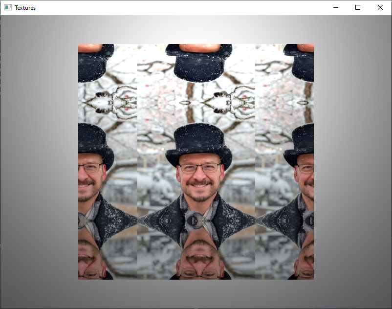
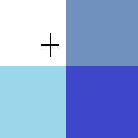
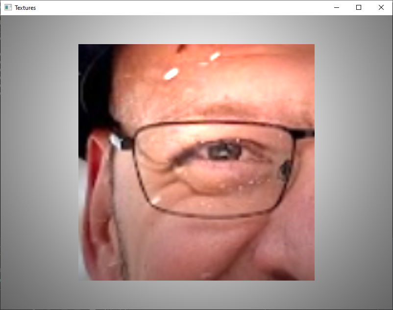

# CLOs
* CLO8 - Use OpenGL to perform texture mapping.

# Introduction

It is time to return to *Textures*. When we created our Object class, we included code to load textures. I had you play around with a texture or two. At the time, we didn't discuss any specifics about how OpenGL handles the application of textures. It is time to fill in those gaps!

# What is a Texture Mapping

Simply put, *Texture Mapping* is the process of painting an image across the surface of a model. Textures are a quick and easy way to add realism to a scene. *Texture Mapping* is so important that GPUs have dedicated hardware units to support it.

Almost any image file can be used as a texture, as long as it is loaded into memory.[^1] While it is possible to write custom code to handle this, we are going to be using *SOIL2* so we can focus on *using* textures right away (more on usage later).

So, *how* do we get OpenGL to apply the textures how we want? We use *Texture Coordinates*. Think back to the code we wrote to load `.obj` files. We created three VBOs to house our *vertex attributes*. The first one is for our vertex *position*. The second one is for our vertex *normals*. The last one is for our *texture coordinates*.

# Texture Coordinates

For our introduction to *Texture Coordinates*, please take a gander at this photo my wife took of me in Colonial Williamsburg.


*Any* image can be a texture, including the above dapperness. All you have to do is apply our *texture coordinate* system. The horizontal and vertical axis are labeled $s$ and $t$ respectively.[^2] The range for each axis is [0,1].

Why do you suppose we use [0,1] as the range?

**HIDE ANSWER: [0,1] provides a way to applying *relative* coordinates onto *any* image. If we had to specify based on the number of pixels, we wouldn't be able to use texture files of different sizes or dimensions without changing the object files themselves.**

In the object file, we specify key *texture coordinates* and then assign them to specific vertices. Depending on the way the object file is written, it changes how the texture is applied. Let's take a look at two different cube objects, each with a different way of assigning textures.


That is a bit more horrific than I had imagined... Push past it and focus on how each cube wraps the image differently.

* Left Cube: The entire image is *squashed* to make it fit on each face.
* Right Cube: The image is broken up across all six faces. If you look closely, the Left Cube doesn't map the entire image to the cube.

How was this achieved? Let's take a look at the `.obj` file for each. We will examine them in pieces.

## OBJ File Vertices

|| Left Cube| Right Cube|
|----------|----------|-----|
| Vertices | # 8 Vertices<br>v 1.000000 1.000000 -1.000000<br>v 1.000000 -1.000000 -1.000000<br>v 1.000000 1.000000 1.000000<br>v 1.000000 -1.000000 1.000000<br>v -1.000000 1.000000 -1.000000<br>v -1.000000 -1.000000 -1.000000<br>v -1.000000 1.000000 1.000000<br>v -1.000000 -1.000000 1.000000<br> | # 8 Vertices<br>v 1.000000 1.000000 -1.000000<br>v 1.000000 -1.000000 -1.000000<br>v 1.000000 1.000000 1.000000<br>v 1.000000 -1.000000 1.000000<br>v -1.000000 1.000000 -1.000000<br>v -1.000000 -1.000000 -1.000000<br>v -1.000000 1.000000 1.000000<br>v -1.000000 -1.000000 1.000000 |

As you can see, both objects have the same vertices (prefixed with `v`). Why only 8 when we tell our `glDrawArrays()` to draw 36?

**HIDE ANSWER: Remember, we aren't able to reuse vertices with our current approach. Since each side of the cube is made up of two triangles, that means that each corner appears in three different faces: $8x3=36$.**

## OBJ File Texture Coordinates

|| Left Cube| Right Cube|
|----------|----------|-----|
| TexCoords | # 4 Texture Coordinates (Full 0-1 coverage)<br>vt 0.000000 0.000000<br>vt 1.000000 0.000000<br>vt 0.000000 1.000000<br>vt 1.000000 1.000000 |  # 14 Texture Coordinates<br>vt 0.875000 0.500000<br>vt 0.625000 0.750000<br>vt 0.625000 0.500000<br>vt 0.375000 1.000000<br>vt 0.375000 0.750000<br>vt 0.625000 0.000000<br>vt 0.375000 0.250000<br>vt 0.375000 0.000000<br>vt 0.375000 0.500000<br>vt 0.125000 0.750000<br>vt 0.125000 0.500000<br>vt 0.625000 0.250000<br>vt 0.875000 0.750000<br>vt 0.625000 1.000000|

These are our *Texture Coordinates* (prefixed with `vt`). Notice, that the Left Cube only needs four coordinates vs. 14 for the Right Cube. This is because we are only using the corners of the image. The Right Cube uses something called *box projection*. Take a look at how both look inside a UV mapper:

|Left Cube | Right Cube |
|--|--|
|||

You can see how each triangle are mapped. In the Left Cube, the texture coordinates are plotted at the corners so only have a value of 0.0 or 1.0. On the other hand, the Right Cube has texture coordinates mapped all over the image, so has values that run the gamut from 0.0 to 1.0.

It is outside the scope of this course, but it is possible to create some very complex mappings.[^3]



## OBJ File Face Normals

|| Left Cube| Right Cube|
|----------|----------|-----|
| TexCoords | # 6 Face Normals<br>vn 0.000000 0.000000 1.000000<br>vn 0.000000 0.000000 -1.000000<br>vn 0.000000 1.000000 0.000000<br>vn 0.000000 -1.000000 0.000000<br>vn 1.000000 0.000000 0.000000<br>vn -1.000000 0.000000 0.000000 | # 6 Face Normals<br>vn 0.000000 0.000000 1.000000<br>vn 0.000000 0.000000 -1.000000<br>vn 0.000000 1.000000 0.000000<br>vn 0.000000 -1.000000 0.000000<br>vn 1.000000 0.000000 0.000000<br>vn -1.000000 0.000000 0.000000|

These normals (prefixed with `vn`) are the same for both models, which makes sense as they are both cubes.

## OBJ File Faces

|| Left Cube| Right Cube|
|----------|----------|-----|
| TexCoords | # 12 Triangulated Faces<br># Front Face<br>f 8/1/1 4/2/1 3/4/1<br>f 8/1/1 3/4/1 7/3/1<br># Right Face<br>f 4/1/5 2/2/5 1/4/5<br>f 4/1/5 1/4/5 3/3/5<br># Back Face<br>f 2/1/2 6/2/2 5/4/2<br>f 2/1/2 5/4/2 1/3/2<br># Left Face<br>f 6/1/6 8/2/6 7/4/6<br>f 6/1/6 7/4/6 5/3/6<br># Top Face<br>f 7/1/3 3/2/3 1/4/3<br>f 7/1/3 1/4/3 5/3/3<br># Bottom Face<br>f 6/1/4 2/2/4 4/4/4<br>f 6/1/4 4/4/4 8/3/4  | # 12 Triangulated Faces<br># Front Face<br>f 3/2/1 8/4/1 4/5/1<br>f 3/2/1 7/14/1 8/4/1<br># Right Face<br>f 1/3/5 4/5/5 2/9/5<br>f 1/3/5 3/2/5 4/5/5<br># Back Face<br>f 5/12/2 2/9/2 6/7/2<br>f 5/12/2 1/3/2 2/9/2<br># Left Face<br>f 7/6/6 6/7/6 8/8/6<br>f 7/6/6 5/12/6 6/7/6<br># Top Face<br>f 5/1/3 3/2/3 1/3/3<br>f 5/1/3 7/13/3 3/2/3<br># Bottom Face<br>f 2/9/4 8/10/4 6/11/4<br>f 2/9/4 4/5/4 8/10/4|

What are we looking at here? As briefly mentioned before, object files only specify each *position*, *texture coordinate*, and *normals* once (for efficiency). In order to define all the actual triangles, the object file enumerates the faces (prefixed with `f`). 

Notice that each face line has three elements? Each of those elements represents a single vertex. Each vertex is defined with three numbers: position/texCoord/normal. Each number references the n<sup>th</sup> element listed in the file for the relevant type. Let's look at an example from Right Cube: `f 3/2/1 8/4/1 4/5/1`.

* Vertex 1
  * position - (1.0, 1.0, 1.0)
  * texCoord - (0.625, 0.75)
  * normal - (0.0, 0.0, 1.0)
* Vertex 2
  * position - (-1.0, -1.0, 1.0)
  * texCoord - (0.375, 1.0)
  * normal - (0.0, 0.0, 1.0)
* Vertex 3
  * position - (1.0, -1.0, 1.0)
  * texCoord - (0.375, 0.75)
  * normal - (0.0, 0.0, 1.0)

These are the values that our object loading code will put into `vertices`, `normals`, and `texCoords` arrays. These will then be passed into the shader using `Vertex Attributes`. This why it is possible to only specify *texture coordinates* at each vertex and still have the entire image show up. More on this in a moment.

As you can see, each of the cubes maps the texture coordinates differently. The Left Cube uses the entire texture image for each side (requiring only four *texCoords*). The Right Cube doesn't reuse any of the texture on any of the faces, so requires many more *texCoords*.

Typically, a 3D artist will create custom UV-mappings (aka ST-mapping) for each *mesh*[^4] they create. This allows for the same texture to be reused multiple times in a scene, but tailored for the specific size and shape of a given object. Then, all of this data is saved together (including the path to the texture).[^5]

# Texture Wrapping

You can also write *texture coordinates* to go beyond the `[0..1]` range. This will result in *tiling/wrapping*. OpenGL supports four types of tiling.

* `GL_REPEAT` - The integer portion of the texture coordinate is ignored and the texture just repeats
* `GL_MIRRORED_REPEAT` - Similar to above, but this time the coordinates are negated when the integer portion is odd
* `GL_CLAMP_TO_EDGE` - Any coordinates less than 0 or greater than 1 are "clamped" to 0 and 1 respectively
* `GL_CLAMP_TO_BORDER` - Any coordinates outside of `[0..1]` are given a specified "border" color

To demonstrate each of these, I am going to modify our cube object's texture coordinates. Below, you will see that I have extended the texture coordinates beyond `[0..1]` to `[-0.5..1.5]`. This will allow us to center my handsome face in the middle of the cube face.

```
# 4 Centered Texture Coordinates (Shifted by -0.5)
vt -0.500000 -0.500000
vt  1.500000 -0.500000
vt -0.500000  1.500000
vt  1.500000  1.500000
```

Can you guess which is which (no cheating!)?


|<!-- -->|<!-- -->|
|--|--|
|||
|||

**HIDE ANSWER: Clockwise from the top-left: `GL_MIRRORED_REPEAT`, `GL_CLAMP_TO_EDGE`, `GL_CLAMP_TO_BORDER`, `GL_REPEAT`.**

You have to specify which tiling method you want to use for both dimensions (s and t). This means, you can mix and match them! What do you think is happening here?



**HIDE ANSWER: Did you guess `GL_REPEAT` along s and `GL_MIRRORED_REPEAT` along t?**

# Texture Filtering

Remember *interpolation*? As the fragment shader is processing each fragment, it is calculating where to get the correct *texel* (the name for a texture pixel) for each pixel. Since the resolution of our rendered scene likely is different from that of our textures, we have to tell OpenGL how to "guess" the correct *texel* color.

OpenGL has two main Texture Filters:

* `GL_NEAREST` - picks the nearest texel (aka pixel) in the texture and uses that
* `GL_LINEAR` - samples the four closest texel and calculates a weighted average when picking a color

Let's take a look at an exaggerated example of how it works.

||`GL_NEAREST`|`GL_LINEAR`|
|--|--|--|
||||
|returns||


`GL_NEAREST` creates a very *crisp* image with distinct pixelization. Ideal for retro art or UI elements. `GL_LINEAR` creates a smoother blending of the image, making it look more realistic, but blurry when zoomed in close. Below you will find yet more of me, but this time with each of these filters flipped on. See if you can identify which filter was used for which image (no cheating by checking the file name or alt text!).

|Image 1 | Image 2|
|--|--|
|||

**HIDE ANSWER: You may have to squint to see that Image 2 has more distinct pixels. This means it uses `GL_NEAREST`.**

# Mipmapping

OpenGL does a *very* good job of interpolating texture coordinates across our objects, but sometimes things get *complicated* and it can start having fits. One thing it can struggle with is drawing textures very far away from the camera or at drastic angles.

The reason for this is that as an object gets smaller on the screen it represents fewer screen pixels. Each pixel now covers a large area of the texture. Very likely multiple texels could map to each pixel and they all likely don't share a color! This issue is called *aliasing* and it can show up as "shimmering" when objects are in motion. Take a look!


If you watch the complete loop (8 seconds) you can briefly see the scene without movement. It doesn't look that bad, but the moment you start moving, the texture immediately starts "shimmering". This is not ideal!

Luckily, OpenGL has a solution: *MipMapping*.[^6] Since one of the causes of this issue is sampling from textures that are too large for the object's on-screen size, a technique was developed that allowed OpenGL to sample from *smaller* versions of the texture under certain conditions. This helps reduce instances where each screen pixel covers too much of a texture.

OpenGL can be instructed to create a *mipmap* of any texture it is asked to load. It then creates a *chain* of successively smaller versions of the same texture (each $\frac{1}{2}$ the size of the previous version). Then when rendering, OpenGL checks to see how fast the *texture coordinates* are changing across the screen.

* Small change - means it is close to the camera (use high resolution image)
* Large change - means it is far away or at steep angle (use lower resolution image)

Here is the same brick floor from before, but this time with *mipmapping* turned on.


Notice that the *aliasing* ("shimmering") is pretty much gone! You may be thinking, "This looks *blurry*" and you wouldn't be wrong. This is because we are using *linear* sampling the same way we could do with *texture filtering* (above). We can actually set multiple types of filtering, but the default is generally what we want to go with:

* `GL_NEAREST_MIPMAP_NEAREST` (good for pixel-art/retro)
* `GL_LINEAR_MIPMAP_NEAREST`
* `GL_NEAREST_MIPMAP_LINEAR`
* `GL_LINEAR_MIPMAP_LINEAR` (default in our code)

We will see shortly that these *filters* will be assigned to either the `minFilter` or `magFilter`. The names hint at when they are used: minimizing (shrinking) or magnifying (enlarging) a texture across an object. The defaults that we set up in our code collectively are called *Trilinear Filtering*: `minFilter` &rarr; `GL_LINEAR_MIPMAP_LINEAR` and `magFilter` &rarr; `GL_LINEAR`.

# The Code

Now that we have the *theory* of textures covered, how do we actually *use* it in our own programs? The good news is that we already have most of the code needed for textures in our Object class. So, let's start with what we have before we move onto the new bits.

## Loading Textures

Below you will see the function that our objects use to load our textures. It takes one parameter (`path`), which holds the location and filename of the desired texture. It returns `true` or `false` based on whether the texture was successfully loaded (useful for debugging). Note: I have made some small changes to make this code work better with setting texture parameters (done later on).

```C++
bool Object::loadTexture(const std::string& path)
{
    textureID = SOIL_load_OGL_texture(
        path.c_str(),
        SOIL_LOAD_AUTO,
        SOIL_CREATE_NEW_ID,
        SOIL_FLAG_INVERT_Y | SOIL_FLAG_MIPMAPS);

    if (textureID == 0) {
        return false;
    }

    // Refactored code so we can put texture paremeters here

    return true;
}
```

* `textureID` - stores the `GLunit` ID number used for binding our texture data
* `SOIL_load_OGL_texture()` - handles loading images, creating an OpenGL texture object (and filling it), and returns the ID associated with it
* `SOIL_LOAD_AUTO` - Flag to allow SOIL2 to determine the color format (RGB, RGBA, etc.)
* `SOIL_CREATE_NEW_ID` - instructs SOIL2 to create a new ID. We could also have provided an existing one to be filled
* `SOIL_FLAG_INVERT_Y` - most image formats have the origin at the top left, but OpenGL `st` coordinates want it in the bottom left. This flag tells SOIL2 to flip the Y-axis
* `SOILD_FLAG_MIPMAPS` - setups the *Trilinear Filtering* discussed above

Pretty simple right? SOIL2 takes care of so much of the annoying bits of working with textures (e.g. loading them and generating mipmaps). What it does not do, is actually *bind* the textures and pass them into the shader. It also defaults to `GL_CLAMP_TO_EDGE` for *texture wrapping*.

Calling the above function is also very simple. Once you have declared your object (`Object myObj`), you need to initialize it (covered in an earlier lesson) before loading the texture. It is helpful for debugging to use the `bool` return type to call `loadTexture()` within an `if` statement.

```C++
if (!crate.loadTexture("brick.jpg")) {
    std::cerr << "Failed to load brick texture" << std::endl;
}
```

## Binding Textures

Now that we have loaded our texture, we need to *bind* it and get it off to the shader. This is done within `draw()`. We actually have two functions that we use to set up our shaders. The first manages our `useTexture` flag. This flag is automatically set to `0` if no texture was loaded. This is needed to turn off any texture related code in our shaders.

```C++
GLint useTexLoc = glGetUniformLocation(program, "useTexture");
if (useTexLoc >= 0) {
    glUniform1i(useTexLoc, (textureID != 0) ? 1 : 0);
}
```

Then we get to the actual binding of the texture.

```C++
if (textureID != 0) {
    glActiveTexture(GL_TEXTURE0);
    glBindTexture(GL_TEXTURE_2D, textureID);
    GLint texLoc = glGetUniformLocation(program, "uTex");
    if (texLoc >= 0) {
        glUniform1i(texLoc, 0);
    }
}
```

* `glActiveTexture(GL_TEXTURE0)` - tells OpenGL which texture we are going to be manipulating (e.g. Texture Unit 0)
* `glBindTexture(GL_TEXTURE_2D, textureID)` - tells OpenGL the type of texture to bind and the ID of the texture object on the GPU to use
* `GLint texLoc = glGetUniformLocation(program, "uTex")` - we should be familiar by now with how to get uniform locations
* `glUniform1i(texLoc, 0)` - tells the texture sampler (discussed below) where to find the texture (i.e. Texture Unit 0)


## Textures In Shaders

It may help to see the shader code as well. I am reproducing the Blinn-Phong shaders we wrote last lesson.

```GLSL
// Vertex Shader
#version 410 core

layout (location = 0) in vec3 aPos;
layout (location = 1) in vec3 aNormal;
layout (location = 2) in vec2 aTexCoord;

uniform mat4 uMV;
uniform mat4 uP;
uniform mat3 uN;

out vec3 fragPos;
out vec3 normal;
out vec2 texCoord;

void main()
{
    fragPos  = vec3(uMV * vec4(aPos, 1.0));
    normal   = uN * aNormal;
    texCoord = aTexCoord;

    gl_Position = uP * uMV * vec4(aPos, 1.0);
}
```

The first texture related code is `layout (location = 2) in vec2 aTexCoord;`.  This is one of the *vertex attributes*. The data is loaded by our object loading function and passed in our `draw()` function. We don't actually use it in our Vertex Shader, so we need to pass it along down the pipeline using `out vec2 texCoord` (after filling `texCoord`).

The Fragment Shader is where the true fun begins!

```GLSL
#version 410 core

in vec3 fragPos;
in vec3 normal;
in vec2 texCoord;

// lighting code omitted

uniform sampler2D uTex;
uniform int useTexture;

out vec4 FragColor;

void main()
{
    vec3 N = normalize(normal);
    vec3 L = normalize(uLight.position - fragPos);
    vec3 V = normalize(-fragPos);
    vec3 H = normalize(L + V);

    // lighting code omitted

    vec3 lightingColor = (ambient + diffuse + specular) * uObjectColor;
    if (useTexture == 1)
        lightingColor *= texture(uTex, texCoord).rgb;

    FragColor = vec4(lightingColor, 1.0);
}
```

This is where we set our texture uniforms. The first is of the type `sampler2D`. This *does not* hold our texture data; it holds the *texture unit index* that points to the texture object on the GPU (Texture Unit 0 in our code). Notice that we have to specify the dimensionality of our sampler. This is because OpenGL can also use other types of samplers.[^7] 

We also set `useTexture`. This allows us to only apply texture colors to our pixels if a texture is actually loaded. Notice how we apply the texture color. We simply call `texture(uTex, texCoord)`. This returns a `vec4` containing the color information for the provided texture coordinates (`texCoord`). We then grab only the `rgb` values (we aren't dealing with transparencies) and multiply the texture color by the `lightingColor`, which has already combined the object color with the lighting effects.

## Setting Texture Parameters

Above, I mentioned that I had to refactor the loading code to get it ready to set *Texture Parameters*. We will be adding these lines of code to the `loadTexture()` function after checking for a valid Texture ID.

What is a *Texture Parameters*? For us, it means:

* Wrapping/Tiling
* Background Color
* Filtering

By default, our code utilizes `GL_CLAMP_TO_EDGE`. Typically, this is not what you actually want (tiling is so useful!), so we likely want to change this. To do so, we need to set *two* parameters:

```C++
glTexParameteri(GL_TEXTURE_2D, GL_TEXTURE_WRAP_S, GL_REPEAT);
glTexParameteri(GL_TEXTURE_2D, GL_TEXTURE_WRAP_T, GL_REPEAT);
```

`GL_TEXTURE_WRAP_*` allows us to independently set the type of wrapping/tiling we want to use. You may recall from the examples above, that you can mix and match the types: `GL_REPEAT`, `GL_MIRRORED_REPEAT`, `GL_CLAMP_TO_EDGE`, and `GL_CLAMP_TO_BORDER`.

In order to use `GL_CLAMP_TO_BORDER` we really should set a background color (the default is black). We do this by defining a `vec4` to hold our RGBA color (the `A` is for *Alpha*).

```C++
glm::vec4 borderColor = glm::vec4{1.0f, 0.0f, 0.0f, 1.0f}; // red
```

We then set the texture parameter, but we can't pass in a `vec4` directly so we have to use `value_ptr()`.

```C++
glTexParameterfv(GL_TEXTURE_2D, GL_TEXTURE_BORDER_COLOR, glm::value_ptr(borderColor));
```

Now, whenever we use `GL_CLAMP_TO_BORDER`, the border will be the color we specify (red in this example).

The last type of *Texture Parameter* we will discuss today is *Filtering*. You likely won't ever want to change the default *Trilinear Filtering*, but you have the option. We can set both the *Minification* and *Magnification* filters. The former is used when a texture has to be *shrunk* to fit an on-screen object. The latter is used when a texture has to be *stretched* to fit an on-screen object.

```C++
glTexParameteri(GL_TEXTURE_2D, GL_TEXTURE_MIN_FILTER, GL_LINEAR_MIPMAP_LINEAR);
glTexParameteri(GL_TEXTURE_2D, GL_TEXTURE_MAG_FILTER, GL_LINEAR);
```

For the *Min Filter* you have many options:

* Without Mipmapping
  * `GL_NEAREST`
  * `GL_LINEAR`
* With Mipmapping
  * `GL_NEAREST_MIPMAP_NEAREST`
  * `GL_LINEAR_MIPMAP_NEAREST`
  * `GL_NEAREST_MIPMAP_LINEAR`
  * `GL_LINEAR_MIPMAP_LINEAR` - our default

  For the *Mag Filter* we only have the two options: `GL_NEAREST` and `GL_LINEAR` (our default).

That's it for *Texture Parameters*!

# Textures Wrapup

As we seem to do frequently, we covered *a lot* of ground in this one lesson. We learned how *Texture Coordinates* are determined and how to use them. We examined how they are stored in our `.obj` files and how we can change the data to suit our needs. We learned how to wrap/tile textures as well as how to set filters to dictate how the interpolation is done. Finally, we went over *Mipmapping* and how it can be used to prevent `aliasing` in our scenes.

Despite *all* we learned, there is still a great deal we can explore with textures. Textures can be used for so much more than just images. They are also a great way to pass in massive amounts of data into the pipeline. One of my favorite is *Render-to-texture* where we do a first rendering pass and store the framebuffer data in a texture and then use it in additional rendering passes. Another common usage is to send in a modified texture image to act as a *normal map*.[^8]

Those advanced topics will need to wait. For now, I recommend you play around with textures on your own. Some things to try:

* Create a pyramid object and apply a brick texture. Try to line up the texture on each face so it looks realistic
* Create your own tiled floor and witness first hand the effects of *aliasing*
* Create objects of different shapes and apply the same texture to see how each shape handles *texture coordinates*

[^1]: Technically, it is possible to have a 3D texture, but we are going to focus only on the more common 2D textures.
[^2]: Most modern approaches use $uv$ instead of $st$ for texture coordinates to match the same terminology that 3D artist use in their software. We are sticking with $st$ because that is permitted by GLSL: `texture.st` &rarr; valid, `texture.uv` &rarr; invalid.
[^3]: Notice that the faces of the model are *quads* (not *triangles*). 3D artists prefer to work in quads. Modern graphics engines (e.g. Unreal and Unity) can convert quads to triangles, which GPUs require. We are not going to be able to do that in this course, so all our faces will be triangles.
[^4]: Mesh just means the vertices that make up an object.
[^5]: You may have noticed the `Failed to load material file(s). Use default material.` warning when running our applications. TinyObjLoader tries to load a *Material* file. These files contain DAS data for lighting, color, shininess, and texture map paths. To keep things approachable, I have not introduced these.
[^6]: It gets its name from how it stores many versions of a texture using only 33% more space than the original: *Multum In Parvo* (Latin for "much in a small place").
[^7]: [OpenGL Sampler Types](https://wikis.khronos.org/opengl/Sampler_(GLSL))
[^8]: [Normal Mapping](https://learnopengl.com/Advanced-Lighting/Normal-Mapping)