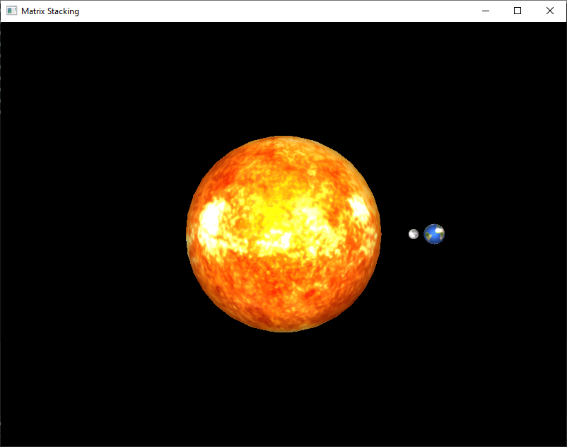
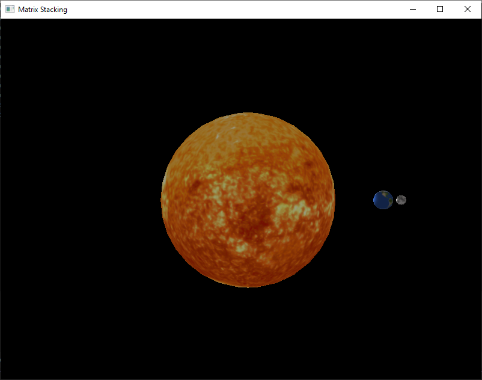
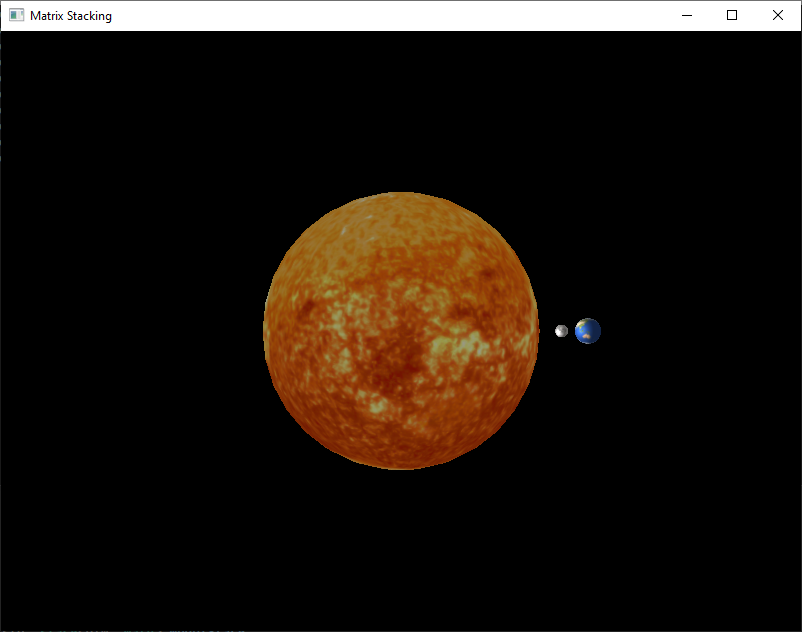
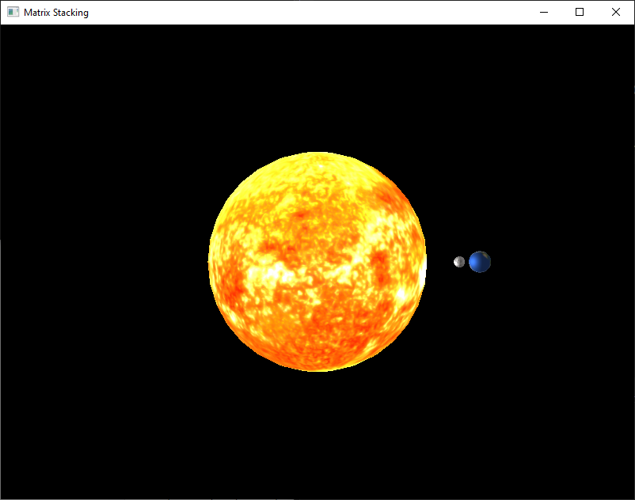

# CLOs
* CLO3 - Create a dynamic 3D scene using OpenGL
* CLO4 - Dynamically alter the viewing of a 3D scene using OpenGL
* CLO6 - Use OpenGL functions to create and apply single and compound transformations
* CLO7 - Use OpenGL to perform light-source shading
* CLO8 - Use OpenGL to perform texture mapping
* CLO10 - Create and use an OpenGL vertex and fragment shader

# Introduction

Congratulations! We have successfully covered all the materials necessary for the *Course Learning Outcomes* (CLOs). This means that everything we do now is for *us*. You have worked so hard, it is time to have some fun and do something truly exciting and special! We are going to leverage every bit of what we have learned thus far to create our most complex scene yet!

Today we are going to learn about *Matrix Stacking*.

# Hierarchical Modeling

Imagine you wanted to create a Ferris wheel in your scene. It spins slowly around its central axis. Attached to the rim of the wheel are passenger seats, which freely swing back and forth. In each of those seats you have a model of a person looking about.

Animating the outer wheel would be fairly easy, but things get complicated as you string all these motions together. You would have to calculate where each seat should be in world coordinates. Then you have to calculate how the motion of the seat affects where you place the person model. Tall order for sure, but doable.

Now, imagine the Ferris wheel is on a cruise ship bobbing on the ocean! All your carefully crafted work would be undone. Surely, there must be a better way!

Yes, Virginia, there *is* a better way.[^1] Computers don't think about the world the same way as us flesh-buckets do. They are very good at organizing things into *hierarchies*.

The computer can easily keep track of how each piece of our Ferris wheel relates to another. A person's position in the scene is *relative* to the seat's position. The seat's position is *relative* to the rim of the wheel. The rim of the wheels is *relative* to the central axis's position, which itself would be *relative* to the position of the cruise ship.

In other words, to place a person in a seat the location of the cruise ship isn't required, as long as the computer knows where the seat is. We call this *Hierarchical Modeling*. Any given object only needs to know the position of the proceeding object in the hierarchy. So when the cruise ship moves, the central axis knows where to move itself. This new central axis position is then *inherited* by the rim of the wheel (and so on).

# Matrix Stacking

There are multiple ways of implementing *Hierarchical Modeling* in an OpenGL program. The most *traditional*, and the one that is easiest to implement with our current codebase, is called *Matrix Stacking*. It gets its name because of how it uses `stack` objects to create the hierarchy. This was such a common way of doing things back in 1990s that OpenGL had dedicated built-ins: `glPushMatrix()` and `glPopMatrix()`.[^2]

While OpenGL's Core Profile no longer supports these functions, there is nothing stopping us from using `std::stack` to implement the same concept. If you aren't familiar with a stack, here is a quick crash course.

The best way to think of a *stack* is to imagine a physical stack of books. You can add to the stack, but only from the top. You can remove a book, but not from the middle, only from the top. This demonstrates the *First In Last Out* (*FILO*) concept. The only way to get the first item added to the stack off is to remove (or *pop*) off everything on top of it.

As we draw our scene, we will add more and more transforms to our matrix, and *push* it onto the stack so that later calls have access to the transforms. We will then *pop* it off to move back up the heirachy. 

I know it is complicated to visualize, so let's get to coding so we can get our hands dirty! To demonstrate *Matrix Stacking*, we are going to be implementing a *crude* Solar System!


# Prepping our Code

I hope that by now you are used to updating our code as we want to do new things. This is a very important aspect of programming. Sometimes you write code without considering what else you would like to achieve. Instead of growing frustrated, *refactor*!

Now, I want come clean. The way we set up our Object class was very helpful for learning, but it isn't exactly *best practices*. Typically, you don't want one class to handle *everything*: shaders, meshes, and positional data. I chose to do it this way to make the code easier to manage so you could focus more on OpenGL.

Unfortunately, our code is not set up to handle *Matrix Stacking*. But remember, we aren't going to get frustrated, we are going to *refactor*! Don't worry, the changes are minor, but it is good practice.

In order for us to use *Matrix Stacking* we need to be able to add the *World Matrix* to our object's *Model Matrix*. I just made up that term, *World Matrix*. It is basically all the transforms that have occured higher up in the hierachy. To accomplish this, our `draw()` function needs to accept another matrix.

In case you haven't been updating your Object class as we go through this course (shame!), here is a barebones version: [object_light.hpp](../downloadable_files/week_7/object_light.hpp) and [object_light.cpp](../downloadable_files/week_7/object_light.cpp).

We are going to start in our header file. We have two options when it comes to `draw()`. We can either rewrite our current version, but make it so it can be used for both normal draws *and* our new purpose, or we can *overload* it.[^3] We are going to *overload* `draw()`.

So, right under where we have our original `draw()` declaration, we are going to add:

```C++
void draw(const glm::mat4& modelFromStack,
          const glm::mat4& view, 
          const glm::mat4& projection,
          const Light& light) const;
```

It is the same, but now the first parameter is `modelFromStack`. This would be what I stupidly dubbed the *World Matrix*. Now, if we call `draw()` with four arguments, the compiler will know to use this version.

In `object_light.cpp` we need to copy-and-paste the entire `draw()` function. Make sure you update the function header to match what we did above. Believe it or not, we only have to add one line and edit another. Right after `glUseProgram(program)`, add the following line:

```C++
glm::mat4 finalModelMatrix = modelFromStack * modelMatrix;
```

The order in which we do this multiplication is *crucial*. The `modelMatrix` has to be on the right or you will get undesired transforms. Remember, these matrices are multiplied right-to-left.

Now, since `modelMatrix` has been combined with `modelFromStack`, we need to update how we calculate `mv`.

```C++
glm::mat4 mv = view * finalModelMatrix; // used to be view * modelMatrix
```

That's it! Everything else will work as normal. I told you it wouldn't be so bad. Now the tricky part, *using* our new `draw()` function.

# Stack'em High!

Again, hopefully you have been keeping up with the application code. In case you have helplessly broken your version, here is a skeleton version: [matrix_stacking.cpp](../downloadable_files/week_8/matrix_stacking.cpp). You are also going to need a sphere object to represent our celestial bodies: [sphere.obj](../downloadable_files/week_8/sphere.obj).

You can source your own textures for your solar system, but I found some high definition textures at [Solar System Scope](https://www.solarsystemscope.com/textures/). Our Solar System will have a star, one planet, and one moon. Therefore, I downloaded the Sun, Earth, and Moon textures (2k versions are more than enough).

Save the textures, object file, and `.cpp`/`.hpp` to your project folder and add them to the Solution Explorer. We are now ready to get coding!

The first thing we need to do is add `#include<stack>` so we can use the `std::stack` object (remember, OpenGL no longer offers one). While we are at the top of the file, let's go ahead and declare our three celestial objects. I named mine `earth`, `moon`, and `sun` (original, I know).[^4]

Next, we need to initialize our objects and load our textures. Do you remember where we do that?

**HIDE ANSWER: We do this in `init()`.**

For each of our objects, we need to initialize it and then load the texture. For those that may have forgotten, the format is:

```C++
if (!objectName.init("shader_name.vert", "shader_name.frag", "objectName.obj")) {
        std::cerr << "Failed to load objectName" << std::endl;
	}
    
    if (!objectName.loadTexture("textureName.jpg")) {
        std::cerr << "Failed to load objectName texture" << std::endl;
    }
    objectName.setShininess(8.0f);
```

You will need to do this for each of our three objects. You can set the shininess to whatever you like, but I feel planets aren't that shiny, so I kept it fairly low.

All this has been preparation for the *real* work, which will be in `display()`.

If you downloaded `matrix_stacking.cpp`, your `display()` is ready to go. If you are using an already functioning program, first make a copy so you don't ruin old project, and second remove all of `display()`'s content after `glm::mat4 view =...`.

In order to animate our scene, we need to calculate some values for our objects. If you are rusty as to how our animation system works, go back to [Simple Animation](../week_3/simple_animation.md) for a refresher. Place the following into `display()`:

```C++
// Calculate orbits/spins
float sunSpin = currentTime * 10.0f; // Sun's spin speed
float earthOrbit = currentTime * 85.0f; // Orbit speed of Earth around Sun
float earthSpin = currentTime * 15.0f; // Earth's spin speed
float moonOrbit = currentTime * 320.0f; // Orbit speed of Moon around Earth
float moonSpin = currentTime * 10.0f; // Moon's spin speed
```

As you can see, we are going to apply a rotation animation to the Sun, Earth, and Moon. We also calculate orbital position for both the Earth and Moon (the sun is in the center). Notice, these are all *angles* in degrees. The specific values used to multiply `currentTime` are not important, but these will produce the face orbit seen in the animation above. Feel free to change them to something more realistic.

Now we need to set up our *Matrix Stack* and *prime* it. Anyone want to take a guess what we are going to push onto our stack first?

**HIDE ANSWER: Of course it would be the *Identity Matrix*. If you look at the code in our Object class, you will see that we start with the *Identity Matrix*.**

```C++
// Set up Matrix Stack
std::stack<glm::mat4> modelStack;
modelStack.push(glm::mat4(1.0f)); // Start with identity matrix
```

If you have never used a `stack` in C++, we put the type we want to store between the `<>`. In this case, we are storing `mat4`s (duh!). We then push the *Identity Matrix* onto the stack.

We are about to start the tricky part. Take your time with this. Read it all the way through once and then read it again. I find it helpful to write some of these things out on paper to visualize what is happening.

While it may not make sense immediately, I am going to move the Sun's position away from the origin. We are doing this so we can discuss some of the nuances of *Matrix Stacking*. Therefore, let's push it aside a bit.

```C++
// Move the Solar System to the Sun's starting position
modelStack.top() = glm::translate(modelStack.top(), glm::vec3(0.0f, 0.0f, -50.0f));
```

The top of our stack will always hold the *current state* of our hierarchy. For this reason, we need to save our translation using `.top()`.

Whenever we dive *deeper* into our hierarchy, we need to save the *current state*. It may seem silly to push the same matrix on the stack again, but later we will be directly transforming the top of the stack, and we need to be able to "undo" those so our next object has the appropriate values in the *World Matrix*. Things will make more sense shortly (fingers crossed!).

So, we are about to render our Sun object, what do we need to do?

**HIDE ANSWER: Push the *current state* onto our stack!**

```C++
// --- LEVEL 1: THE SUN BLOCK ---
modelStack.push(modelStack.top()); 
{
    // Code to come
} modelStack.pop();
```

I am presenting the code this way to highlight the `{}`. It is very important to pay attention to the placement of these brackets. They are going to help us identify which level of the hierarchy we are in.

*Anything* that we put in between these brackets will have access to the *World Matrix* of the Sun. Right now, the only changes we have saved is the translation of the scene -50 along the Z-axis. This translation will then be carried over onto anything drawn from within this block.

Now, between those `{}` we labeled "LEVEL 1", add:

```C++
sun.resetTransform();
sun.scale(glm::vec3(10.0f));
sun.rotate(sunSpin, glm::vec3(0.0f, 1.0f, 0.0f));
        
sun.draw(modelStack.top(), view, proj, light);
```

This should look fairly familiar. We always want to call `resetTransform()` when we are dealing with animations. We then `scale()` our sphere to make the Sun larger than the other celestial bodies. The Sun is then rotated around the Y-axis by the calculated speed. We then call our new `draw()` function and pass in `modelStack.top()` as our `modelFromStack` argument. This passes the current state of our hierarchy.

That is it for our Sun animations. You *should* be able to build and run the code at this point. You should have a lovely spinning sun.

Back to our hierarchy! It is now time to enter "LEVEL 2": *Earth*.

Any wild guesses what we want to do first?

**Hide Answer: We need to save the current state by pushing it onto our stack: `modelStack.push(modelStack.top())`. This is super important. When we are done with Earth and its nested objects (aka "children") we need to go back to the Sun Block so we can place more planets if we wish.**

Go ahead and declare another block:

```C++
// =======================================================================
// --- LEVEL 2: THE EARTH SYSTEM (Nested completely inside Level 1!) ---
// =======================================================================
modelStack.push(modelStack.top());
{

    // Code to come

} modelStack.pop();
```

Again, I am presenting it this way so you clearly see that we are defining distinct blocks. It is also worth getting in the habit when working with *Matrix Stacking* to always write the `.pop()` at the same time as the `.push()`. This will help you avoid runtime errors.

Now we need to place our Earth object. Normally, we would just call `earth.translate()`, but that only works when we are working around the origin. Remember, we are placing it *relative* to the Sun's position. Where is this data stored?

**HIDE ANSWER: In `modelStack.top()`!**

Therefore, we need to do all our *positional* transforms on `modelStack.top()`. In order to get an object to "orbit" a central point, we need to first *translate* it and then apply a *rotation*.[^5] Be careful about the order we apply these transforms. Remember we the transforms we want to happen *first* go at the *end*.

So, inside our "LEVEL 2" block, add:

```C++
    modelStack.top() = glm::rotate(modelStack.top(), glm::radians(earthOrbit), glm::vec3(0.0f, 1.0f, 0.0f));
    // place the Earth +15 along the X-axis
    modelStack.top() = glm::translate(modelStack.top(), glm::vec3(15.0f, 0.0f, 0.0f));  
```

Notice, we are directly modifying `modelStack.top()`. This is safe to do because the changes we make to `.top()` only exist within this block (we `.pop()` at the end). Again, if you reverse these, you will not end up with an orbiting Earth. Instead, you will end up with an Earth fixed at a set distance from the Sun.

Now we need to *animate* our Earth. Let's add a spin! In the same block add:

```C++
earth.resetTransform();
earth.rotate(earthSpin, glm::vec3(0.0f, 1.0f, 0.0f)); // Stays local to earth object!

earth.draw(modelStack.top(), view, proj, light);
```

These use our old `draw()` call so behave as they always have. These transforms *do not* affect the *World Matrix*, so won't be carried over to the Moon.

Speaking of the Moon; it's time! We need to declare a new "LEVEL 3" block *nested* inside "LEVEL 2". Below, I am showing the structure we have after declaring this new block.

```C++
// LEVEL 1
modelStack.push(modelStack.top());
{
    // Sun code

    // LEVEL 2
    modelStack.push(modelStack.top());
    {
        // Earth code

        //LEVEL 3
        modelStack.push(modelStack.top());
        {
            // Future Moon code

        } modelStack.pop();
    } modelStack.pop();
} modelStack.pop();
```

Again, we need to *nest* "LEVEL 3" inside "LEVEL 2" so that changes made to the *World Matrix* (`modelStack.top()`) carry over into the next object. You see, the Moon is a "child" of the Earth; the Moon goes where the Earth goes. So, we need that translation and rotation that established the Earth's orbit so we can base our Moon placement on it.

Inside "LEVEL 3" we need to define our Moon's orbit *relative* to the Earth. As I have *repeatedly* stated (tired of hearing it?) this information is stored in our *World Matrix* (like magic!). Pay attention to the order of the transforms.

```C++
modelStack.top() = glm::rotate(modelStack.top(), glm::radians(moonOrbit), glm::vec3(0.0f, 1.0f, 0.0f));
// place the moon +2 along the X-axis
modelStack.top() = glm::translate(modelStack.top(), glm::vec3(2.0f, 0.0f, 0.0f));  
```

The last thing we need to do is give our Moon animations. I really wish I had the patience to figure out the correct *spin* value to ensure that the same side of the Moon always faces the earth.[^6] Sadly, I don't, so the values provide here are fairly random.

```C++
moon.resetTransform();
moon.scale(glm::vec3(0.5f));
moon.rotate(moonSpin, glm::vec3(0.0f, 1.0f, 0.0f));

moon.draw(modelStack.top(), view, proj, light);
```

The last step is to ensure we pop off the initial *Identity Matrix*. So, add `modelStack.pop()` at the end of `display()` *outside* all our blocks. You should now be able to build and run your very own Solar System! Go ahead and see if it works! If it doesn't go back and review where things may have gone wrong.

If you can't figure it out after 10–20 minutes, you can "cheat" and look below. *Seriously*, give it a good faith effort to find the issues with your code on your own. Discovering these things yourself leads to *much* better learning.

**HIDE CODE:**
```C++
// Set up Matrix Stack
std::stack<glm::mat4> modelStack;
modelStack.push(glm::mat4(1.0f)); // Start with identity matrix

// Move the Solar System to the Sun's starting position
modelStack.top() = glm::translate(modelStack.top(), glm::vec3(0.0f, 0.0f, -50.0f));

// --- LEVEL 1: THE SUN BLOCK ---
modelStack.push(modelStack.top()); 
{
    sun.resetTransform();
    sun.scale(glm::vec3(10.0f));
    sun.rotate(sunSpin, glm::vec3(0.0f, 1.0f, 0.0f));
            
    sun.draw(modelStack.top(), view, proj, light);

        // =======================================================================
        // --- LEVEL 2: THE EARTH SYSTEM (Nested completely inside Level 1!) ---
        // =======================================================================
        modelStack.push(modelStack.top()); 
        { 
            // Orbit around the clean Sun center core, then push out to radius
            modelStack.top() = glm::rotate(modelStack.top(), glm::radians(earthOrbit), glm::vec3(0.0f, 1.0f, 0.0f));
            modelStack.top() = glm::translate(modelStack.top(), glm::vec3(15.0f, 0.0f, 0.0f));

            earth.resetTransform();
            earth.rotate(earthSpin, glm::vec3(0.0f, 1.0f, 0.0f)); // Stays local to earth object!
            earth.draw(modelStack.top(), view, proj, light);

            // --- LEVEL 3: THE MOON SYSTEM (Nested directly inside Earth space) ---
            modelStack.push(modelStack.top()); {
                modelStack.top() = glm::rotate(modelStack.top(), 
                                               glm::radians(moonOrbit), 
                                               glm::vec3(0.0f, 1.0f, 0.0f));
                modelStack.top() = glm::translate(modelStack.top(), 
                                                  glm::vec3(2.0f, 0.0f, 0.0f));

                moon.resetTransform();
                moon.scale(glm::vec3(0.5f));
                moon.rotate(moonSpin, glm::vec3(0.0f, 1.0f, 0.0f)); // Stays local to moon object!
                
                moon.draw(modelStack.top(), view, proj, light);
            } modelStack.pop(); // Clear Moon Space, return to Earth Space

        } modelStack.pop(); // Clear Earth space, return to Sun Center Space

    } modelStack.pop(); // Clear Sun Space, return to pure World Identity Space

    modelStack.pop(); 
```
**END HIDE**

If all has gone as it should, you should see something similar to the following:



Before moving on, take some time to change some of the transforms to see how they affect the scene. For example, can you get the Earth to orbit the Sun around the X-axis, while the Moon continues to orbit around the Y-axis? It looks *really* weird. Doing that will show you that all these things are *relative* to the `modelStack.top()`.

# Let's Spice It Up!

No, that isn't a Dune reference! I am talking about making our scene look nicer. None of what we are going to cover here has to do with *Matrix Staking*, but will teach you how to make your scenes look better and therefore fun to show off.

Did you happen to fly around to the backside of the Sun? If you did, you likely noticed that it is dimmer on that side.



Why do you suppose that is?

**HIDE ANSWER: It is because `light.position` is roughly the same place our camera starts (0.0f, 5.0f, 0.0f). Our Sun, on the other hand, is located at (0.0f, 0.0f, -50.0f).**

This means the light is shining *on* the Sun, and not *from* the Sun. I don't know about you, but I like things to make sense, so let's put our light source *inside* the Sun. This will allow for more realistic lighting on the planet/moon as well (they should be illuminated on the side facing the Sun). We can do this easily by changing `light.position` to match the Sun's position.



Wow! Things look different! Take a moment and compare the differences. The first thing you should notice is that the Sun is now dim *everywhere* (not ideal). Second, you should notice that the Earth and Moon now have the Sunward side illuminated (ideal).

So, we fixed one issue and made another one *worse*. What gives with the Sun losing its brightness. You would have thought putting the light source *inside* the Sun would make it brighter. Think back to how we calculate lighting (Hint: how are *normals* used?). Can you come up with a theory to explain the dim Sun?

**HIDE ANSWER: If you couldn't figure it out, that is OK, but make sure you remember going forward. The reason is that our lighting equation requires that the *surface normals* face the light source. This is done so we don't end up illuminating the backside of objects. The issue here is that the Sun's normals point outward, but the light source is *inside*. This means that *none* of the surfaces will be lit!**

Take a moment to think of possible solutions to this problem. How can we keep the light source inside the Sun, but still have it illuminated?

**HIDE ANSWER: Simple, we need the Sun's normals to point *inward*.**

There are multiple ways to achieve this. The easiest to accomplish with our current knowledge are:

* Update the Sun's model file so that the normals are reversed
* Update the Sun's shader code to flip the normals on the fly

Which one should we choose? To help you decide, go take a look at `sphere.obj` in a text editor. In order to flip the normals, we have to update the `vn` lines in `sphere.obj`. Go see how practical that would be.

Back? So, do you want to change all those lines (risking making a mistake)? No? I didn't think so. So, that leaves us with changing the normals inside the Sun shader.

This will require us to make a new (and separate) Vertex Shader for the Sun. While we only need a new Vertex Shader, I think it is best to make a new Fragment Shader as well. So, copy your `blinn_phong.vert` and `blinn_phong.frag` code into two new files: `sun.vert` and `sun.frag`. Update your `sun.init()` to point to the new shader files.

Having the `sun.vert` flip the normals is beyond easy. Find the line where you assign `normal` and change `aNormal` to `-aNormal`. That is it! Negating the normals is the same thing as flipping it.

Build and run your new shader code and you should see:



Go, take your spaceship and fly around to the backside. It should now be illuminated completely, with no dim areas.

[^1]: [*Yes, Virginia, there is a Santa Claus*](https://en.wikipedia.org/wiki/Yes,_Virginia,_there_is_a_Santa_Claus).
[^2]: As with many of the OpenGL built-ins, these were removed when OpenGL moved to the fully-programmable pipeline.
[^3]: Overloading a function means creating a new function with the same name, but different parameters. The compiler will automatically figure out which one we are calling.
[^4]: You should get into the habit of always going into `main()` and adding `object.cleanup()` whenever you declare a new `Object` so you don't forget later.
[^5]: Remember, rotations always occur around the center point of the *Model Matrix*. If you translate before you rotate, then the object is further from the origin so the rotation carries it around in a sweeping motion.
[^6]: Due to a phenominon called [*Tidal Locking*](https://en.wikipedia.org/wiki/Tidal_locking), we only ever see the one side of the Moon.
